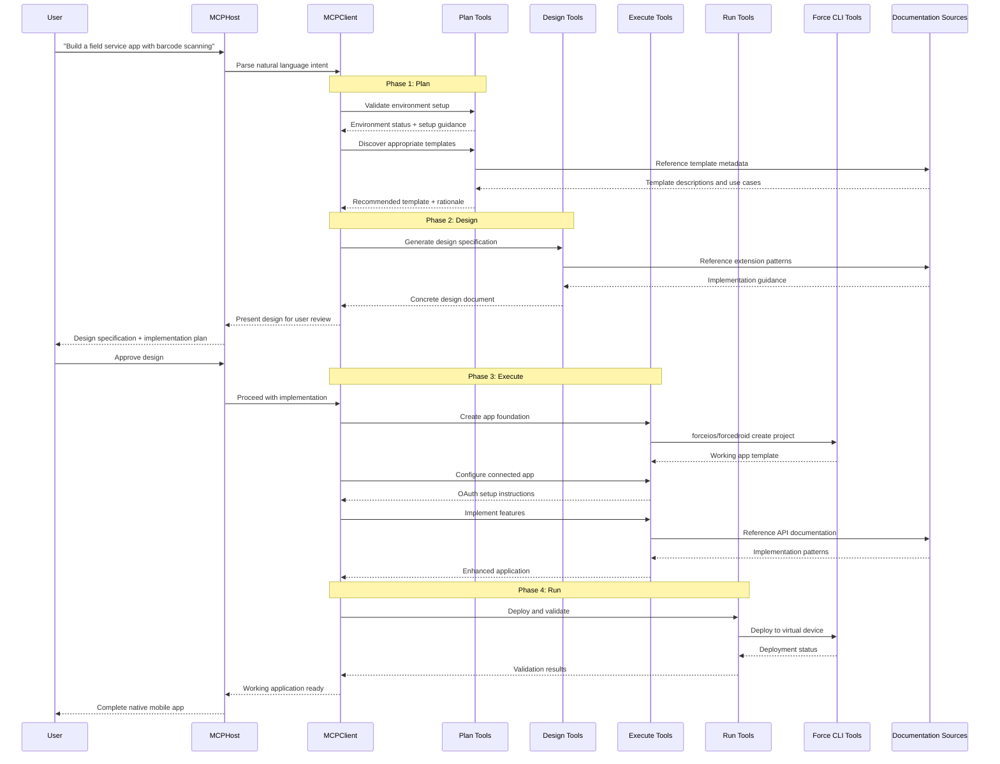

# Mobile Native App Generation - MCP Server Design

# Overview

This document outlines the specific requirements and technical design considerations for the **`@salesforce/mobile-native-mcp-server`** within the `mobile-mcp-tools` monorepo. This MCP server represents a revolutionary approach to native mobile app development, transforming natural language user intent directly into production-ready Salesforce Platform-based native mobile applications.

The Mobile Native App Generation server embodies the core vision of **prompt-to-app development**, eliminating the traditional complexity barriers that have historically forced customers to choose between optimal user experience and development feasibility. By leveraging existing Salesforce Mobile SDK tooling and comprehensive documentation grounding, this server enables anyone to create sophisticated native mobile applications through natural language interaction.

---

# High-Level Project Design

## Vision Alignment

This MCP server directly implements the vision outlined in **Mobile Apps with Agentic AI at Salesforce**, specifically targeting the elimination of the "development skill tax" that has historically constrained mobile app creation. The server transforms the mobile development paradigm from "figure it out" to "build what you imagined."

## Core Design Principles

### Documentation and Metadata Over Custom Tools

**Philosophy**: "Don't build tools, tell the LLM how to use what we already have."

- **Rich Template Metadata**: Each mobile SDK template includes comprehensive documentation describing when to use it, its structure, main files, and crucially, how to extend and build upon it
- **Extension Guidance**: Specific instructions for common scenarios (e.g., adding opportunity support requires updating `userStore.json` and `userSync.json`)
- **Documentation Grounding**: All guidance stems from official Salesforce Mobile SDK documentation, ensuring accuracy and best practices

### Preserve LLM Agency for Self-Healing

- **Guided Autonomy**: Provide comprehensive context and guidance while allowing the LLM to make implementation decisions
- **Error Recovery**: When issues arise, the LLM can adapt and self-correct rather than failing due to overly restrictive tool constraints
- **Adaptive Problem-Solving**: LLM maintains the ability to reason through unexpected scenarios using provided documentation context

### Bring Documentation to Users

**Principle**: Users should never need to leave their development environment to find information.

- **Contextual Guidance**: All necessary documentation, setup instructions, and troubleshooting guidance delivered directly through MCP tools
- **Environment Setup**: Comprehensive validation and guidance for required tools (Xcode, Force CLI) with specific setup instructions
- **Connected App Configuration**: Step-by-step mobile-specific OAuth configuration guidance delivered in-context

### Deterministic Foundation with Existing Tools

- **CLI Tool Leverage**: Utilize existing `forceios` and `forcedroid` CLI tools to create working app foundations deterministically
- **Template-Based Bootstrapping**: Start with proven, tested app templates rather than generating from scratch
- **Incremental LLM Enhancement**: LLM adds features on top of deterministically created, working foundations

## Four-Phase Workflow Architecture

### Phase 1: Plan
- **Environment Validation**: Verify required development tools are installed and configured
- **Template Discovery**: Analyze user intent and recommend appropriate Mobile SDK templates
- **Setup Guidance**: Provide specific installation and configuration instructions when needed

### Phase 2: Design  
- **Specification Generation**: Create concrete design documents based on user requirements
- **User Checkpoint**: Present design for user review and feedback before implementation
- **Implementation Roadmap**: Generate detailed plan referencing design document for subsequent phases

### Phase 3: Execute
- **Template Instantiation**: Use CLI tools to create working app foundation from selected template
- **Connected App Configuration**: Guide setup of Salesforce OAuth configuration for mobile applications
- **Feature Implementation**: Add requested features guided by design document and template extension instructions
- **Documentation-Grounded Development**: Reference official Mobile SDK documentation for all implementation decisions

### Phase 4: Run
- **Deployment**: Leverage existing tooling for app deployment to virtual devices
- **Validation**: Verify login functionality and core app features
- **User Handoff**: Provide working, deployable native mobile application

---

# System Flow

The following sequence diagram illustrates the comprehensive workflow for transforming user intent into a production-ready native mobile application:



---

# MCP Client Integration and Transport

## Standard MCP Compatibility

The server follows established Model Context Protocol standards for maximum ecosystem compatibility:

* **npx Invocation**: Standardized launch mechanism for frictionless integration
```bash
npx -y @salesforce/mobile-native-mcp-server
```

* **StdioServerTransport Communication**: Uses standard input/output streams per MCP specifications, ensuring broad MCP client compatibility

## Integration Approach

* **Multi-Tool Orchestration**: Complex workflows spanning multiple MCP tools with built-in coordination
* **State Management**: Maintains workflow context across tool calls while remaining stateless at the protocol level
* **Error Handling**: Graceful degradation with comprehensive guidance when issues arise

---

# MCP Server Properties

## Server Metadata

**Name:** `sfdc-mobile-native-mcp-server`  
**Description:** The `sfdc-mobile-native-mcp-server` MCP server provides a comprehensive collection of tools that enable prompt-to-app development for Salesforce Platform-based native mobile applications. The server orchestrates a four-phase workflow (Plan, Design, Execute, Run) leveraging existing Mobile SDK tooling, templates, and documentation to transform natural language intent into production-ready native mobile applications.

## Tool Categories and Annotations

### Planning Tools
| Annotation        | Value   | Notes                                                                           |
| :---------------- | :------ | :------------------------------------------------------------------------------ |
| `readOnlyHint`    | `false` | Environment validation may trigger installation guidance                        |
| `destructiveHint` | `false` | No destructive operations, but may recommend software installation              |
| `idempotentHint`  | `true`  | Environment checks and template discovery produce consistent results           |
| `openWorldHint`   | `true`  | May need to check local environment state and available templates             |

### Design Tools
| Annotation        | Value   | Notes                                                                           |
| :---------------- | :------ | :------------------------------------------------------------------------------ |
| `readOnlyHint`    | `true`  | Generate specifications without modifying environment                           |
| `destructiveHint` | `false` | Specification generation is non-destructive                                    |
| `idempotentHint`  | `true`  | Same input produces consistent design specifications                           |
| `openWorldHint`   | `false` | Operates on provided requirements without external dependencies                |

### Execution Tools
| Annotation        | Value   | Notes                                                                           |
| :---------------- | :------ | :------------------------------------------------------------------------------ |
| `readOnlyHint`    | `false` | Creates and modifies mobile application projects                               |
| `destructiveHint` | `false` | Creates new projects but doesn't modify existing unrelated files              |
| `idempotentHint`  | `false` | Project creation and feature implementation modify file system state          |
| `openWorldHint`   | `true`  | Interacts with CLI tools, file system, and documentation sources             |

### Deployment Tools
| Annotation        | Value   | Notes                                                                           |
| :---------------- | :------ | :------------------------------------------------------------------------------ |
| `readOnlyHint`    | `false` | Deploys applications to virtual devices                                        |
| `destructiveHint` | `false` | Deployment doesn't destroy existing applications                               |
| `idempotentHint`  | `false` | Deployment creates new application instances                                   |
| `openWorldHint`   | `true`  | Requires interaction with deployment infrastructure and virtual devices       |

---

# Technical Implementation

## Project Structure

Following the monorepo pattern established in `mobile-mcp-tools`:

```
mobile-native/
├── src/           # MCP server implementation
│   ├── tools/     # Phase-specific tool implementations
│   │   ├── plan/      # Environment validation, template discovery
│   │   ├── design/    # Specification generation, user checkpoints  
│   │   ├── execute/   # App creation, feature implementation
│   │   └── run/       # Deployment, validation
│   ├── schemas/   # Zod schemas for tool inputs/outputs
│   └── utils/     # Shared utilities and CLI integrations
├── resources/     # Template metadata and documentation
│   ├── templates/     # Mobile SDK template descriptions and extension guides
│   ├── setup-guides/ # Environment setup instructions
│   └── api-docs/      # Mobile SDK API documentation excerpts
├── scripts/       # Project utilities and maintenance
├── tests/         # Comprehensive testing suite
└── package.json   # Project configuration and dependencies
```

## Tool Suite Organization

### Plan Phase Tools
- **Environment Validator**: Checks for Xcode, Force CLI, required dependencies
- **Template Discoverer**: Analyzes user intent and recommends appropriate Mobile SDK templates
- **Setup Guide Provider**: Delivers contextual installation and configuration guidance

### Design Phase Tools  
- **Specification Generator**: Creates concrete design documents from user requirements
- **Design Reviewer**: Facilitates user checkpoints and design approval workflow
- **Implementation Planner**: Generates detailed roadmaps referencing design specifications

### Execute Phase Tools
- **Foundation Creator**: Interfaces with Force CLI tools to instantiate app templates
- **Connected App Configurator**: Guides OAuth setup for mobile application authentication
- **Feature Implementer**: Adds requested functionality guided by design documents and documentation
- **Documentation Grounding Engine**: Provides real-time access to Mobile SDK documentation

### Run Phase Tools
- **Deployment Orchestrator**: Manages application deployment to virtual devices
- **Validation Engine**: Verifies application functionality and user authentication
- **Handoff Coordinator**: Prepares final application deliverables

## Documentation Integration Strategy

### Template Metadata Management
- **Rich Descriptions**: Each template includes comprehensive metadata describing purpose, structure, and extension patterns
- **Extension Guidance**: Specific instructions for common scenarios (record type additions, feature integrations)
- **Best Practices**: Embedded guidance following official Mobile SDK documentation patterns

### Real-Time Documentation Access
**TODO**: Define strategy for connecting LLM to official Salesforce documentation during implementation phase. Options under consideration:
- **Metadata Dictionary Approach**: Curated map of documentation URLs for specific use cases  
- **Vectorized Documentation**: Local vector database of Mobile SDK documentation for semantic search
- **Hybrid Approach**: Metadata dictionary with fallback to vectorized search for comprehensive coverage

*Priority*: Critical for preventing API hallucination and ensuring generated code follows Mobile SDK best practices.

## CLI Tool Integration

### Force iOS Integration
- **Project Creation**: `forceios create` with template specification
- **Configuration Management**: Automated info.plist and configuration updates
- **Dependency Management**: CocoaPods and Swift Package Manager integration

### Force Android Integration  
- **Project Creation**: `forcedroid create` with template specification
- **Gradle Configuration**: Automated build configuration and dependency management
- **Manifest Updates**: AndroidManifest.xml configuration for mobile features

## Workflow Orchestration

### State Management Between Phases
- **Design Document Persistence**: Maintain design specifications across Execute phase tool calls
- **Template Context**: Preserve template metadata and extension guidance throughout implementation
- **Error Context**: Maintain error state and recovery guidance across workflow phases

### User Interaction Patterns
- **Checkpoint Approvals**: Clear handoff points for user review and approval
- **Progress Reporting**: Transparent communication of workflow progress and next steps
- **Error Recovery**: Graceful failure handling with clear guidance for resolution

---

# Security Requirements and Considerations

This project adheres to security best practices established for MCP servers in the AI-assisted development ecosystem.

## Security Profile

| **Security Consideration**      | **Status** | **Notes**                                                          |
| :------------------------------ | :--------- | :----------------------------------------------------------------- |
| **Local Development Focus**     | Secure     | All operations target local development environment only           |
| **CLI Tool Interaction**        | Controlled | Uses established Salesforce CLI tools with validated parameters   |
| **Documentation Sources**       | Public     | All documentation sources are public Mobile SDK materials         |
| **User Data**                   | None       | No user-specific data stored or transmitted                        |
| **Code Generation**             | Validated  | Generated code follows established Mobile SDK patterns            |
| **External Dependencies**       | Minimal    | Limited to Salesforce CLI tools and established Node.js packages  |

## Security Considerations

* **CLI Execution Safety**: All CLI tool invocations use validated parameters and established patterns
* **Template Security**: Mobile SDK templates are sourced from official Salesforce repositories
* **Documentation Integrity**: Documentation sources verified against official Salesforce Mobile SDK materials
* **Local Environment**: All operations contained within user's local development environment

---

# MCP Host Compatibility

## Engineering Standard: Broad MCP Host Compatibility

| **MCP Specification Compliance**                                     | ✅  | Strict adherence to official Model Context Protocol specifications           |
| :------------------------------------------------------------------- | :-: | :--------------------------------------------------------------------------- |
| **Open Source Node.js Package**                                      | ✅  | Published to NPM for broad ecosystem access                                 |
| **Domain-Specific Tool Naming**                                      | ✅  | All tools prefixed with `sfmobile-native` for clear identification          |
| **npx Invocation Support**                                           | ✅  | Standard `npx -y @salesforce/mobile-native-mcp-server` invocation pattern  |
| **stdio Transport**                                                   | ✅  | Standard input/output communication per MCP specifications                  |
| **Cross-Host Testing**                                                | ✅  | Validated against multiple MCP hosts for broad compatibility                |

## Product Priority: Salesforce Platform Integration

### Primary Integration Targets

**Agentforce for Developers (A4D)**: 
- Optimized for A4D's MCP Host and Client infrastructure
- Enhanced tool discovery for VSCode development workflows  
- Comprehensive testing within A4D environments
- Support for A4D development patterns and enterprise integration

**Salesforce Studio Integration**:
- Strategic alignment with Salesforce Studio roadmap
- Foundation for prompt-to-app capabilities within Salesforce's primary development platform
- Stepping stone toward comprehensive Salesforce development experience

---

# Future Expansion and Roadmap

## Template Ecosystem Evolution

### From App Templates to Feature Templates
**Long-term Vision**: Transition from monolithic app templates to composable feature templates enabling mix-and-match functionality.

- **Current State**: App-focused templates (Field Service App, Sales App, etc.)  
- **Future State**: Feature-focused templates (Authentication, Sync, Object Explorer, etc.)
- **Benefits**: Reduced template proliferation, increased customization flexibility, improved LLM comprehension

### Template Metadata Enhancement
- **Interactive Guidance**: Templates with embedded decision trees for extension scenarios
- **Dependency Mapping**: Clear relationships between features and required configurations
- **Version Management**: Template versioning aligned with Mobile SDK releases

## Documentation Integration Advancement

### Real-Time Documentation Access
**Priority**: Resolve documentation integration challenges identified in research phase.

**Investigation Areas**:
- **Salesforce Documentation API**: Direct integration with official documentation systems
- **Semantic Documentation Search**: Advanced vectorization and retrieval for context-specific guidance  
- **Dynamic Documentation Updates**: Automatic synchronization with Mobile SDK documentation changes

### LLM Grounding Enhancement
- **Type System Integration**: Direct access to Mobile SDK TypeScript definitions
- **API Validation**: Real-time validation of generated code against current Mobile SDK APIs
- **Best Practice Enforcement**: Automated adherence to Mobile SDK coding standards and patterns

## Advanced Workflow Capabilities

### Multi-Platform Support
- **Cross-Platform Templates**: Templates supporting both iOS and Android from single specification
- **Platform-Specific Optimization**: Automatic platform-specific feature implementation
- **Unified Development Experience**: Consistent workflow across mobile platforms

### Integration Ecosystem Expansion
- **Experience Cloud Integration**: Native app templates with Experience Cloud connectivity
- **Agentforce Integration**: Templates with embedded Agentforce agent capabilities
- **Salesforce Data Cloud**: Advanced sync and analytics integration templates

## Quality and Reliability Enhancement

### Automated Testing Integration
- **Generated Code Validation**: Automatic testing of generated mobile applications
- **Template Regression Testing**: Continuous validation of template metadata and extension guidance
- **End-to-End Workflow Testing**: Comprehensive testing of Plan → Design → Execute → Run workflows

### Error Recovery and Self-Healing
- **Intelligent Error Analysis**: Advanced diagnosis of common development issues
- **Automated Resolution**: Self-healing capabilities for common configuration and build problems  
- **Learning from Failures**: Continuous improvement based on user interaction patterns

---

# Success Metrics and Evaluation

## Core Success Criteria

### User Experience Metrics
- **Time to Working App**: Measure from initial prompt to deployable application
- **User Intervention Required**: Track instances requiring manual user action outside MCP workflow
- **Success Rate**: Percentage of prompts resulting in working, deployable applications

### Technical Quality Metrics  
- **Generated Code Quality**: Adherence to Mobile SDK best practices and coding standards
- **Template Coverage**: Percentage of user intents successfully matched to appropriate templates
- **Documentation Grounding Effectiveness**: Reduction in API hallucination and incorrect implementations

### Ecosystem Integration Metrics
- **MCP Host Compatibility**: Successful operation across target MCP client environments
- **CLI Tool Integration**: Reliability of Force iOS/Android CLI interactions
- **Template Extension Success**: Effectiveness of template metadata in guiding feature additions

## Evaluation Framework

### Automated Evaluation Pipeline
- **Component Testing**: Individual tool validation against known inputs/outputs
- **Integration Testing**: End-to-end workflow testing with realistic user scenarios
- **Regression Testing**: Continuous validation against Mobile SDK updates and changes

### User Study Validation
- **Developer Experience Studies**: Comparative analysis against traditional mobile development workflows
- **Learning Curve Assessment**: Time to productivity for developers new to Mobile SDK
- **Feature Completion Analysis**: Success rates for complex, multi-feature application requirements

---

# TODO: Implementation Specification Details

The following areas require detailed specification before implementation begins:

## Template Metadata Schema Definition
- **Formal Schema**: Zod-based schema for template metadata structure
- **Extension Pattern Specification**: Standardized format for describing template extension scenarios
- **Validation Rules**: Automated validation of template metadata completeness and accuracy

## CLI Tool Integration Specification
- **Parameter Mapping**: Detailed mapping of user requirements to CLI tool parameters
- **Error Handling**: Comprehensive error scenarios and recovery strategies for CLI tool failures
- **Version Compatibility**: Strategy for handling different versions of Force CLI tools

## Documentation Integration Architecture
- **Documentation Source Management**: Automated processes for maintaining current Mobile SDK documentation
- **Context Retrieval Strategy**: Algorithms for selecting relevant documentation based on user intent and implementation context
- **API Evolution Handling**: Processes for adapting to Mobile SDK API changes and deprecations

## Workflow Orchestration Implementation
- **State Management**: Technical specification for maintaining context across workflow phases
- **Checkpoint Implementation**: User interaction patterns and approval workflows
- **Error Recovery Workflows**: Detailed specifications for handling failures at each workflow phase

## Quality Assurance Framework
- **Testing Strategy**: Comprehensive testing approach covering unit, integration, and end-to-end scenarios
- **Evaluation Metrics**: Specific, measurable criteria for assessing tool effectiveness and user experience
- **Continuous Improvement**: Feedback loops and improvement processes based on user interactions and outcomes

---

*This document represents the foundational requirements for the Mobile Native App Generation MCP server. Implementation should proceed iteratively, validating core assumptions through prototyping and user feedback while maintaining alignment with the broader vision of democratizing native mobile app development.*