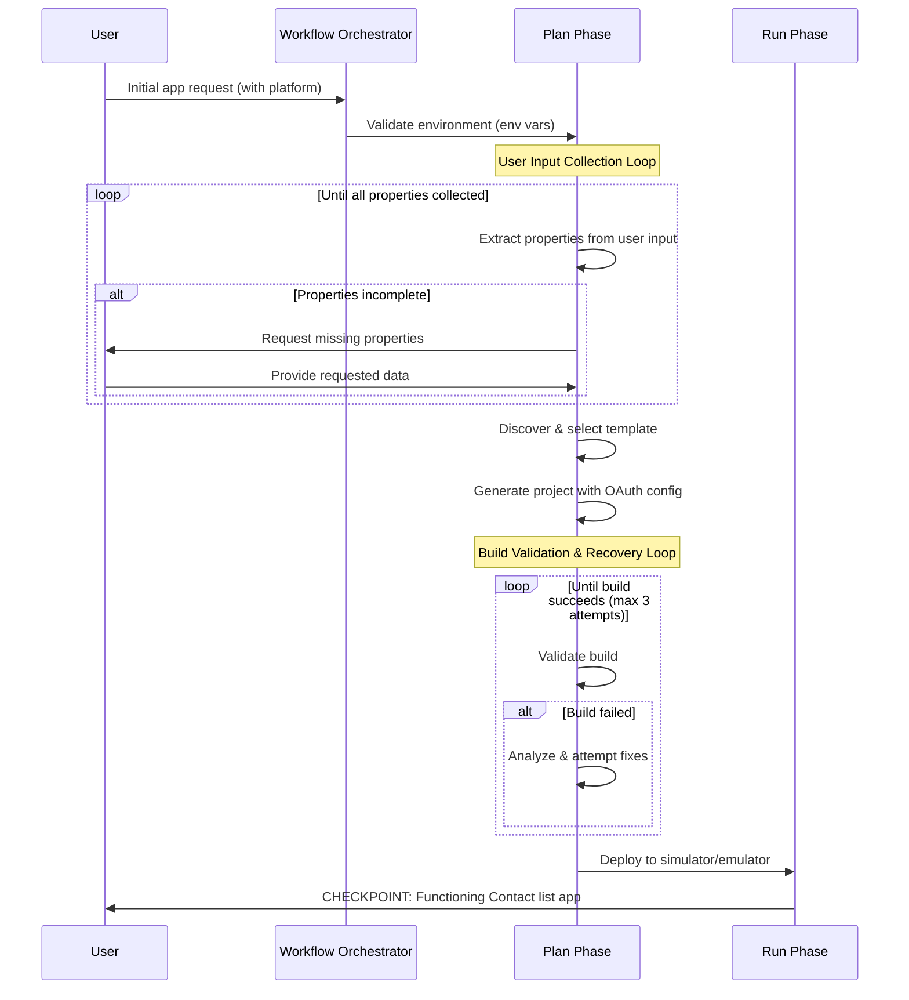
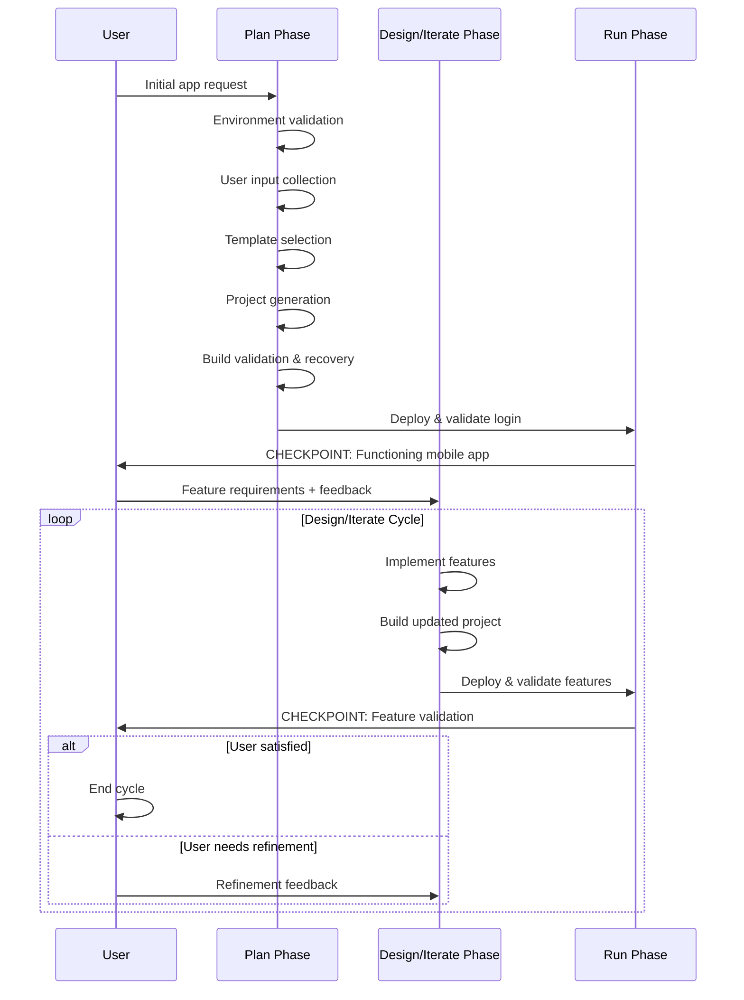
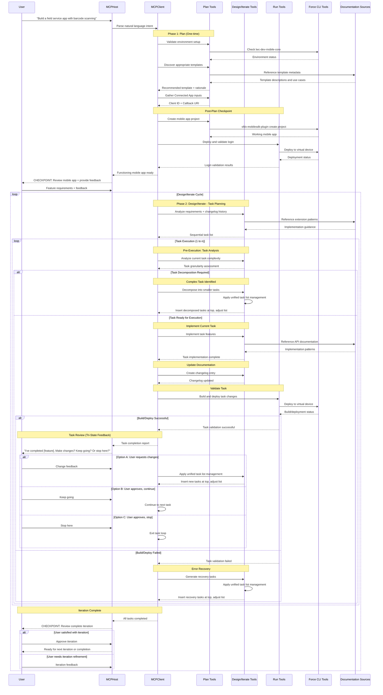

# Mobile Native App Generation - MCP Server Design

# Overview

This document outlines the specific requirements and technical design considerations for the **`@salesforce/mobile-native-mcp-server`** within the `mobile-mcp-tools` monorepo. This MCP server represents a revolutionary approach to native mobile app development, transforming natural language user intent directly into production-ready Salesforce Platform-based native mobile applications.

The Mobile Native App Generation server embodies the core vision of **prompt-to-app development**, eliminating the traditional complexity barriers that have historically forced customers to choose between optimal user experience and development feasibility. By leveraging existing Salesforce Mobile SDK tooling and comprehensive documentation grounding, this server enables anyone to create sophisticated native mobile applications through natural language interaction.

---

# High-Level Project Design

## Vision: Democratizing Native Mobile Development

For too long, mobile app development has forced an artificial choice between optimal user experience and development accessibility. Customers who want the responsive, intuitive, and engaging experience that only native mobile apps provide have been constrained by a "development skill tax"—the penalty paid in time, complexity, and expertise required to build truly excellent mobile experiences.

This paradigm made sense in the pre-generative-AI era, when technical complexity genuinely required specialized human expertise to navigate. However, with the advent of generative AI and agentic technology, we now have the tools to level this playing field. When customers are freed from technical constraints and asked what kind of mobile experience they truly want, the answer is overwhelmingly clear: the most responsive, attention-holding, intuitive, and productivity-enhancing experience possible. These experiences are optimally delivered through native mobile applications.

**The complexities of native mobile development are real and substantial.** Platform-specific toolchains, SDK integrations, build systems, and deployment workflows create multiplicative complexity far beyond the comparatively more straightforward approaches of e.g. mobile web development. This genuine technical complexity established a legitimate barrier to entry that was beyond most customers' reach.

Yet these technical hurdles need not be insurmountable for aspiring app creators. Through the skillful deployment of generative AI and agentic systems, we can make sophisticated native development accessible to anyone who can describe what they want to build. The underlying complexity remains—but it can be elegantly managed by expert systems that translate vision into implementation.

### The Agentic Mobile Development Revolution

This MCP server represents a fundamental shift in how mobile applications are created. Rather than forcing developers to master platform-specific expertise, complex toolchains, and intricate SDK integrations, we enable them to describe what they want to build in natural language and receive production-ready native mobile applications.

This isn't about replacing developers—it's about **eliminating artificial constraints** that have historically forced compromise between development feasibility and user experience quality. When agentic AI handles the technical complexity, developers can focus entirely on specifying desired outcomes while the system generates optimal implementations.

### From Intent to Impact: Four Transformative Shifts

Our vision rests on four fundamental transformations that redefine mobile developer experience:

1. **Machine-Actionable Documentation**: Documentation becomes executable intelligence—structured, tagged, and context-rich so AI assistants can reason about and act upon it, transforming more open-ended prompts into real project scaffolding

2. **Intent-Orchestrated Development**: Existing CLI tools and SDKs become composable building blocks orchestrated by natural language intent, with AI assistants acting as intelligent command planners

3. **IDE as Intelligent Partner**: Development environments transform from editors to guides, delivering contextual assistance, setup automation, and next-step suggestions exactly when and where needed

4. **Apps That Provide Live Feedback**: Generated applications provide immediate, structured runtime feedback to app developers, enabling fast iteration cycles and experience-driven decision making as they refine their mobile experiences

### The Ultimate Goal: Removing the Development Skill Tax

When we eliminate the artificial barriers between intent and implementation, we unlock a new class of mobile app creators who can build sophisticated native experiences without mastering specialized technical skills. Customers no longer sacrifice user experience quality for development feasibility—they simply describe what they want to build and receive the optimal implementation.

This transformation democratizes access to the pinnacle of mobile user experience while preserving the full power and sophistication of existing mobile development ecosystems. We're not replacing professional mobile development—we're making its capabilities accessible to anyone who can articulate their vision.

**The future of mobile development shifts the starting point from "figure it out" to "build what you imagined."**

---

## Core Design Principles

1. **Machine-Actionable Documentation**: Template metadata and extension guidance that LLMs can reason about and act upon
2. **Intent-Orchestrated CLIs**: Existing Force CLI tools become composable building blocks orchestrated by natural language intent
3. **IDE as Guide**: The development environment becomes an intelligent partner that transforms intent into working software
4. **Apps That Talk Back**: Generated applications provide immediate user experience feedback to developers, enabling fast iteration cycles and experience-driven refinement

### Agentic Philosophy: LLM-Led Execution

**Let LLMs drive creativity and decision-making.** We optimize for agentic flows that guide LLMs to act directly, especially where automation through code would constrain adaptability or be too costly to maintain. MCP tools should primarily provide context, constraints, and next-step guidance, enabling the LLM to plan and execute tasks end-to-end.

- **Guide, don’t over-abstract**: Prefer information-forward tools that teach the LLM how to proceed rather than doing everything on its behalf.
- **Enable self-healing**: Preserve access to raw outputs (stdout/stderr, exit codes, JSON) from downstream tools so the LLM can diagnose and recover from errors.
- **Use guardrails sparingly**: Add algorithmic guardrails only where correctness or safety requires deterministic behavior.

### Treat LLMs as Counterparts to Humans

We design agentic interactions as if LLMs have the same knowledge expectations and call-to-action requirements as human developers.

- **Human-parity tasking**: Instruct LLMs the way we would instruct humans; collaborate and iterate to reach the desired outcome.
- **Leverage existing IP and workflows**: Favor tools, docs, and CLIs already used by humans so we can reuse proven assets and cover existing use cases with minimal refactoring.
- **Consistency of interfaces**: Documentation, help systems, and CLI UX should remain useful to both humans and LLMs.

### Machine-Actionable Documentation and Metadata

**Philosophy**: "Don't build tools, tell the LLM how to use what we already have."

**From Human-Readable to Machine-Actionable**: Documentation isn't just for humans—it's structured, tagged, and context-rich so LLMs can reason about and act upon it. We recognize that documentation exists in multiple forms throughout the development ecosystem:

- **Public Development Guides**: Official customer-facing documentation including development guides, best practices, tutorials, and architectural patterns
- **API Documentation**: Richly-described TypeScript declaration files, DocC comments (iOS), KDoc documentation (Android), and inline code documentation that provides semantic context about functionality and usage
- **Self-Describing CLI Tools**: Command-line interfaces that expose their capabilities, parameters, and usage patterns through built-in help systems and structured output formats

We embrace and extend all of these documentation outlets as sources of rich, contextual information that can guide agentic decision-making and provide prescriptive workflows for complex development scenarios.

- **Rich Template Metadata**: Each mobile SDK template includes comprehensive, structured documentation that goes beyond basic descriptions. This includes not only _what_ the template provides, but _how_ it works—covering design considerations, architectural decisions, extension scenarios, upgrade paths, common pitfalls, and integration patterns
- **Embedded Complete Examples**: Verifiable code examples that demonstrate exact implementation patterns
- **Clear Requirements and Dependencies**: Structured information about platform, version, prerequisites, and dependencies that can be programmatically validated
- **Documentation Grounding**: All guidance stems from official Salesforce documentation across all sources—public development guides, SDK API documentation, CLI tool specifications, and code-level documentation—ensuring accuracy and best practices while being machine-interpretable and actionable

**Enabling LLM Agency Through Knowledge**: This comprehensive documentation ecosystem enables sophisticated LLM autonomy and resilience:

- **Guided Autonomy**: Rich contextual information allows the LLM to make informed implementation decisions while staying grounded in best practices
- **Error Recovery**: When issues arise, comprehensive documentation provides the knowledge base for the LLM to adapt and self-correct rather than failing due to insufficient context
- **Adaptive Problem-Solving**: The LLM maintains the ability to reason through unexpected scenarios by drawing upon the full spectrum of available documentation and examples

### Assistant as Intelligent Guide

**Principle**: The assistant should be where the real developer experience begins—not just code generation, but understanding, suggesting, and adapting, wherever developers choose to work.

**From Tool to Partner**: The AI assistant becomes an intelligent guide that turns developer intent into working software by stitching together documentation, tools, and SDKs, meeting developers in their preferred environment.

- **Contextual Guidance**: All necessary documentation, setup instructions, and troubleshooting guidance delivered directly through the assistant interface, regardless of the developer's chosen environment
- **Environment Orchestration**: Comprehensive validation and intelligent setup of required tools (Xcode, Force CLI, simulators) orchestrated by the assistant across any development context
- **Adaptive Configuration**: Step-by-step mobile-specific OAuth and connected app configuration guidance delivered exactly when and where needed, whether in an IDE, terminal, or other development environment
- **Next-Step Suggestions**: The assistant doesn't just generate code—it suggests logical next steps based on current context and project state, maintaining continuity across different interaction modes
- **Real-Time Adaptation**: The assistant adapts its guidance based on the specific template, features being implemented, and current project configuration

### Intent-Orchestrated CLIs

**Philosophy**: CLI functionality provides the algorithmic foundation, removing the burden of imagination from agents for predictable tasks and freeing them to focus on complex feature integration.

**Division of Labor**: CLIs handle the algorithmically repeatable, well-defined operations while agents focus on the creative, feature-specific challenges that require reasoning and adaptation.

- **Algorithmic Foundation**: Leverage CLI tools (`sfdx-mobilesdk-plugin`) for deterministic, repeatable operations like project generation, dependency setup, and file templating
- **Predictable Scaffolding**: Use CLIs to establish the proven, tested structural foundation that agents can confidently build upon
- **Agent Focus on Value**: By offloading repetitive, algorithmic tasks to CLIs, agents can concentrate on the complex work of feature integration, user experience design, and adaptive problem-solving
- **Intelligent Orchestration**: Agents determine when and how to invoke CLI operations based on user intent, but rely on CLI precision for execution
- **Deterministic Base + Creative Extension**: Start with CLI-generated, working foundations, then layer agent-driven features and customizations on top
- **Error-Resistant Foundation**: CLIs provide tested, reliable base functionality, reducing the surface area where agents need to handle edge cases

#### CLIs Are the APIs for LLMs

We treat command-line interfaces as the primary “APIs” that LLMs will use to achieve algorithmic execution within broader, creative workflows.

- **Self-contained execution**: CLIs encapsulate their technology stacks, minimizing environment orchestration burden on the LLM.
- **Declarative inputs**: Command-line arguments supply the salient configuration the LLM needs without exposing internal implementation details.
- **Self-describing**: LLMs can query `--help` (and prefer `--json` when available) to learn capabilities and parameters without human intervention.
- **Human-aligned**: CLIs mirror how human counterparts accomplish the same outcomes, reinforcing the “LLMs as teammates” model.

#### Tool Design Mode

- **Instruction-First Tools (Tell the LLM how to work)**: Tools return steps, commands, arguments, file paths, and references to documentation; the LLM executes and reasons, maintaining agency and adaptability. This project is intentionally focused on this mode—tools direct the LLM to the right CLI(s), arguments, and docs rather than hiding execution behind automation through code.

- **Surface raw outputs**: When instruction-first tools advise CLI usage and the LLM executes them, preserve stdout/stderr, exit codes, and structured outputs for self-healing.
- **Automate only when necessary**: Add deterministic checks or automation only for safety-critical, compliance-bound, or highly repetitive operations.
- **Exploit self-describing CLIs (instruction-first context)**: Encourage discovery via `--help` and machine-readable flags so guidance stays thin and resilient to change.

---

## Three-Phase Workflow Architecture

### Workflow Overview

The three-phase workflow follows this pattern:

- **Plan phase** runs once during initial setup (includes template instantiation and connected app configuration)
- **Design/Iterate phase** can run multiple times across sequential user sessions (includes feature implementation and testing)
- **Run phase** is incorporated within Design/Iterate for validation and iteration

### Phase Workflow and Checkpoints

**Steel Thread Implementation** (Current):



**Full Vision** (Future Design/Iterate Phase):



#### Checkpoint: Post-Plan Phase

By the end of the Plan phase, a functioning mobile app project must be in place. This checkpoint validates:

1. **Build Validation**: Ensure project builds successfully
2. **Runtime Validation**: Launch app in virtual device using Run phase tools
3. **Login Verification**: Ensure user can successfully login to the functioning app
4. **User Feedback Collection**: Prompt user for feedback to carry into Design/Iterate phase

#### Checkpoint: Post-Design/Iterate Phase

By the end of each Design/Iterate phase, the user validates implemented features:

1. **Build Validation**: Ensure updated project builds successfully
2. **Feature Deployment**: Deploy app to virtual device using Run phase tools
3. **Feature Validation**: User reviews implemented features in running app
4. **Satisfaction Check**: User determines if features meet requirements
   - **If satisfied**: End phase cycle
   - **If refinement needed**: Collect feedback and repeat Design/Iterate phase

### Phase 1: Plan

**Objective**: Establish environment and create functioning mobile app project.

#### Environment Setup

- Validate required development tools for chosen mobile platform using `@salesforce/lwc-dev-mobile` CLI plugin
- Leverage existing `sf force lightning local setup` command environment checks
- _Note: CLI plugin requires updates to support structured JSON output via `--json` flag_

#### Template Selection

- Determine optimal `sfdx-mobilesdk-plugin` project template based on user requirements
- **Primary Template Source**: Official [SalesforceMobileSDK-Templates](https://github.com/forcedotcom/SalesforceMobileSDK-Templates) repository included as package files, with architecture designed to support additional template sources in future iterations
- **Template Repository Integration**:
  - Templates included at `<ServerRoot>/templates/` provide local access to official Salesforce templates as primary foundation
  - `sfmobile-native-template-discovery` tool parses template metadata with extensible architecture for multiple template sources
  - Platform-specific template filtering (iOS/Android) based on user requirements across all available template repositories
  - Direct integration with `sfdx-mobilesdk-plugin` CLI using local template paths

#### Template Metadata System

- **Primary Template Registry**: Leverages official template metadata accessed via `sfdx-mobilesdk-plugin` CLI commands with `--doc` and `--json` flags
- **Rich Template Metadata**: Comprehensive project information including:
  - Detailed descriptions and specific use case guidance
  - Structured features arrays for precise capability matching
  - Complexity ratings (simple, moderate, advanced) for appropriate template selection
  - List of customization points with file-level modification instructions
  - Platform-specific configuration and dependency information
- **Local Access**: All templates and metadata available locally as packaged files without network dependencies
- **Extensible Architecture**: Template discovery system designed to accommodate additional template repositories and community-contributed templates in future releases
- **Package Updates**: NPM package updates provide access to latest templates and improvements from Salesforce Mobile SDK team

#### Connected App Configuration

- Gather required Connected App Client ID and Callback URI
- Essential inputs for baseline mobile app project creation

#### Project Creation and Setup

- **Template-Based Project Generation**: Guide LLM through using `sfdx-mobilesdk-plugin` CLI tools to generate boilerplate app projects from Mobile SDK templates through keyword substitution
- **Connected App Integration**: Direct LLM to configure OAuth parameters in generated project files using provided Connected App credentials via CLI tool parameters
- **Dependency Configuration**: Instruct LLM on ensuring generated projects include properly configured CocoaPods/Swift Package Manager (iOS) or Gradle (Android) dependencies
- **Ready-to-Build Foundation**: Guide LLM to verify CLI output creates immediately buildable projects using native platform build systems

### Phase 2: Design/Iterate

**Objective**: Transform user requirements into working features through iterative development cycles with continuous validation.

#### Pre-Conditions

- List of user requirements from initial utterance
- Functioning mobile app project based on selected Mobile SDK template that builds and deploys successfully
- User can login to launched app on virtual devices

#### Core Facility: Changelog System

- **Iteration Tracking**: Create sequential Markdown documents (`changelog-1.md`, `changelog-2.md`, etc.) in `changelog/` folder within mobile app project
- **Changelog Content**:
  - Date/time of change
  - User-consumable summary of iteration changes
  - Rationale for significant design decisions
  - **Structured Metadata** (machine-readable while preserving user readability):
    - `task_scope`: Brief categorization (e.g., "new_feature", "refactor", "bug_fix", "ui_enhancement")
    - `complexity_level`: Task complexity rating (e.g., "simple", "moderate", "complex")
    - `affected_components`: List of major code areas modified
    - `dependencies`: Tasks or features this iteration depends on
    - `validation_criteria`: Specific success criteria for the task
- **Purpose**: Provide chronological history and reasoning for future LLM iterations to inform decision-making

#### Workflow

**Goal**: Break work into reasonably-scoped tasks to ensure high quality and adherence to user requirements.

1. **Task Planning**
   - Analyze user feature utterances, local documentation store, and previous changelog docs
   - Create sequential/iterative task list to execute user requirements
   - Each task completion results in buildable and deployable app state
   - **Task Granularity Guidance**: MCP tools provide LLM with task sizing recommendations and execution strategies:
     - **Simple tasks**: Single UI component, basic configuration change, simple data model update, single file modifications
       - _Approach_: Execute as single atomic operation with immediate validation
       - _Validation_: Build, deploy, verify single feature works as expected
     - **Moderate tasks**: Feature integration, API endpoint implementation, complex UI workflow, multi-file coordinated changes
       - _Approach_: Break into 2-3 sub-steps, validate each step incrementally within the task
       - _Validation_: Build after each sub-step, deploy and test complete feature functionality
     - **Complex tasks**: Multi-component features, major architectural changes, cross-platform implementations, extensive refactoring
       - _Approach_: Decompose into 3-5 smaller tasks instead of executing as single complex task
       - _Execution_: Insert decomposed tasks at top of task list, adjust remaining tasks as needed
     - **Avoid**: Tasks affecting >3 major code areas simultaneously or requiring fundamental architecture changes
       - _Execution_: Always decompose into multiple moderate or simple tasks, insert at top of task list

2. **Iterative Task Execution** (Loop for tasks 1 to n)
   - **Execute Task**: Update mobile app project for current task
   - **Test Implementation**: Add/amend unit tests to validate implemented functionality
   - **Document Changes**: Create next sequential changelog file with structured metadata
   - **Validate Build**: Build and launch app with project changes
   - **Error Handling**: If build fails or critical issues arise:
     - Attempt immediate recovery through iterative fixes
     - If recovery impossible: rollback to previous "good" state and treat as fatal workflow error
     - Cease further task processing on fatal errors
   - **User Review**: Report task completion with tri-state feedback prompt:
     - _"I've completed [feature description]. Would you like to make changes? Or otherwise, would you like me to keep going with the next round of changes?"_
   - **Dynamic Task List Management**: Handle all task list adjustments through unified mechanism:
     - **User Feedback (Option A)**: Evaluate requested changes → insert new tasks at top of list → adjust remaining tasks
     - **Task Decomposition**: Complex task identified → decompose into smaller tasks → insert at top of list → adjust remaining tasks
     - **Error Recovery**: Build failure requiring fixes → insert recovery tasks at top of list → adjust remaining tasks
     - **Continue Execution (Option B)**: No adjustments needed → continue to next task in current list
     - **Stop Processing (Option C)**: Complete current iteration cycle → exit to post-iteration checkpoint

#### Integrated Build Process

Build capabilities are embedded throughout the Design/Iterate phase rather than being a separate phase:

- **Continuous Build Validation**: Guide LLM through build verification using native platform build tools (Xcode for iOS, Gradle for Android) after every task completion
- **Build-First Approach**: Direct LLM to validate code changes through platform build process before user review
- **Native Build System Integration**: Provide LLM with Xcode compilation/linking (iOS) and Gradle compilation/packaging (Android) command guidance
- **Build Error Recovery**: Instruct LLM on error recovery task insertion using unified task list management when build failures occur
- **CLI Tool Separation**: Guide LLM to use `sfdx-mobilesdk-plugin` for project generation only; build validation uses native platform tooling

**Build Workflow Integration:**

1. **Task Implementation** → **Native Platform Build** → **Build Validation** → **Deploy & Test** → **User Review**
2. **Build Failure** → **Error Analysis** → **Recovery Task Generation** → **Task List Insertion** → **Retry Build**

#### Task Scoping Principles

- Focus on one feature set iteration at a time
- Maintain app in buildable/deployable state after each task
- Enable continuous user validation and feedback integration

### Phase 3: Run

**Overall Goal**: Provide developers with fast feedback on their app changes by building, deploying, and launching to virtual devices, enabling quick assessment of implementation details and user experience-driven iteration.

**Core Functionality**: Guide LLM through leveraging existing CLI tooling to rapidly deploy app projects to configured virtual devices (iOS simulator, Android emulator), allowing developers to immediately see and interact with their changes.

- **CLI-Driven Deployment**: Direct LLM to utilize the `@salesforce/lwc-dev-mobile` Salesforce CLI plugin to launch app projects to virtual devices
- **Fast Feedback Loop**: Provide LLM with methods to enable immediate visual and interactive feedback on implementation changes, supporting experience-driven decision making
- **Virtual Device Integration**: Guide LLM through seamless deployment to iOS simulators and Android emulators for rapid testing and validation
- **User Experience Focus**: Direct LLM to prioritize developer assessment of user experience and interface changes over automated debugging
- **Iterative Validation**: Instruct LLM on quick build-deploy-test cycles that inform the next round of Design/Iterate phase improvements

**Implementation Details**: The CLI tooling functionality exists but requires restoration, as `@salesforce/lwc-dev-mobile` is currently deprecated and sparsely documented. The MCP server tools will guide the LLM through this CLI plugin usage to enable virtual device deployment.

---

# Deterministic Workflow Orchestration

## Workflow Design Philosophy

The Mobile Native App Generation MCP server implements a **deterministic workflow orchestration** approach that cleanly separates orchestration logic from agentic task execution. This design ensures scalable complexity management across both deterministic workflow control and agentic task execution while guaranteeing reliable execution of the specification-driven development (SDD) process.

### Core Orchestration Principles

1. **Deterministic Workflow Control**: The workflow graph, state transitions, and execution order are deterministically controlled via LangGraph.js, ensuring predictable and reliable orchestration
2. **Agentic Task Execution**: All creative and adaptive work is performed by instruction-first MCP tools that guide LLMs through complex development tasks
3. **Clean Separation of Concerns**: Workflow orchestration and task execution operate independently, enabling deep complexity in both domains without cross-contamination
4. **Specification-Driven Development**: The workflow implements a structured SDD process from requirements gathering through environment validation, planning, execution, preview, feedback, and iterative refinement

## LangGraph.js Workflow Engine

### Primary Orchestrator Tool: `sfmobile-native-project-manager`

**Core Function**: The primary interface tool responsible for managing LangGraph-based orchestration across a complex graph of specialized MCP server tools. This tool serves as the face of the native app generation project, being the first tool users invoke and recurring throughout the workflow.

### StateGraph Architecture

The workflow engine leverages [LangGraph.js StateGraph](https://langchain-ai.github.io/langgraphjs/reference/classes/langgraph.StateGraph.html) to implement a graph-based workflow with nodes and edges:

```typescript
interface WorkflowState {
  // Core workflow data
  userInput: unknown; // Current user input (original request or tool output)
  platform: 'iOS' | 'Android';

  // Plan phase state
  validEnvironment: boolean;
  workflowFatalErrorMessages: string[];
  selectedTemplate: string;
  projectName: string;
  projectPath: string;
  packageName: string;
  organization: string;
  connectedAppClientId: string;
  connectedAppCallbackUri: string;
  loginHost: string;

  // Build and deployment state
  buildType: 'debug' | 'release';
  targetDevice: string;
  buildSuccessful: boolean;
  buildAttemptCount: number;
  buildErrorMessages: string[];
  maxBuildRetries: number;
  buildOutputFilePath: string;
  recoveryReadyForRetry: boolean;
  deploymentStatus: string;
}

interface WorkflowToolMetadata<T extends z.ZodRawShape> {
  name: string;
  title: string;
  description: string;
  inputSchema: z.ZodObject<T>;
}

interface MCPToolInvocationData<T extends z.ZodRawShape> {
  llmMetadata: WorkflowToolMetadata<T>;
  input: Record<string, any>;
  isComplete: boolean;
}

interface WorkflowTask {
  id: string;
  description: string;
  complexity: 'simple' | 'moderate' | 'complex';
  status: 'pending' | 'in-progress' | 'completed' | 'failed';
  dependencies: string[];
  affectedComponents: string[];
}
```

### Workflow State Management

The `WorkflowState` interface serves as the central data coordination mechanism for the entire mobile app generation process, fulfilling two critical functions:

#### 1. Workflow Continuation Data

The state captures essential values that drive workflow progression and determine inputs for downstream nodes:

- **Platform and Requirements**: `platform`, `userRequirements`, and `userInput` guide template selection and project generation decisions
- **Execution Context**: `currentPhase`, `currentTaskIndex`, and `taskList` control workflow routing and task sequencing
- **Validation Status**: `environmentValidated`, `lastBuildStatus`, and `deploymentStatus` determine conditional workflow paths
- **Error Recovery**: `errorState` enables intelligent error handling and recovery workflows

#### 2. Persistent Project Configuration

The state also serves as a comprehensive capture mechanism for long-term project persistence:

- **Project Identity**: `projectId` and `projectPath` establish the project foundation for multi-session workflows
- **Template Context**: `selectedTemplate` and `templateMetadata` preserve template selection rationale for future customizations
- **Authentication Configuration**: `connectedAppConfig` maintains OAuth settings essential for Salesforce platform integration
- **Development History**: `changelogEntries` and `iterationCount` provide complete project evolution tracking

#### State Evolution Pattern

Each workflow node follows a consistent pattern for state management:

```typescript
// Nodes receive current state and return partial state updates
function workflowNode(state: WorkflowState): Partial<WorkflowState> {
  // Use existing state values to determine node behavior
  if (state.environmentValidated) {
    return state; // Skip if preconditions already met
  }

  // Gather new information via MCP tool interruption
  const toolResult = interrupt(toolInvocationData);

  // Return state updates that influence downstream workflow
  return {
    environmentValidated: true,
    // Merge tool results into persistent state
    ...extractPersistentConfiguration(toolResult),
  };
}
```

This dual-purpose design ensures that workflow state both **drives intelligent decision-making** during execution and **preserves complete project context** for resumption across development sessions, tool failures, and iterative refinement cycles.

### Human-in-the-Loop Integration

Every agentic action in the workflow implements [LangGraph Human-in-the-Loop](https://langchain-ai.github.io/langgraphjs/concepts/human_in_the_loop/) patterns:

#### Workflow Interruption Pattern

1. **Node Interruption**: Workflow nodes representing agentic actions call `interrupt()` to pause execution
2. **Tool Invocation Data**: The interrupting node provides structured `ToolInvocation` data containing:
   - Target MCP tool name
   - Required input parameters and schema
   - Tool description for context
3. **MCP Host Handoff**: The `sfmobile-native-project-manager` creates natural language orchestration prompt embedding tool invocation data and returns instructions to the MCP client/host.
4. **Agentic Execution**: MCP host invokes the specified tool, which provides instruction-first guidance to the LLM
5. **Workflow Resumption**: Each MCP tool appends post-processing instructions to its response, guiding the LLM to re-invoke `sfmobile-native-project-manager` with the tool's outputs.
6. **State Restoration**: Orchestrator rehydrates serialized workflow state, passes the inputs back to the originally interrupting node, and resumes execution

#### Example Node Implementation

```typescript
// Example: Environment validation node
const validateEnvironmentNode = (state: WorkflowState): Partial<WorkflowState> => {
  if (state.environmentValidated) {
    return state; // Skip if already validated
  }

  // Create MCP tool invocation data with rich metadata
  const interruptData: MCPToolInvocationData<
    typeof ENVIRONMENT_VALIDATION_TOOL_METADATA.inputSchema.shape
  > = {
    llmMetadata: ENVIRONMENT_VALIDATION_TOOL_METADATA,
    input: {
      platform: state.platform,
      targetMobilePlatform: state.platform,
    },
    isComplete: false,
  };

  // Interrupt workflow - LangGraph will surface this data to MCP client
  const validationResult = interrupt(interruptData);

  return {
    environmentValidated: true,
    // Store validation results in state for downstream nodes
    ...validationResult,
  };
};

// Tool metadata definition
const ENVIRONMENT_VALIDATION_INPUT_SCHEMA = z.object({
  platform: z.string().describe('Development platform (macOS, Windows, Linux)'),
  targetMobilePlatform: z.string().describe('Target mobile platform (iOS, Android)'),
});

const ENVIRONMENT_VALIDATION_TOOL_METADATA: WorkflowToolMetadata<
  typeof ENVIRONMENT_VALIDATION_INPUT_SCHEMA.shape
> = {
  name: 'sfmobile-native-environment-validation',
  title: 'Environment Validation',
  description: 'Validates development environment setup for mobile app development',
  inputSchema: ENVIRONMENT_VALIDATION_INPUT_SCHEMA,
};
```

## Workflow State Persistence

### Project Artifact Management

**Well-Known Directory Structure**: The `.magen/` directory serves as a well-known location for storing project artifacts and state information:

- **Purpose**: Centralized storage for workflow state, tool artifacts, logging data, and other persistent project data
- **Scope**: User home directory by default (`~/.magen/`), or project-specific (`$PROJECT_PATH/.magen/`) when `PROJECT_PATH` environment variable is set
- **Future Extensibility**: Designed to accommodate additional artifacts such as configuration files, cached metadata, and tool-specific state
- **Convention**: Hidden directory (dot-prefixed) to avoid workspace clutter while remaining accessible for debugging

**Logging Architecture**: All workflow orchestration and MCP tool interactions are logged to `~/.magen/workflow_logs.json` (or `$PROJECT_PATH/.magen/workflow_logs.json`) for comprehensive debugging and audit capabilities:

- **Structured Logging**: JSON-formatted log entries with structured metadata for workflow sessions, tool invocations, and error tracking
- **Persistent Debugging**: Log files preserved across sessions for comprehensive workflow analysis and troubleshooting
- **Component Identification**: All log entries include component names and workflow session identifiers for precise debugging
- **Production Focus**: Workflow logging emphasizes production debugging needs while maintaining development-friendly structured output

### Checkpointing Strategy

The workflow uses [LangGraph persistence](https://langchain-ai.github.io/langgraphjs/concepts/persistence/) to maintain state across tool invocations and workflow session boundaries.

#### JSON-Based Checkpointing

**Implementation**: Uses custom `JsonCheckpointSaver` class for cross-platform compatible state persistence without binary dependencies:

```typescript
import { JsonCheckpointSaver } from './workflow/jsonCheckpointer.js';
import { WorkflowStatePersistence } from './workflow/workflowStatePersistence.js';
import { getWorkflowStateStorePath } from './utils/wellKnownDirectory.js';

// Create JSON checkpointer that serializes state using base64 encoding
const checkpointer = new JsonCheckpointSaver();

// Load persisted state from .magen directory if it exists
const storePath = getWorkflowStateStorePath(); // ~/.magen/workflow-state.json
const statePersistence = new WorkflowStatePersistence(storePath);
const savedState = await statePersistence.readState();
if (savedState) {
  await checkpointer.importState(savedState);
}

const workflow = workflowGraph.compile({
  checkpointer,
});
```

**Storage Location**: Workflow state persisted in `~/.magen/workflow-state.json` (or `$PROJECT_PATH/.magen/workflow-state.json` if `PROJECT_PATH` environment variable is set), ensuring:

- Cross-platform compatibility without native binary dependencies
- Human-readable JSON format for debugging and state inspection
- Long-lived reference data remains accessible across sessions
- Project-specific workflow history and replay capabilities when `PROJECT_PATH` is configured

#### Workflow State Round-Tripping and Persistence

The MCP server maintains workflow continuity across stateless tool invocations through session ID round-tripping and server-side persistence:

```typescript
interface WorkflowStateData {
  thread_id: string; // Unique session identifier (e.g. "abc-123-unique-value")
}

// Orchestrator execution with round-tripped workflow state
const executeWorkflow = async (
  userInput: Record<string, unknown>,
  workflowStateData?: WorkflowStateData
) => {
  // Generate new thread_id if none provided (new workflow)
  const threadId = workflowStateData?.thread_id || generateUniqueThreadId();
  const config = { configurable: { thread_id: threadId } };

  // Initialize JSON checkpointer for server-side persistence
  // State stored in user's home directory .magen/ folder (or PROJECT_PATH if set)
  const checkpointer = new JsonCheckpointSaver();
  const storePath = getWorkflowStateStorePath();
  const statePersistence = new WorkflowStatePersistence(storePath);
  const savedState = await statePersistence.readState();
  if (savedState) {
    await checkpointer.importState(savedState);
  }

  // Compile workflow with persistent state
  const compiledWorkflow = workflow.compile({ checkpointer });

  // Check for interrupted workflow state
  const graphState = await compiledWorkflow.getState(config);
  const interruptedTask = graphState.tasks.find(task => task.interrupts.length > 0);

  let result;
  if (interruptedTask) {
    // Resume interrupted workflow with user input
    result = await compiledWorkflow.invoke(new Command({ resume: userInput }), config);
  } else {
    // Start new workflow session
    result = await compiledWorkflow.invoke(
      {
        userInput,
        projectId: threadId,
        platform: extractPlatform(userInput) || 'iOS',
      },
      config
    );
  }

  // Extract interrupt data for next tool invocation
  const interruptData: MCPToolInvocationData<any> | undefined =
    '__interrupt__' in result ? result.__interrupt__[0].value : undefined;

  if (!interruptData) {
    throw new Error('Workflow completed without expected interrupt');
  }

  // Create orchestration prompt with embedded workflow state
  const orchestrationPrompt = interruptData.isComplete
    ? 'Workflow completed successfully.'
    : createOrchestrationPrompt(interruptData, { thread_id: threadId });

  return {
    orchestrationInstructionsPrompt: orchestrationPrompt,
    isComplete: interruptData.isComplete,
    // Round-trip workflow state for continuation
    workflowStateData: { thread_id: threadId },
  };
};

// Unique thread ID generation
const generateUniqueThreadId = (): string => {
  return `mobile-${Date.now()}-${Math.random().toString(36).substring(2, 8)}`;
};
```

### Workflow State Round-Tripping Pattern

Following the stateless service pattern (similar to web cookies), workflow state flows through the MCP tool ecosystem:

**1. Initial Request (No State)**:

```typescript
// User starts new workflow - no workflowStateData provided
const result = await orchestrator.execute({
  userInput: { platform: 'iOS', intent: 'Contact list app' },
  // workflowStateData: undefined (new session)
});
// Returns: { workflowStateData: { thread_id: "mobile-1699123456-a7b2c9" } }
```

**2. Tool Invocation (State Embedded)**:

```typescript
// Orchestrator embeds workflow state in tool invocation instructions
const toolInstructions = `
Invoke sfmobile-native-template-discovery with:
- workflowStateData: {"thread_id": "mobile-1699123456-a7b2c9"}
`;
```

**3. Tool Response (State Round-Tripped)**:

```typescript
// Each tool receives and passes through workflow state
class TemplateDiscoveryTool {
  async execute(input: { platform: string; workflowStateData?: WorkflowStateData }) {
    // Tool provides its guidance + round-trip instructions
    return this.addPostInvocationInstructions(
      toolGuidance,
      'template selection results',
      input.workflowStateData // Pass through unchanged
    );
  }
}
```

**4. Workflow Resumption (State Continued)**:

```typescript
// LLM re-invokes orchestrator with preserved state
const resumeResult = await orchestrator.execute({
  userInput: { selectedTemplate: 'iOSNativeSwiftTemplate', platform: 'iOS' },
  workflowStateData: { thread_id: 'mobile-1699123456-a7b2c9' }, // Same session
});
```

### Key Benefits

**1. Stateless Service Pattern**: Standard approach used in web services - lightweight session ID with server-side persistence

**2. Performance Optimized**: Only passes minimal session identifier, not large serialized state data

**3. Seamless Continuity**: Workflow resumes exactly where it left off using SQLite-persisted state

**4. Simple Implementation**: No complex session management logic - just round-trip the thread_id

```typescript
// Natural language orchestration prompt creation with workflow state
const createOrchestrationPrompt = (
  interruptData: MCPToolInvocationData<any>,
  workflowStateData: WorkflowStateData
): string => {
  return `
# Your Role

You are participating in a workflow orchestration process. The current (\`sfmobile-native-project-manager\`) MCP server tool is the orchestrator, and is sending you instructions on what to do next. These instructions describe the next participating MCP server tool to invoke, along with its input schema and input values.

# Your Task

- Invoke the following MCP server tool:

**MCP Server Tool Name**: ${interruptData.llmMetadata?.name}
**MCP Server Tool Input Schema**:
\`\`\`json
${JSON.stringify(zodToJsonSchema(interruptData.llmMetadata?.inputSchema))}
\`\`\`
**MCP Server Tool Input Values**:
\`\`\`json
${JSON.stringify(interruptData.input)}
\`\`\`

## Additional Input: \`workflowStateData\`

\`workflowStateData\` is an additional input parameter that is specified in the input schema above, and should be passed to the next
MCP server tool invocation, with the following object value:

${JSON.stringify(workflowStateData)}

This represents opaque workflow state data that should be round-tripped back to the \`sfmobile-native-project-manager\` MCP server tool orchestrator
at the completion of the next MCP server tool invocation, without modification. These instructions will be further specified by the
next MCP server tool invocation.

- The MCP server tool you invoke will respond with its output, along with further instructions for continuing the workflow.
`;
};
```

### Workflow State Management

#### Thread-Based Project Tracking

- **Thread ID**: Each project maintains a unique thread identifier for state isolation
- **Checkpoint Isolation**: Multiple projects can run concurrent workflows without state interference
- **State Recovery**: Workflows can be resumed from any checkpoint, enabling:
  - Recovery from tool failures
  - Multi-session development workflows
  - Debugging and workflow replay
  - Branching and experimentation

#### Persistent Context Preservation

The checkpointing system maintains:

- **Complete Workflow State**: All variables, task lists, and execution context
- **Tool Output History**: Results from previous agentic tool executions
- **User Interaction History**: Feedback, approvals, and refinement requests
- **Error Recovery Context**: Failed operations and recovery strategies
- **Template and Configuration Context**: Selected templates, Connected App settings, and environment state

## Workflow Graph Structure

### Primary Workflow Nodes

The StateGraph implements the three-phase architecture through deterministic node progression:

```typescript
const WorkflowStateAnnotation = Annotation.Root({
  // Core workflow data
  userInput: Annotation<unknown>,
  platform: Annotation<'iOS' | 'Android'>,

  // Plan phase state
  validEnvironment: Annotation<boolean>,
  workflowFatalErrorMessages: Annotation<string[]>,
  selectedTemplate: Annotation<string>,
  projectName: Annotation<string>,
  projectPath: Annotation<string>,
  packageName: Annotation<string>,
  organization: Annotation<string>,
  connectedAppClientId: Annotation<string>,
  connectedAppCallbackUri: Annotation<string>,
  loginHost: Annotation<string>,

  // Build and deployment state
  buildType: Annotation<'debug' | 'release'>,
  targetDevice: Annotation<string>,
  buildSuccessful: Annotation<boolean>,
  buildAttemptCount: Annotation<number>,
  buildErrorMessages: Annotation<string[]>,
  maxBuildRetries: Annotation<number>,
  buildOutputFilePath: Annotation<string>,
  recoveryReadyForRetry: Annotation<boolean>,
  deploymentStatus: Annotation<string>,
});

const workflowGraph = new StateGraph(WorkflowStateAnnotation)
  // Workflow nodes (steel thread implementation)
  .addNode('validateEnvironment', environmentValidationNode.execute)
  .addNode('initialUserInputExtraction', initialUserInputExtractionNode.execute)
  .addNode('getUserInput', userInputNode.execute)
  .addNode('templateDiscovery', templateDiscoveryNode.execute)
  .addNode('projectGeneration', projectGenerationNode.execute)
  .addNode('buildValidation', buildValidationNode.execute)
  .addNode('buildRecovery', buildRecoveryNode.execute)
  .addNode('deployment', deploymentNode.execute)
  .addNode('completion', completionNode.execute)
  .addNode('failure', failureNode.execute)

  // Define workflow edges
  .addEdge(START, 'validateEnvironment')
  .addConditionalEdges('validateEnvironment', checkEnvironmentValidatedRouter.execute)
  .addConditionalEdges('initialUserInputExtraction', checkPropertiesFulFilledRouter.execute)
  .addEdge('getUserInput', 'initialUserInputExtraction')
  .addEdge('templateDiscovery', 'projectGeneration')
  .addEdge('projectGeneration', 'buildValidation')
  // Build validation with recovery loop
  .addConditionalEdges('buildValidation', checkBuildSuccessfulRouter.execute)
  .addEdge('buildRecovery', 'buildValidation')
  // Continue to deployment and completion
  .addEdge('deployment', 'completion')
  .addEdge('completion', END)
  .addEdge('failure', END);

// Example node implementations following the interrupt pattern
// Environment validation (synchronous node - no interrupt)
class EnvironmentValidationNode extends BaseNode {
  execute = (state: State): Partial<State> => {
    const { invalidEnvironmentMessages, connectedAppClientId, connectedAppCallbackUri } =
      this.validateEnvironmentVariables();

    const validEnvironment = invalidEnvironmentMessages.length === 0;
    return {
      validEnvironment,
      workflowFatalErrorMessages: validEnvironment ? undefined : invalidEnvironmentMessages,
      connectedAppClientId,
      connectedAppCallbackUri,
    };
  };
}

// Template discovery (tool invocation via interrupt)
class TemplateDiscoveryNode extends AbstractToolNode {
  execute = (state: State): Partial<State> => {
    return this.executeTool(state, templateDiscoveryTool, {
      platform: state.platform,
      workflowStateData: { thread_id: '' }, // Populated by orchestrator
    });
  };
}

// Build recovery (service-based invocation)
class BuildRecoveryNode extends BaseNode {
  execute = (state: State): Partial<State> => {
    const service = new BuildRecoveryService();
    const result = service.recoverBuild(state);

    return {
      buildErrorMessages: result.fixesAttempted,
      recoveryReadyForRetry: result.readyForRetry,
    };
  };
}
```

### Conditional Edge Logic

The workflow implements intelligent routing based on state conditions:

```typescript
// Dynamic routing based on workflow state
workflowGraph.addConditionalEdges(
  'processTaskFeedback',
  (state: WorkflowState) => {
    if (state.userFeedback?.includes('make changes')) {
      return 'planTasks'; // Add new tasks based on feedback
    } else if (state.userFeedback?.includes('keep going')) {
      return 'executeTask'; // Continue with next task
    } else if (state.userFeedback?.includes('stop here')) {
      return 'iterationCheckpoint'; // Complete current iteration
    } else if (state.currentTaskIndex < state.taskList.length - 1) {
      return 'executeTask'; // Continue with remaining tasks
    } else {
      return 'iterationCheckpoint'; // All tasks completed
    }
  },
  {
    planTasks: 'planTasks',
    executeTask: 'executeTask',
    iterationCheckpoint: 'iterationCheckpoint',
  }
);

// Error handling routing
workflowGraph.addConditionalEdges(
  'validateTaskBuild',
  (state: WorkflowState) => {
    return state.lastBuildStatus === 'failed' ? 'handleError' : 'deployTaskChanges';
  },
  {
    handleError: 'handleError',
    deployTaskChanges: 'deployTaskChanges',
  }
);
```

### Workflow Entry and Termination

```typescript
// Workflow initialization
workflowGraph.addEdge(START, 'initializeProject');

// Normal completion paths
workflowGraph.addEdge('completeWorkflow', END);

// Error termination paths
workflowGraph.addConditionalEdges(
  'handleError',
  (state: WorkflowState) => {
    return state.errorState?.recoverable ? 'planTasks' : 'completeWorkflow';
  },
  {
    planTasks: 'planTasks',
    completeWorkflow: 'completeWorkflow',
  }
);
```

## Integration with Instruction-First MCP Tools

### Tool Coordination Pattern

The workflow orchestrator maintains clean separation between deterministic control flow and agentic task execution:

#### Orchestrator Responsibilities (Deterministic)

- **State Management**: Maintain workflow state, task lists, and execution context
- **Flow Control**: Determine next workflow steps based on current state and conditions
- **Tool Selection**: Choose appropriate MCP tools for specific agentic tasks
- **Context Preservation**: Maintain continuity across tool invocations and user sessions
- **Error Recovery**: Handle failures and route to appropriate recovery workflows

#### MCP Tool Responsibilities (Agentic)

- **Instruction-First Guidance**: Provide comprehensive instructions for LLM task execution
- **CLI Integration**: Guide LLMs through complex CLI tool usage and output interpretation
- **Documentation Access**: Surface relevant documentation and implementation patterns
- **Error Diagnosis**: Provide troubleshooting guidance and self-healing capabilities
- **Output Validation**: Ensure task completion meets quality and functional requirements

### Post-Processing Instructions Template

Each MCP tool includes standardized post-processing instructions that guide the LLM back to the orchestrator:

```typescript
// Common template used by all workflow MCP tools
export const POST_INVOCATION_INSTRUCTIONS_TEMPLATE = `
# Post-Tool-Invocation Instructions

After this prompt has been processed, you MUST initiate the following actions to proceed with the in-progress workflow:

- Invoke the \`sfmobile-native-project-manager\` tool, with the following input schema:

\`\`\`json
${JSON.stringify(zodToJsonSchema(ORCHESTRATOR_INPUT_SCHEMA))}
\`\`\`

- The value for the \`userInput\` parameter should be {toolOutputDescription}
- The value for the \`workflowStateData\` parameter should be {workflowStateData}
`;

// Example: Environment validation tool implementation
class EnvironmentValidationTool {
  private addPostInvocationInstructions(
    prompt: string,
    toolOutputDescription: string,
    workflowStateData: any
  ): string {
    return `${prompt}\n\n${POST_INVOCATION_INSTRUCTIONS_TEMPLATE.replace(
      '{toolOutputDescription}',
      toolOutputDescription
    ).replace('{workflowStateData}', JSON.stringify(workflowStateData))}`;
  }

  public async execute(input: EnvironmentValidationInput) {
    const validationPrompt = `
# Environment Validation Workflow

## Your Task
Validate the development environment for ${input.platform} development targeting ${input.targetMobilePlatform}.

[... detailed validation instructions ...]
    `;

    const finalPrompt = this.addPostInvocationInstructions(
      validationPrompt,
      'the environment validation results (success/failure status and any installation guidance)',
      input.workflowStateData
    );

    return {
      content: [{ type: 'text', text: finalPrompt }],
      structuredContent: { promptForLLM: finalPrompt },
    };
  }
}
```

### MCP Tool Output Schema

```typescript
// Standard output schema for all workflow MCP tools
const MCP_TOOL_OUTPUT_SCHEMA = z.object({
  promptForLLM: z
    .string()
    .describe('Complete prompt with instructions and post-processing guidance'),
});

// Common workflow state schema for round-tripping session identity
const WORKFLOW_STATE_DATA_SCHEMA = z.object({
  thread_id: z.string().describe('Unique workflow session identifier for state persistence'),
});

// Orchestrator input schema for workflow resumption
const ORCHESTRATOR_INPUT_SCHEMA = z.object({
  userInput: z
    .record(z.string(), z.unknown())
    .describe(
      'Structured user input (initial request or output from previously executed MCP tool)'
    ),
  workflowStateData: WORKFLOW_STATE_DATA_SCHEMA.optional().describe(
    'Workflow session state for continuation (auto-generated if not provided)'
  ),
});
```

## Workflow Execution Model

### Session Management

#### Single-Session Execution

- **Atomic Phases**: Plan phase typically executes in single session from initiation to functional mobile app
- **State Persistence**: Each tool invocation persists complete state via checkpointing
- **Interruption Recovery**: Workflow can resume from any interruption point

#### Multi-Session Execution

- **Long-Running Development**: Design/Iterate phase spans multiple development sessions
- **Context Restoration**: Full project context restored from persistent state
- **Incremental Progress**: Each session builds upon previous work with complete history

### Error Handling and Recovery

#### Graceful Error Recovery

```typescript
const handleErrorNode = async (state: WorkflowState): Promise<Partial<WorkflowState>> => {
  const errorContext = state.errorState;

  if (errorContext?.type === 'build-failure') {
    // Generate error recovery tasks
    return {
      ...state,
      currentNode: 'handleError',
      nextToolInvocation: {
        toolName: 'sfmobile-native-build-diagnostics',
        inputs: {
          projectPath: state.projectPath,
          buildError: errorContext.details,
          platform: state.platform,
        },
        postProcessingInstructions: `
Analyze build failure and generate recovery tasks.
Re-invoke sfmobile-native-project-manager with:
- recoveryTasks: array of specific fix tasks
- errorResolution: description of resolution strategy
- continueWorkflow: true to resume task execution
        `,
      },
    };
  }

  // Handle other error types...
};
```

#### Rollback and State Recovery

- **Checkpoint Rollback**: Ability to revert to previous successful state
- **Task Rollback**: Individual task failures can rollback to pre-task state
- **User-Initiated Recovery**: Users can manually restart from specific workflow points

### Performance and Scalability

#### Efficient State Management

- **Selective Persistence**: Only essential state data persisted to minimize overhead
- **Lazy Loading**: Complex state objects loaded on-demand during workflow execution
- **State Compression**: Large outputs compressed before persistence

#### Concurrent Workflow Support

- **Thread Isolation**: Multiple projects maintain separate workflow threads
- **Resource Management**: Shared resources (documentation, templates) cached across workflows
- **Cleanup Automation**: Completed workflows automatically archived or purged based on retention policies

---

# System Flow

The following sequence diagram illustrates the comprehensive workflow including checkpoints and iterative cycles:



---

# MCP Client Integration and Transport

## Standard MCP Compatibility

The server follows established Model Context Protocol standards for maximum ecosystem compatibility:

- **npx Invocation**: Standardized launch mechanism for frictionless integration

```bash
npx -y @salesforce/mobile-native-mcp-server
```

- **StdioServerTransport Communication**: Uses standard input/output streams per MCP specifications, ensuring broad MCP client compatibility

## Integration Approach

- **Deterministic Orchestration**: LangGraph-based workflow orchestration with human-in-the-loop integration for agentic task execution
- **State Persistence**: SQLite-based checkpointing maintains workflow context across tool invocations and session boundaries
- **Error Handling**: Graceful degradation with comprehensive guidance when issues arise

---

# MCP Server Properties

## Server Metadata

**Name:** `sfdc-mobile-native-mcp-server`  
**Description:** The `sfdc-mobile-native-mcp-server` MCP server provides a comprehensive collection of tools that enable prompt-to-app development for Salesforce Platform-based native mobile applications. The server implements deterministic workflow orchestration via LangGraph.js with instruction-first MCP tools, managing a three-phase specification-driven development workflow (Plan, Design/Iterate, Run) that leverages existing Mobile SDK tooling, templates, and documentation to transform natural language intent into production-ready native mobile applications.

## Tool Categories and Annotations

### Workflow Orchestration Tools

| Annotation        | Value   | Notes                                                                |
| :---------------- | :------ | :------------------------------------------------------------------- |
| `readOnlyHint`    | `false` | Manages workflow state and coordinates other MCP tools               |
| `destructiveHint` | `false` | Orchestrates but does not directly perform destructive operations    |
| `idempotentHint`  | `false` | Workflow progression creates new states and project modifications    |
| `openWorldHint`   | `true`  | Coordinates with multiple tools, file system, and external resources |

### Planning Tools

| Annotation        | Value   | Notes                                                                |
| :---------------- | :------ | :------------------------------------------------------------------- |
| `readOnlyHint`    | `false` | Environment validation may trigger installation guidance             |
| `destructiveHint` | `false` | No destructive operations, but may recommend software installation   |
| `idempotentHint`  | `true`  | Environment checks and template discovery produce consistent results |
| `openWorldHint`   | `true`  | May need to check local environment state and available templates    |

### Design Tools

| Annotation        | Value   | Notes                                                             |
| :---------------- | :------ | :---------------------------------------------------------------- |
| `readOnlyHint`    | `true`  | Provide guidance and specifications without modifying environment |
| `destructiveHint` | `false` | Specification generation is non-destructive                       |
| `idempotentHint`  | `true`  | Same input produces consistent design specifications              |
| `openWorldHint`   | `false` | Operates on provided requirements without external dependencies   |

### Execution Tools

| Annotation        | Value   | Notes                                                                 |
| :---------------- | :------ | :-------------------------------------------------------------------- |
| `readOnlyHint`    | `false` | Guides LLM through creating and modifying mobile application projects |
| `destructiveHint` | `false` | Creates new projects but doesn't modify existing unrelated files      |
| `idempotentHint`  | `false` | Project creation and feature implementation modify file system state  |
| `openWorldHint`   | `true`  | Interacts with CLI tools, file system, and documentation sources      |

### Deployment Tools

| Annotation        | Value   | Notes                                                                   |
| :---------------- | :------ | :---------------------------------------------------------------------- |
| `readOnlyHint`    | `false` | Guides LLM through deploying applications to virtual devices            |
| `destructiveHint` | `false` | Deployment doesn't destroy existing applications                        |
| `idempotentHint`  | `false` | Deployment creates new application instances                            |
| `openWorldHint`   | `true`  | Requires interaction with deployment infrastructure and virtual devices |

---

## MCP Prompts

The server provides MCP prompts that allow users to initiate workflows through slash commands in MCP-compatible hosts (such as Cursor, Claude Desktop, Windsurf, and others). These prompts serve as convenient entry points to the Magen mobile app generation workflow.

### `mobile_app_project` Prompt

**Name:** `mobile_app_project`  
**Description:** Launch the Magen (Mobile App Generation) workflow to create a new mobile application project for iOS or Android

**Arguments:**

- `platform` (required): The target mobile platform for the application
  - Valid values: `iOS` | `Android`
  - Provides completion suggestions in compatible MCP hosts

**Purpose:**  
The `mobile_app_project` prompt provides a structured, user-friendly way to initiate the mobile app generation workflow without requiring users to directly invoke the `sfmobile_native_project_manager` orchestrator tool. This is particularly valuable because:

1. **Discovery**: Prompts appear as slash commands in many MCP hosts, making the capability more discoverable
2. **Simplicity**: Users can start building a mobile app by simply selecting a platform rather than understanding the orchestrator tool's interface
3. **Guidance**: The prompt response provides clear instructions and context about the workflow, helping users understand what to expect

**Usage Example:**

In a compatible MCP host (e.g., Cursor), users can invoke:

```
/mobile_app_project platform:iOS
```

or

```
/mobile_app_project platform:Android
```

**Prompt Response:**

When invoked, the prompt returns a structured conversation that:

1. Acknowledges the user's platform choice
2. Explains the Magen framework workflow
3. Describes the workflow phases (requirements gathering, template selection, project generation, build setup, deployment)
4. Encourages the user to describe the mobile application they want to build
5. Provides context for the LLM to invoke the `sfmobile_native_project_manager` orchestrator to begin the workflow

**Design Rationale:**

The prompt is designed to be:

- **Platform-Focused**: The only required argument is platform selection, keeping the initial interaction simple
- **Extensible**: Future enhancements could add additional optional arguments (e.g., template preferences, project name) without breaking existing usage
- **Conversational**: The prompt response is crafted to naturally lead into the orchestrator workflow while providing helpful context

### Prompt Architecture Pattern

All prompts in the server follow a consistent architectural pattern:

1. **Abstract Base Class**: `AbstractPrompt` provides a common interface for all prompts
   - Encapsulates the `McpServer` instance
   - Defines the abstract `register()` method that implementations must provide
   - Ensures consistent structure across all prompt implementations

2. **Implementation Structure**: Each prompt is organized in its own directory with:
   - `prompt.ts`: Class extending `AbstractPrompt` with `register()` implementation
   - `metadata.ts`: Constants, types, and response generation functions
   - Consistent imports from common schemas (e.g., `PLATFORM_ENUM`)

3. **Registration Pattern**: Similar to tools, prompts are:
   - Instantiated in `src/index.ts` with the server instance
   - Registered via their `register()` method
   - Grouped in a dedicated "Register prompts" section

This pattern enables:

- **Consistency**: All prompts follow the same structure and conventions
- **Maintainability**: Easy to add new prompts by following the established pattern
- **Type Safety**: Leverages TypeScript and Zod for argument validation
- **Reusability**: Common schemas and types are shared across prompts and tools

---

# Technical Implementation

## Project Structure

Following the monorepo pattern established in `mobile-mcp-tools`:

```
mobile-native-mcp-server/
├── src/           # MCP server implementation
│   ├── tools/     # MCP tool implementations
│   │   ├── base/      # Abstract base classes
│   │   │   ├── abstractTool.ts           # Base class for all tools
│   │   │   └── abstractWorkflowTool.ts   # Base class for workflow tools
│   │   ├── plan/      # Plan phase tools
│   │   │   ├── sfmobile-native-template-discovery/
│   │   │   ├── sfmobile-native-project-generation/
│   │   │   ├── sfmobile-native-build/
│   │   │   ├── sfmobile-native-build-recovery/
│   │   │   ├── sfmobile-native-get-input/
│   │   │   └── sfmobile-native-input-extraction/
│   │   ├── run/       # Run phase tools
│   │   │   └── sfmobile-native-deployment/
│   │   ├── utils/     # Utility tools
│   │   │   └── utils-xcode-add-files/
│   │   └── workflow/  # Workflow orchestration tools
│   │       ├── sfmobile-native-project-manager/
│   │       ├── sfmobile-native-completion/
│   │       └── sfmobile-native-failure/
│   ├── prompts/   # MCP prompt implementations
│   │   ├── base/              # Abstract base classes
│   │   │   └── abstractPrompt.ts  # Base class for all prompts
│   │   ├── mobile-app-project/    # Mobile app project prompt
│   │   │   ├── prompt.ts          # Prompt class implementation
│   │   │   └── metadata.ts        # Prompt metadata and response generation
│   │   └── index.ts               # Prompt exports
│   ├── workflow/  # LangGraph.js workflow engine
│   │   ├── graph.ts                   # StateGraph definition
│   │   ├── metadata.ts                # Workflow state annotation
│   │   ├── jsonCheckpointer.ts        # JSON-based state persistence
│   │   ├── workflowStatePersistence.ts # File I/O for workflow state
│   │   ├── nodes/                     # Individual workflow node implementations
│   │   │   ├── abstractBaseNode.ts
│   │   │   ├── abstractToolNode.ts
│   │   │   ├── buildRecovery.ts
│   │   │   ├── buildValidation.ts
│   │   │   └── [other nodes]
│   │   └── services/                  # Reusable MCP tool services
│   │       ├── abstractService.ts
│   │       ├── buildRecoveryService.ts
│   │       ├── buildValidationService.ts
│   │       ├── getInputService.ts
│   │       └── inputExtractionService.ts
│   ├── common/    # Common types and schemas
│   ├── utils/     # Shared utilities
│   │   └── wellKnownDirectory.ts  # .magen directory management
│   └── logging/   # Structured logging with Pino
│       └── logger.ts
├── templates/     # Official Salesforce Mobile SDK Templates (packaged with NPM)
│   ├── iOSNativeSwiftTemplate/
│   ├── AndroidNativeKotlinTemplate/
│   ├── MobileSyncExplorerSwift/
│   ├── MobileSyncExplorerKotlinTemplate/
│   └── templates.json
├── tests/         # Comprehensive testing suite
│   ├── tools/     # Tool-specific tests
│   ├── workflow/  # Workflow node and service tests
│   ├── prompts/   # Prompt-specific tests
│   └── utils/     # Utility tests
└── package.json   # Project configuration (includes @langchain/langgraph)
```

## Generated Mobile App Project Structure (includes changelog system)

```
mobile-app-project/
├── changelog/     # Sequential iteration history
│   ├── changelog-1.md
│   ├── changelog-2.md
│   └── ...
├── [platform-specific files] # iOS/Android project structure
└── [standard mobile project files]
```

## Development Workspace Structure (workflow state persistence)

```
~/.magen/                       # User's home directory .magen folder (or $PROJECT_PATH/.magen/ if set)
├── workflow-state.json        # JSON-serialized workflow checkpoints (created at runtime)
└── workflow_logs.json         # Structured JSON logs for workflow orchestration and MCP tool interactions

development-workspace/         # User's development workspace directory
├── mobile-app-project/        # Generated native mobile app projects
│   ├── ContactListApp/
│   ├── AnotherMobileApp/
│   └── ...
└── [other workspace files]
```

## Sample Changelog Structure

## changelog/changelog-1.md

```markdown
# Changelog Entry 1

**Date**: 2024-01-15 14:30:00
**Task Scope**: new_feature
**Complexity Level**: moderate
**Affected Components**: [ContactListView, ContactService, ContactModel]
**Dependencies**: [Base template, OAuth setup]
**Validation Criteria**: [Contact list displays, search functionality works, detail navigation functional]

## Summary

Implemented contact list feature with search and detail navigation capabilities.

## Changes Made

- Added ContactListView component with search bar
- Implemented ContactService for Salesforce Contact API integration
- Created ContactModel with proper field mapping
- Added navigation routing to contact detail screens

## Design Rationale

- Used standard iOS UITableView for performance with large contact lists
- Implemented local caching to reduce API calls and improve offline experience
- Followed Mobile SDK patterns for OAuth-authenticated API calls
```

## Tool Suite Organization

### Plan Phase Tools

- **Environment Validation**: [`sfmobile-native-environment-validation`](#sfmobile-native-environment-validation) tool provides comprehensive development environment setup and validation, including Salesforce CLI installation, required plugin management, and third-party tool validation integration
- **Template Discovery**: [`sfmobile-native-template-discovery`](#sfmobile-native-template-discovery) tool provides comprehensive template discovery and selection guidance using official Salesforce Mobile SDK Templates repository
- **Template Metadata Provider**: Delivers comprehensive template information to the LLM including feature descriptions, implementation considerations, and extension patterns for informed decision-making
- **Connected App Configuration Guide**: Directs LLM through the process of gathering required Connected App Client ID and Callback URI, with setup instructions and validation steps
- **Project Generation Guide**: Provides LLM with precise `sfdx-mobilesdk-plugin` CLI commands and parameter guidance for generating boilerplate projects from templates via keyword substitution
- **Configuration Instruction Provider**: Guides LLM through parameter substitution and dependency setup in generated project files with specific file paths and configuration examples
- **Project Validation Instructor**: Directs LLM through validation steps for generated skeletal projects using native platform build tools, including build verification and login testing procedures

### Design/Iterate Phase Tools

- **Task Planning Guide**: Provides LLM with methodologies for analyzing user requirements, documentation, and changelog history to create sequential task lists with granularity guidance and execution strategies
- **Task Granularity Advisor**: Supplies LLM with task sizing criteria, decomposition strategies, and complexity assessment guidelines to ensure optimal task scoping
- **Dynamic Task List Instructor**: Guides LLM through unified task list management approaches including:
  - User feedback integration (converting change requests into new tasks)
  - Task decomposition (breaking complex tasks into manageable steps)
  - Error recovery task insertion (generating build failure fixes)
  - Task prioritization and dependency management strategies
- **Changelog Documentation Guide**: Directs LLM through creating and maintaining sequential changelog files with structured metadata templates and design rationale formats
- **Iterative Task Execution Guide**: Provides LLM with task execution methodologies including code update patterns and test implementation strategies
- **Build Integration Instructor**: Guides LLM through continuous build validation using native platform build systems (Xcode/Gradle) with specific commands and validation steps
- **Build Validation Guide**: Directs LLM through keeping apps in buildable/deployable state after each task completion with error recovery procedures
- **Error Recovery Instructor**: Provides LLM with build failure diagnosis techniques and rollback procedures to previous stable states
- **Feature Implementation Assistant**: Supplies LLM with implementation patterns and guidance based on design documents and Mobile SDK documentation
- **Documentation Access Provider**: Delivers real-time Mobile SDK documentation sections relevant to current implementation context

### Run Phase Tools - Live Feedback Ecosystem

- **Deployment Guide**: Provides LLM with step-by-step instructions for deploying applications to virtual devices and physical devices, including monitoring setup and validation procedures
- **Live Feedback Interpreter**: Supplies LLM with real-time structured runtime events from running applications (logs, errors, analytics, network requests, auth issues, SDK misconfigurations) and interpretation guidance
- **Real-Time Diagnostic Guide**: Delivers immediate troubleshooting methodologies and issue resolution strategies to the LLM based on live feedback patterns
- **Validation Instruction Provider**: Guides LLM through application functionality verification and user authentication testing while monitoring runtime health indicators
- **Error Recovery Advisor**: Provides LLM with diagnostic patterns for common issues and specific fix recommendations based on runtime feedback analysis
- **Handoff Documentation Guide**: Directs LLM through preparing final application deliverables with established feedback loop documentation for ongoing development

## Documentation Integration Strategy

### Template Metadata Management

- **Rich Descriptions**: Each template includes comprehensive metadata describing purpose, structure, and extension patterns
- **Extension Guidance**: Specific instructions for common scenarios (record type additions, feature integrations)
- **Best Practices**: Embedded guidance following official Mobile SDK documentation patterns

### Real-Time Documentation Access: Simple Document Store with Section Selectors

**Architecture Decision**: Implement a minimal documentation storage system where each MCP tool knows exactly which document and section it needs, eliminating complex lookup logic while maintaining local reliability.

#### Simple Documentation System Architecture

The documentation facility consists of two core components:

```typescript
// Minimal Documentation System
interface DocumentationSystem {
  documentStore: SimpleDocumentStore;
  updateManager: DocumentUpdateManager;
}
```

#### Document Configuration Schema

**Simple Document Storage**: Each MCP server lists the documents it needs, and each tool knows exactly which section to extract:

```typescript
interface DocumentationConfig {
  mcpServerName: string;
  documents: DocumentSource[];
  toolMappings: ToolDocumentMapping[];
  updateFrequency: UpdateFrequency;
}

interface DocumentSource {
  id: string; // Unique identifier for this document
  name: string; // Human-readable name
  url: string; // Source URL
  type: 'html' | 'markdown';
}

// Each tool maps to one or more document sections
interface ToolDocumentMapping {
  toolName: string; // e.g., "createiOSProject"
  documents: DocumentReference[]; // Can reference multiple documents/sections
  description: string; // What this documentation provides
}

interface DocumentReference {
  documentId: string; // References DocumentSource.id
  selector?: string; // CSS selector for HTML, simple path for Markdown. If omitted, returns whole document
  label?: string; // Optional label for this document section (e.g., "CLI Commands", "Authentication Setup")
}

// Example configuration for mobile-native MCP server (initial focus)
const mobileNativeDocsConfig: DocumentationConfig = {
  mcpServerName: 'sfdc-mobile-native-mcp-server',
  documents: [
    {
      id: 'salesforce-cli-installation',
      name: 'Salesforce CLI Installation Guide',
      url: 'https://developer.salesforce.com/docs/atlas.en-us.sfdx_setup.meta/sfdx_setup/sfdx_setup_install_cli.htm',
      type: 'html',
    },
    {
      id: 'sfdx-mobilesdk-plugin-ios-reference',
      name: 'Salesforce Mobile SDK Plugin iOS Reference',
      url: 'https://www.npmjs.com/package/sfdx-mobilesdk-plugin',
      type: 'html',
    },
    {
      id: 'sfdx-mobilesdk-plugin-android-reference',
      name: 'Salesforce Mobile SDK Plugin Android Reference',
      url: 'https://www.npmjs.com/package/sfdx-mobilesdk-plugin',
      type: 'html',
    },
    {
      id: 'mobile-auth-setup',
      name: 'Mobile SDK Authentication Setup',
      url: 'https://developer.salesforce.com/docs/atlas.en-us.mobile_sdk.meta/mobile_sdk/oauth_setup.htm',
      type: 'html',
    },
    {
      id: 'mobile-templates',
      name: 'Mobile SDK Template Overview',
      url: 'https://developer.salesforce.com/docs/atlas.en-us.mobile_sdk.meta/mobile_sdk/native_templates.htm',
      type: 'html',
    },
  ],
  toolMappings: [
    {
      toolName: 'environmentValidation',
      documents: [
        {
          documentId: 'salesforce-cli-installation',
          // No selector - returns whole document
          label: 'Salesforce CLI Installation Guide',
        },
      ],
      description:
        'Complete guide for validating and installing Salesforce CLI and required plugins',
    },
    {
      toolName: 'createiOSProject',
      documents: [
        {
          documentId: 'sfdx-mobilesdk-plugin-ios-reference',
          selector: '.main .create-section',
          label: 'CLI Commands',
        },
        {
          documentId: 'mobile-templates',
          selector: '.ios-templates',
          label: 'iOS Templates',
        },
      ],
      description:
        'Instructions for creating iOS projects using sfdx-mobilesdk-plugin CLI and available templates',
    },
    {
      toolName: 'createAndroidProject',
      documents: [
        {
          documentId: 'sfdx-mobilesdk-plugin-android-reference',
          selector: '.main .create-section',
          label: 'CLI Commands',
        },
        {
          documentId: 'mobile-templates',
          selector: '.android-templates',
          label: 'Android Templates',
        },
      ],
      description:
        'Instructions for creating Android projects using sfdx-mobilesdk-plugin CLI and available templates',
    },
    {
      toolName: 'configureAuthentication',
      documents: [
        {
          documentId: 'mobile-auth-setup',
          // No selector - returns whole document
          label: 'Complete Authentication Guide',
        },
      ],
      description: 'Complete OAuth and connected app configuration guide',
    },
    {
      toolName: 'selectProjectTemplate',
      documents: [
        {
          documentId: 'mobile-templates',
          selector: '.template-options',
          label: 'Template Options',
        },
      ],
      description: 'Available project templates and their use cases',
    },
  ],
  updateFrequency: 'weekly',
};
```

#### Simple Document Storage

**Minimal Processing**: Store whole documents in their native format and parse sections at runtime:

```typescript
interface SimpleDocumentStore {
  storeDocument(document: StoredDocument): Promise<void>;
  getDocument(documentId: string): Promise<StoredDocument | null>;
  getDocumentSection(documentId: string, selector?: string): Promise<string>;
  updateDocument(documentId: string, content: string): Promise<void>;
  listDocuments(): Promise<StoredDocument[]>;
}

interface StoredDocument {
  id: string;
  name: string;
  url: string;
  type: 'html' | 'markdown';
  content: string; // Raw HTML or Markdown content
  lastUpdated: Date;
}

// Built-in parsers for extracting sections
interface DocumentParser {
  extractSection(content: string, selector?: string): string;
}

class HtmlParser implements DocumentParser {
  extractSection(htmlContent: string, cssSelector?: string): string {
    if (!cssSelector) {
      return htmlContent; // Return whole document if no selector
    }
    // Use standard HTML parsing (e.g., jsdom) with CSS selectors
    // Returns the matched section as text/HTML
  }
}

class MarkdownParser implements DocumentParser {
  extractSection(markdownContent: string, pathSelector?: string): string {
    if (!pathSelector) {
      return markdownContent; // Return whole document if no selector
    }
    // Simple path-based selection for Markdown
    // e.g., "## Getting Started > ### Installation"
    // Returns the matched section as Markdown/text
  }
}
```

**Key Principles**:

- **Whole Document Storage**: Each document stored as a single database row in native format
- **Runtime Parsing**: Tools parse and extract sections when needed, not during ingestion
- **Built-in Parsers**: HTML and Markdown parsers included in the MCP server package
- **Flexible Tool Access**: Each tool can access one or more documents, with optional section selectors
- **Optional Selectors**: Tools can get whole documents (no selector) or specific sections (with selector)

#### Tool Interface for Documentation Access

**Direct Document Access**: Each tool accesses exactly the documentation section it needs:

```typescript
// Simple service that tools use to get their documentation
class DocumentationService {
  constructor(
    private documentStore: SimpleDocumentStore,
    private config: DocumentationConfig
  ) {}

  async getDocumentationForTool(toolName: string): Promise<ToolDocumentation> {
    // Find the mapping for this tool
    const mapping = this.config.toolMappings.find(m => m.toolName === toolName);
    if (!mapping) {
      throw new Error(`No documentation mapping found for tool: ${toolName}`);
    }

    // Get all document sections for this tool
    const sections = await Promise.all(
      mapping.documents.map(async docRef => {
        const content = await this.documentStore.getDocumentSection(
          docRef.documentId,
          docRef.selector
        );
        return {
          content,
          label: docRef.label || docRef.documentId,
          documentId: docRef.documentId,
        };
      })
    );

    return {
      sections,
      description: mapping.description,
    };
  }
}

interface ToolDocumentation {
  sections: DocumentationSection[];
  description: string;
}

interface DocumentationSection {
  content: string;
  label: string;
  documentId: string;
}
```

**Storage Implementation**:

- **SQLite Database**: Local, file-based storage for simplicity and reliability
- **Single Table**: Documents stored as rows with `id`, `content`, `type`, `url`, `lastUpdated`
- **Shared Database**: Single database shared across all MCP tools in the server
- **Local Deployment**: Self-contained storage within MCP server installations
- **No External Dependencies**: Standard Node.js libraries (SQLite, jsdom for HTML parsing)

#### Example Tool Implementation

**Simple Tool Usage**: Each tool directly gets its required documentation section:

```typescript
// Example MCP tool implementation
class CreateiOSProjectTool {
  constructor(private documentationService: DocumentationService) {}

  async execute(requirements: ProjectRequirements): Promise<ToolResult> {
    // Tool gets all its configured documentation sections
    const docs = await this.documentationService.getDocumentationForTool('createiOSProject');

    // Format multiple sections into response
    const formattedDocs = docs.sections
      .map(section => `## ${section.label}\n\n${section.content}`)
      .join('\n\n');

    return {
      content: [
        {
          type: 'text',
          text: `To create your iOS project, follow these steps:

${formattedDocs}

Based on your requirements:
- Project name: ${requirements.name}
- Template: ${requirements.template}
- Platform: iOS

Run the following command:
\`\`\`bash
sf mobilesdk ios create --name ${requirements.name} --template ${requirements.template}
\`\`\`

Next steps: ${this.generateNextSteps(requirements)}`,
        },
      ],
    };
  }
}

class ConfigureAuthenticationTool {
  constructor(private documentationService: DocumentationService) {}

  async execute(): Promise<ToolResult> {
    // Gets the whole authentication document (no selector configured)
    const docs = await this.documentationService.getDocumentationForTool('configureAuthentication');

    return {
      content: [
        {
          type: 'text',
          text: `To configure authentication for your mobile app:

${docs.sections[0].content}

Make sure to save your Connected App consumer key and callback URL for the next steps.`,
        },
      ],
    };
  }
}
```

#### Document Update Manager

**Simple Update Process**: Periodically fetch fresh documentation from sources:

```typescript
interface DocumentUpdateManager {
  updateDocument(documentId: string, url: string): Promise<void>;
  updateAllDocuments(config: DocumentationConfig): Promise<void>;
}

class SimpleUpdateManager implements DocumentUpdateManager {
  constructor(private documentStore: SimpleDocumentStore) {}

  async updateDocument(documentId: string, url: string): Promise<void> {
    // Fetch fresh content from URL
    const response = await fetch(url);
    const content = await response.text();

    // Store updated document
    await this.documentStore.updateDocument(documentId, content);
  }

  async updateAllDocuments(config: DocumentationConfig): Promise<void> {
    for (const doc of config.documents) {
      await this.updateDocument(doc.id, doc.url);
    }
  }
}
```

#### GitHub Integration via Project Maintenance Utilities

**Simple Automated Updates**: Weekly documentation refresh via GitHub Actions:

```typescript
// Add to project-maintenance-utilities
export class DocumentationUpdateService {
  async updateMobileNativeDocumentation(): Promise<void> {
    const updateManager = new SimpleUpdateManager(documentStore);
    await updateManager.updateAllDocuments(mobileNativeDocsConfig);
  }
}
```

**GitHub Action Workflow**:

```yaml
# .github/workflows/update-documentation.yml
name: Update Documentation
on:
  schedule:
    - cron: '0 2 * * 1' # Weekly Monday 2AM
  workflow_dispatch:

jobs:
  update-docs:
    runs-on: ubuntu-latest
    steps:
      - uses: actions/checkout@v4
      - name: Setup Node.js
        uses: actions/setup-node@v4
        with:
          node-version: '18'
      - name: Update documentation
        run: npm run update-docs:mobile-native
      - name: Commit changes
        run: |
          git config --local user.email "action@github.com"
          git config --local user.name "GitHub Action"
          git add .
          git diff --staged --quiet || git commit -m "chore: update documentation"
          git push
```

#### Implementation Timeline and Phases

**Phase 1: Core Documentation Storage**

- Simple SQLite document store
- HTML and Markdown parsers (jsdom, marked)
- Basic DocumentationService for tools to access sections
- Initial mobile-native tool integration

**Phase 2: Mobile SDK Documentation**

- Ingest Force iOS/Android CLI documentation
- Configure tool mappings for createiOSProject, createAndroidProject, configureAuthentication
- Test section extraction with CSS selectors
- Implement automated GitHub Actions updates

**Phase 3: Polish and Reliability**

- Error handling for missing documents/selectors
- Markdown path selector implementation
- Performance optimization for document parsing
- Comprehensive testing

#### Simplified Package Structure

```
mobile-mcp-tools/
├── packages/
│   ├── mobile-native-mcp-server/       # Enhanced with simple documentation (future)
│   │   ├── src/
│   │   │   ├── tools/
│   │   │   │   ├── plan/               # Plan phase tools
│   │   │   │   ├── run/                # Run phase tools
│   │   │   │   ├── utils/              # Utility tools
│   │   │   │   └── workflow/           # Workflow orchestration tools
│   │   │   ├── workflow/
│   │   │   │   ├── graph.ts            # LangGraph workflow definition
│   │   │   │   ├── metadata.ts         # Workflow state annotation
│   │   │   │   ├── jsonCheckpointer.ts # JSON-based state persistence
│   │   │   │   ├── nodes/              # Workflow node implementations
│   │   │   │   └── services/           # Reusable MCP tool services
│   │   │   ├── prompts/                # MCP prompts
│   │   │   ├── utils/                  # Utility functions
│   │   │   └── logging/                # Structured logging
│   │   ├── templates/                  # Salesforce Mobile SDK templates
│   │   └── package.json
│   └── project-maintenance-utilities/  # Enhanced with simple doc updates (future)
│       ├── src/services/implementations/
│       │   └── DocumentationUpdateService.ts
│       └── package.json
```

#### Benefits of Simple Document Store Approach

**vs. URL-Based Documentation Access:**

- **Reliability**: Local documentation eliminates network dependency failures
- **Performance**: Instant document access from local SQLite database
- **Offline**: Works in air-gapped or restricted network environments
- **Consistency**: Guaranteed documentation availability across all user environments

**vs. Complex RAG/Vector Database Systems:**

- **Deployment Simplicity**: No embedding models, vector databases, or complex dependencies
- **Startup Performance**: Instant initialization - just SQLite and standard parsers
- **Predictable Results**: Each tool knows exactly which document section it gets
- **Minimal Resource Usage**: Standard Node.js libraries only
- **Maintenance**: Simple document updates, no complex reindexing or embeddings

**Core Advantages:**

- **Tool-Driven Context**: Each tool knows exactly what documentation it needs (single or multiple documents)
- **Direct Mapping**: No complex lookup logic - tools directly access their configured sections
- **Runtime Parsing**: Parse document sections only when needed, not pre-processed
- **Standard Technologies**: HTML/CSS selectors and simple Markdown paths
- **Flexible Granularity**: Tools can access whole documents or specific sections as needed
- **No Black Box**: Clear, debuggable document → selector → content flow

**Implementation Benefits:**

- **Fast Development**: No need to build complex search/ranking systems
- **Easy Debugging**: Can inspect exact document content and selector results
- **Simple Configuration**: Just document URLs and CSS/path selectors per tool
- **Familiar Technologies**: Developers already know HTML selectors and Markdown structure

_Priority_: Critical for preventing API hallucination and ensuring generated code follows Mobile SDK best practices while maintaining maximum deployment simplicity and developer familiarity.

## CLI Tool Integration

### Salesforce Mobile SDK Plugin iOS Integration

- **Project Generation**: `sf mobilesdk ios create` generates boilerplate apps from Mobile SDK templates through keyword substitution
- **Template Support**: `sf mobilesdk ios createwithtemplate` enables custom template usage from GitHub repositories
- **Configuration Substitution**: Automated parameter replacement in info.plist and project configuration files
- **Dependency Setup**: Configures CocoaPods or Swift Package Manager dependencies from template specifications
- **Ready-to-Build Output**: Generates Xcode-compatible projects ready for immediate compilation

### Salesforce Mobile SDK Plugin Android Integration

- **Project Generation**: `sf mobilesdk android create` generates boilerplate apps from Mobile SDK templates through keyword substitution
- **Template Support**: `sf mobilesdk android createwithtemplate` enables custom template usage from GitHub repositories
- **Configuration Substitution**: Automated parameter replacement in Gradle configuration and AndroidManifest.xml files
- **Dependency Setup**: Configures Gradle dependencies from template specifications
- **Ready-to-Build Output**: Generates Android Studio-compatible projects ready for immediate compilation

### User Interaction Patterns

- **Checkpoint Approvals**: Clear handoff points for user review and approval
- **Progress Reporting**: Transparent communication of workflow progress and next steps
- **Error Recovery**: Graceful failure handling with clear guidance for resolution

---

# Security Requirements and Considerations

This project adheres to security best practices established for MCP servers in the AI-assisted development ecosystem.

## Security Profile

| **Security Consideration**  | **Status** | **Notes**                                                        |
| :-------------------------- | :--------- | :--------------------------------------------------------------- |
| **Local Development Focus** | Secure     | All operations target local development environment only         |
| **CLI Tool Interaction**    | Controlled | Uses established Salesforce CLI tools with validated parameters  |
| **Documentation Sources**   | Public     | All documentation sources are public Mobile SDK materials        |
| **User Data**               | None       | No user-specific data stored or transmitted                      |
| **Code Generation**         | Validated  | Generated code follows established Mobile SDK patterns           |
| **External Dependencies**   | Minimal    | Limited to Salesforce CLI tools and established Node.js packages |

## Security Considerations

- **CLI Execution Safety**: All CLI tool invocations use validated parameters and established patterns
- **Template Security**: Mobile SDK templates are sourced from official Salesforce repositories
- **Documentation Integrity**: Documentation sources verified against official Salesforce Mobile SDK materials
- **Local Environment**: All operations contained within user's local development environment

---

# MCP Host Compatibility

## Engineering Standard: Broad MCP Host Compatibility

| **MCP Specification Compliance** | ✅  | Strict adherence to official Model Context Protocol specifications        |
| :------------------------------- | :-: | :------------------------------------------------------------------------ |
| **Open Source Node.js Package**  | ✅  | Published to NPM for broad ecosystem access                               |
| **Domain-Specific Tool Naming**  | ✅  | All tools prefixed with `sfmobile-native` for clear identification        |
| **npx Invocation Support**       | ✅  | Standard `npx -y @salesforce/mobile-native-mcp-server` invocation pattern |
| **stdio Transport**              | ✅  | Standard input/output communication per MCP specifications                |
| **Cross-Host Testing**           | ✅  | Validated against multiple MCP hosts for broad compatibility              |

## Product Priority: Salesforce Platform Integration

### Primary Integration Targets

**Agentforce for Developers (A4D)**:

- Optimized for A4D's MCP Host and Client infrastructure
- Enhanced tool discovery for VSCode development workflows
- Comprehensive testing within A4D environments
- Support for A4D development patterns and enterprise integration

**Broader Integration with Agentforce Features**:

- Strategic alignment with expanding Agentforce development capabilities
- Foundation for prompt-to-app capabilities within Salesforce's development ecosystem
- Stepping stone toward comprehensive Salesforce development experience

---

# Future Expansion and Roadmap

## Template Ecosystem Evolution

### From App Templates to Feature Templates

**Long-term Vision**: Transition from monolithic app templates to composable feature templates enabling mix-and-match functionality.

- **Current State**: App-focused templates (Field Service App, Sales App, etc.)
- **Future State**: Feature-focused templates (Authentication, Sync, Object Explorer, etc.)
- **Benefits**: Reduced template proliferation, increased customization flexibility, improved LLM comprehension

### Template Metadata Enhancement

- **Interactive Guidance**: Templates with embedded decision trees for extension scenarios
- **Dependency Mapping**: Clear relationships between features and required configurations
- **Version Management**: Template versioning aligned with Mobile SDK releases

## Documentation Integration Advancement

### Real-Time Documentation Access

**Priority**: Resolve documentation integration challenges identified in research phase.

**Investigation Areas**:

- **Salesforce Documentation API**: Direct integration with official documentation systems
- **Semantic Documentation Search**: Advanced vectorization and retrieval for context-specific guidance
- **Dynamic Documentation Updates**: Automatic synchronization with Mobile SDK documentation changes

### LLM Grounding Enhancement

- **Type System Integration**: Direct access to Mobile SDK TypeScript definitions
- **API Validation**: Real-time validation of generated code against current Mobile SDK APIs
- **Best Practice Enforcement**: Automated adherence to Mobile SDK coding standards and patterns

## Advanced Workflow Capabilities

### Live Feedback and Real-Time Debugging

**Priority**: Implement comprehensive "Apps That Talk Back" capability for revolutionary debugging experience.

- **Structured Runtime Events**: Generated applications stream comprehensive runtime data including logs, errors, analytics, network requests, auth issues, and SDK misconfigurations
- **Intelligent Error Diagnosis**: AI assistant analyzes live feedback in real-time to provide immediate troubleshooting and specific resolution guidance
- **Conversational Debugging**: Transform trial-and-error debugging into intelligent iteration through live app feedback
- **Performance Monitoring**: Real-time analysis of app performance with AI-driven optimization suggestions
- **Feature Flag Integration**: Live feedback about feature states and configuration issues with automatic resolution suggestions

### Multi-Platform Support

- **Cross-Platform Templates**: Templates supporting both iOS and Android from single specification
- **Platform-Specific Optimization**: Automatic platform-specific feature implementation
- **Unified Development Experience**: Consistent workflow across mobile platforms

### Integration Ecosystem Expansion

- **Experience Cloud Integration**: Native app templates with Experience Cloud connectivity
- **Agentforce Integration**: Templates with embedded Agentforce agent capabilities
- **Salesforce Data Cloud**: Advanced sync and analytics integration templates

## Comprehensive Environment Setup and Validation

### Salesforce CLI Foundation Requirements

**Priority**: Critical foundation for all mobile native workflows.

**Scope**: Ensure Salesforce CLI and required plugins are properly installed and validated before proceeding with mobile app development workflows.

#### Salesforce CLI Installation Validation

- **Detection Strategy**: Use `sf --version` command to verify Salesforce CLI availability
- **Installation Guidance**: Leverage official Salesforce CLI installation documentation (`developer.salesforce.com/docs/atlas.en-us.sfdx_setup.meta/sfdx_setup/sfdx_setup_install_cli.htm`) for platform-specific installation instructions
- **Installation Options**:
  - **OS-native Installation**: Guide users through platform-specific installer downloads (macOS, Windows) without automated installation
  - **npm-based Installation**: LLM-guided npm installation workflow (`npm install @salesforce/cli --global`) with Node.js prerequisite validation
  - **Workflow Termination**: Graceful termination with clear messaging when prerequisites cannot be met
- **Validation Workflow**: Post-installation verification using `sf --version` with error reporting and troubleshooting guidance

#### Required Plugin Management

**Plugin Requirements**: All Salesforce CLI plugins essential for mobile native development must be validated and installed:

- `sfdx-mobilesdk-plugin`: iOS/Android project generation and management
- `@salesforce/lwc-dev-mobile`: Deployment, device management, and environment validation

**Installation Workflow**:

- **Plugin Detection**: Use `sf plugins inspect <plugin-name> --json` for each required plugin
- **Automated Installation**: Execute `sf plugins install <plugin-name>` for missing plugins
- **Validation Strategy**: Verify plugin installation success through exit codes and JSON response analysis
- **Error Handling**: Provide clear guidance for plugin installation failures with troubleshooting steps

#### Integration with Existing Third-Party Validation

**Coordination Strategy**: Seamlessly integrate Salesforce CLI validation with existing third-party tool validation capabilities:

- **Pre-requisite Ordering**: Validate Salesforce CLI and plugins before invoking `@salesforce/lwc-dev-mobile` for third-party tool validation
- **Unified Workflow**: Present environment validation as single cohesive process despite multiple validation layers
- **Error Recovery**: Provide coordinated troubleshooting guidance across both first-party and third-party tool issues

### MCP Server Tool Specification

#### `sfmobile-native-environment-validation`

**Purpose**: Provides comprehensive environment validation and setup guidance for Salesforce CLI and required plugins

**Input Schema**:

```typescript
{
  platform: 'macOS' | 'Windows' | 'Linux';
  targetMobilePlatform: 'iOS' | 'Android' | 'both';
  skipUserPrompts?: boolean; // For automated environments
}
```

**Configuration Schema** (Internal MCP server configuration):

```typescript
interface PluginVersionRequirements {
  'sfdx-mobilesdk-plugin': string; // e.g., "1.0.0"
  '@salesforce/lwc-dev-mobile': string; // e.g., "2.1.0"
}

// Configurable within MCP server package
const MINIMUM_PLUGIN_VERSIONS: PluginVersionRequirements = {
  'sfdx-mobilesdk-plugin': '1.0.0',
  '@salesforce/lwc-dev-mobile': '2.1.0',
};
```

**Output**: Instruction-first environment validation guidance including:

- Salesforce CLI detection and installation workflows
- Required plugin verification and installation commands
- Platform-specific installation guidance with user choice preservation
- Integration with third-party tool validation
- Error recovery and troubleshooting steps

**Example Output**:

````markdown
# Mobile Native Environment Validation Workflow

## Step 1: Validate Salesforce CLI Installation

First, check if the Salesforce CLI is available:

```bash
sf --version
```

**Expected Success**: Command returns version information (e.g., "@salesforce/cli/2.xx.x")
**If Command Not Found**: Salesforce CLI is not installed. Proceed with installation guidance.

### Salesforce CLI Installation Workflow

**Step 1: Check Node.js Availability**

First, check if Node.js environment is available for automated installation:

```bash
node --version
```

**If Node.js Available (Version 18+)**: Proceed with automated npm installation:

```bash
npm install @salesforce/cli --global
```

This is the preferred path as it enables automated installation without user intervention.

**If Node.js Not Available**: Present user with manual installation options:

**Option A: OS-Native Installation (Recommended for Manual Setup)**

- macOS: Download installer from https://developer.salesforce.com/docs/atlas.en-us.sfdx_setup.meta/sfdx_setup/sfdx_setup_install_cli.htm
- Windows: Download and run Windows installer
- Manual installation required - workflow cannot proceed automatically

**Option B: Install Node.js First, Then Automate CLI**

- Guide user to install Node.js LTS from https://nodejs.org
- After Node.js installation, return to automated npm installation path above

**Option C: Cancel Workflow**

- Inform user that mobile native development requires Salesforce CLI
- Terminate workflow gracefully with clear next steps

### Post-Installation Verification

After any installation method:

```bash
sf --version
```

**Success Criteria**: Command returns version information
**Failure**: Terminate workflow with installation troubleshooting guidance

## Step 2: Validate Required Plugins

Check each required plugin installation and version compatibility:

### Plugin 1: sfdx-mobilesdk-plugin

```bash
sf plugins inspect sfdx-mobilesdk-plugin --json
```

**Expected Success**: Zero exit code, JSON response without "error" property
**Version Validation**: Extract version from response JSON: `response[0].manifest.version`
**Required Minimum Version**: 1.0.0 (configurable in MCP server)

**If Missing**: Install with user consent:

```bash
sf plugins install sfdx-mobilesdk-plugin
```

**If Version Too Old**: Update plugin:

```bash
sf plugins install sfdx-mobilesdk-plugin
```

### Plugin 2: @salesforce/lwc-dev-mobile

```bash
sf plugins inspect @salesforce/lwc-dev-mobile --json
```

**Version Validation**: Extract version from `response[0].manifest.version`
**Required Minimum Version**: 2.1.0 (configurable in MCP server)

**If Missing or Outdated**: Install/update with:

```bash
sf plugins install @salesforce/lwc-dev-mobile
```

### Environment Validation Integration

With both required plugins installed, proceed to third-party tool validation using `@salesforce/lwc-dev-mobile`:

```bash
sf force lightning local setup --platform=ios
```

**For Android target platforms**:

```bash
sf force lightning local setup --platform=android
```

### Version Comparison Logic

For each plugin, compare installed version against minimum required version:

**JSON Response Structure**:

```json
[
  {
    "manifest": {
      "version": "1.2.3",
      "name": "plugin-name"
    }
  }
]
```

**Version Check Process**:

1. Parse installed version from `response[0].manifest.version`
2. Compare against configured minimum version using semantic version comparison
3. If installed version < minimum version: trigger update workflow
4. If plugin install/update fails: terminate workflow with error guidance

## Step 3: Third-Party Tool Validation

With Salesforce CLI and plugins confirmed, proceed to third-party validation using `@salesforce/lwc-dev-mobile`:

```bash
sf force lightning local setup --platform=ios
```

**For Android target platforms**:

```bash
sf force lightning local setup --platform=android
```

## Environment Validation Complete

**Success Criteria**:

- ✅ Salesforce CLI installed and functional
- ✅ All required plugins installed and meet minimum version requirements
- ✅ Platform-specific tools validated (Xcode/Android Studio) via `@salesforce/lwc-dev-mobile`

**Next Step**: Proceed with `sfmobile-native-template-discovery`

## Error Recovery

**Common Issues**:

- Node.js version conflicts: Guide user to Node.js LTS installation
- Plugin installation failures: Check network connectivity, retry with --verbose
- Plugin version incompatibility: Force update with `sf plugins install <plugin-name>`
- Semantic version parsing errors: Validate JSON response structure, check for malformed version strings
- Third-party tool issues: Refer to platform-specific installation guides

**Workflow Termination Scenarios**:

- User declines CLI installation
- Node.js unavailable for npm installation method
- Critical plugin installation failures
- Plugin version requirements cannot be satisfied after update attempts
- Invalid or corrupted plugin installations (malformed JSON responses)
````

### Implementation Strategy

The `sfmobile-native-environment-validation` tool specified above represents the concrete implementation of environment validation capabilities while maintaining instruction-first approach:

- **Documentation Integration**: Leverage official Salesforce documentation through local documentation store
- **User Choice Preservation**: Maintain user agency in installation decisions with clear workflow termination options
- **Error Transparency**: Surface all CLI output (stdout/stderr, exit codes) for LLM self-healing capabilities
- **Platform Awareness**: Provide platform-specific guidance (macOS, Windows, Linux) based on user environment

### MCP Server Tool Specification

#### `sfmobile-native-template-discovery`

**Purpose**: Provides comprehensive template discovery and selection guidance, primarily using official Salesforce Mobile SDK Templates repository with extensible architecture for additional template sources

**Input Schema**:

```typescript
{
  platform: 'iOS' | 'Android' | 'both';
  complexityPreference?: 'simple' | 'moderate' | 'advanced';
  useCase?: string; // "Contact management", "Field service", "Sales automation"
}
```

**Output**: Instruction-first template discovery guidance including:

- CLI commands for comprehensive template discovery (`sf mobilesdk ios listtemplates --doc --json`)
- Structured JSON parsing instructions for template metadata analysis
- Template matching logic based on features, complexity, and use cases
- Optional detailed template investigation commands (`sf mobilesdk ios describetemplate --doc --json`)
- Customization point analysis for template adaptation requirements
- Next steps for project generation with selected template

**Example Output**:

````markdown
# Mobile Template Discovery Workflow

## Step 1: Validate Template Repository Access

First, verify access to the official Salesforce Mobile SDK Templates:

```bash
ls -la <ServerRoot>/templates/
```

**Expected**: Directory contains official Salesforce Mobile SDK template folders and `templates.json` metadata file.

## Step 2: Discover Available Templates

Use the `sfdx-mobilesdk-plugin` CLI to get comprehensive template information:

```bash
sf mobilesdk ios listtemplates --templatesource=<ServerRoot>/templates --doc --json
```

**Template Discovery:**

- `--doc` flag provides detailed descriptions, use cases, features, and complexity ratings for each template
- `--json` flag returns structured data perfect for LLM parsing and decision-making
- Comprehensive metadata includes: description, useCase, features array, complexity level, and list of customization points
- Platform-specific filtering automatically applied (iOS templates only)

## Step 3: Template Analysis and Selection

Parse the JSON output from the `listtemplates` command to match user requirements:

**Expected JSON Structure** (from CLI output):

```json
[
  {
    "template": "iOSNativeSwiftTemplate",
    "description": "A basic iOS native Swift application template using Salesforce Mobile SDK with MobileSync, SwiftUI, and Combine...",
    "useCase": "Use this template when you need to create a basic iOS native app that integrates with Salesforce using Swift, SwiftUI, and Combine...",
    "features": ["native-ios", "swift", "swiftui", "combine", "salesforce-sdk", "mobilesync", "authentication", "account-list", "contact-management", "smartstore", "offline-capability"],
    "complexity": "simple",
    "customizationPoints": [...]
  },
  {
    "template": "MobileSyncExplorerSwift",
    "description": "A comprehensive iOS Swift application template demonstrating advanced Salesforce Mobile SDK integration...",
    "features": ["native-ios", "swift", "swiftui", "salesforce-sdk", "mobilesync", "offline-sync", "smartstore", "contact-management", "search-functionality", "split-view-navigation"],
    "complexity": "moderate"
  }
]
```

**Template Matching Logic:**

- Filter templates by required features: ["contact-management", "record-list", "crud"]
- Match complexity preference: "simple" or "moderate"
- Analyze customization points for required modifications
- Consider `useCase` descriptions for alignment with user intent

## Step 4: Detailed Template Investigation (Optional)

For additional template details, use the `describetemplate` command:

```bash
sf mobilesdk ios describetemplate --template=iOSNativeSwiftTemplate --templatesource=<ServerRoot>/templates --doc --json
```

**Template Details:**

- Complete list of customization points with specific modification guidance
- Detailed file-level instructions for common customization scenarios
- Platform-specific configuration requirements
- Dependencies and version compatibility information

## Step 5: Validation and Next Steps

**Selected Template**: iOSNativeSwiftTemplate
**Template Path**: `<ServerRoot>/templates/iOSNativeSwiftTemplate/`

**Next Step**: Proceed with `sfmobile-native-project-generation` using:

- selectedTemplate: "iOSNativeSwiftTemplate"
- templateSource: "<ServerRoot>/templates"

**Template Customization Notes**:

- Template includes placeholder configurations for Connected App setup
- Default implementation uses Account objects - will need adaptation for Contact records
- Includes standard iOS Mobile SDK authentication and API patterns
````

### Implementation Strategy

The `sfmobile-native-template-discovery` tool leverages packaged templates to provide reliable, local access to official Salesforce Mobile SDK templates while maintaining instruction-first principles and extensible architecture:

- **Primary Package Integration**: Direct access to official Salesforce templates packaged with NPM distribution, eliminating network dependencies during development
- **Extensible Metadata Parsing**: Intelligent interpretation of template metadata with architecture designed to support multiple template sources
- **Platform Filtering**: Automatic filtering based on target mobile platform (iOS/Android) across all available template repositories
- **Feature Matching**: Template recommendation based on user requirements and feature keywords from comprehensive template catalog
- **CLI Integration**: Seamless integration with `sfdx-mobilesdk-plugin` commands using local template paths
- **Future Template Sources**: Architecture designed to accommodate community templates, partner templates, and custom organizational template repositories

## Quality and Reliability Enhancement

### Automated Testing Integration

- **Generated Code Validation**: Automatic testing of generated mobile applications
- **Template Regression Testing**: Continuous validation of template metadata and extension guidance
- **End-to-End Workflow Testing**: Comprehensive testing of Plan → Design/Iterate → Run workflows

### Error Recovery and Self-Healing

- **Intelligent Error Analysis**: Advanced diagnosis of common development issues
- **Automated Resolution**: Self-healing capabilities for common configuration and build problems
- **Learning from Failures**: Continuous improvement based on user interaction patterns

---

# Success Metrics and Evaluation

## Core Success Criteria

### User Experience Metrics

- **Time to Working App**: Measure from initial prompt to deployable application
- **User Intervention Required**: Track instances requiring manual user action outside MCP workflow
- **Success Rate**: Percentage of prompts resulting in working, deployable applications

### Technical Quality Metrics

- **Generated Code Quality**: Adherence to Mobile SDK best practices and coding standards
- **Template Coverage**: Percentage of user intents successfully matched to appropriate templates
- **Documentation Grounding Effectiveness**: Reduction in API hallucination and incorrect implementations

### Ecosystem Integration Metrics

- **MCP Host Compatibility**: Successful operation across target MCP client environments
- **CLI Tool Integration**: Reliability of Force iOS/Android CLI interactions
- **Template Extension Success**: Effectiveness of template metadata in guiding feature additions

## Evaluation Framework

### Automated Evaluation Pipeline

- **Component Testing**: Individual tool validation against known inputs/outputs
- **Integration Testing**: End-to-end workflow testing with realistic user scenarios
- **Regression Testing**: Continuous validation against Mobile SDK updates and changes

### User Study Validation

- **Developer Experience Studies**: Comparative analysis against traditional mobile development workflows
- **Learning Curve Assessment**: Time to productivity for developers new to Mobile SDK
- **Feature Completion Analysis**: Success rates for complex, multi-feature application requirements

---

# TODO: Implementation Specification Details

The following areas require detailed specification before implementation begins:

## Template Metadata Schema Definition

- **Formal Schema**: Zod-based schema for template metadata structure
- **Extension Pattern Specification**: Standardized format for describing template extension scenarios
- **Validation Rules**: Automated validation of template metadata completeness and accuracy

## CLI Tool Integration Specification

- **Parameter Mapping**: Detailed mapping of user requirements to CLI tool parameters
- **Error Handling**: Comprehensive error scenarios and recovery strategies for CLI tool failures
- **Version Compatibility**: Strategy for handling different versions of Force CLI tools

## Documentation Integration Architecture

- **Documentation Source Management**: Automated processes for maintaining current Mobile SDK documentation
- **Context Retrieval Strategy**: Algorithms for selecting relevant documentation based on user intent and implementation context
- **API Evolution Handling**: Processes for adapting to Mobile SDK API changes and deprecations

## Workflow Orchestration Implementation

- **State Management**: Technical specification for maintaining context across workflow phases
- **Checkpoint Implementation**: User interaction patterns and approval workflows
- **Error Recovery Workflows**: Detailed specifications for handling failures at each workflow phase

## Live Feedback and Runtime Integration Implementation

- **Runtime Event Schema**: Structured data formats for streaming logs, errors, analytics, and configuration issues from running applications
- **Feedback Transport Layer**: Secure communication channels between running applications and IDE/AI assistant
- **Real-Time Analysis Engine**: AI capabilities for immediate diagnosis and resolution of runtime issues based on live feedback
- **Device Integration**: Support for both virtual devices (simulators/emulators) and physical devices with consistent feedback streams
- **Privacy and Security**: Ensure live feedback mechanisms maintain user privacy and data security standards

## Quality Assurance Framework

- **Testing Strategy**: Comprehensive testing approach covering unit, integration, and end-to-end scenarios
- **Evaluation Metrics**: Specific, measurable criteria for assessing tool effectiveness and user experience
- **Continuous Improvement**: Feedback loops and improvement processes based on user interactions and outcomes

---

_This document represents the foundational requirements for the Mobile Native App Generation MCP server. Implementation should proceed iteratively, validating core assumptions through prototyping and user feedback while maintaining alignment with the broader vision of democratizing native mobile app development._
