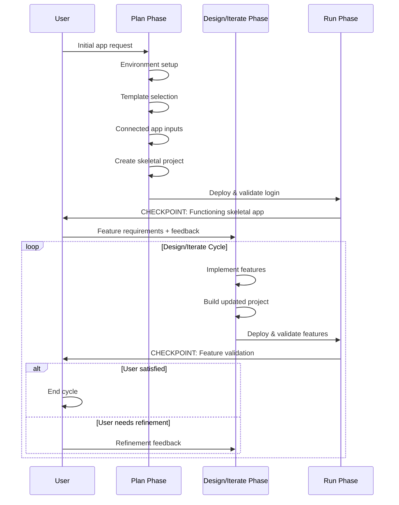
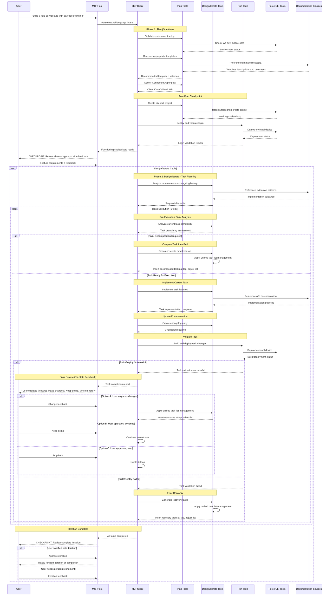

# Mobile Native App Generation - MCP Server Design

# Overview

This document outlines the specific requirements and technical design considerations for the **`@salesforce/mobile-native-mcp-server`** within the `mobile-mcp-tools` monorepo. This MCP server represents a revolutionary approach to native mobile app development, transforming natural language user intent directly into production-ready Salesforce Platform-based native mobile applications.

The Mobile Native App Generation server embodies the core vision of **prompt-to-app development**, eliminating the traditional complexity barriers that have historically forced customers to choose between optimal user experience and development feasibility. By leveraging existing Salesforce Mobile SDK tooling and comprehensive documentation grounding, this server enables anyone to create sophisticated native mobile applications through natural language interaction.

---

# High-Level Project Design

## Vision: Democratizing Native Mobile Development

For too long, mobile app development has forced an artificial choice between optimal user experience and development accessibility. Customers who want the responsive, intuitive, and engaging experience that only native mobile apps provide have been constrained by a "development skill tax"—the penalty paid in time, complexity, and expertise required to build truly excellent mobile experiences.

This paradigm made sense in the pre-generative-AI era, when technical complexity genuinely required specialized human expertise to navigate. However, with the advent of generative AI and agentic technology, we now have the tools to level this playing field. When customers are freed from technical constraints and asked what kind of mobile experience they truly want, the answer is overwhelmingly clear: the most responsive, attention-holding, intuitive, and productivity-enhancing experience possible. These experiences are optimally delivered through native mobile applications.

**The complexities of native mobile development are real and substantial.** Platform-specific toolchains, SDK integrations, build systems, and deployment workflows create multiplicative complexity far beyond the comparatively more straightforward approaches of e.g. mobile web development. This genuine technical complexity established a legitimate barrier to entry that was beyond most customers' reach.

Yet these technical hurdles need not be insurmountable for aspiring app creators. Through the skillful deployment of generative AI and agentic systems, we can make sophisticated native development accessible to anyone who can describe what they want to build. The underlying complexity remains—but it can be elegantly managed by expert systems that translate vision into implementation.

### The Agentic Mobile Development Revolution

This MCP server represents a fundamental shift in how mobile applications are created. Rather than forcing developers to master platform-specific expertise, complex toolchains, and intricate SDK integrations, we enable them to describe what they want to build in natural language and receive production-ready native mobile applications.

This isn't about replacing developers—it's about **eliminating artificial constraints** that have historically forced compromise between development feasibility and user experience quality. When agentic AI handles the technical complexity, developers can focus entirely on specifying desired outcomes while the system generates optimal implementations.

### From Intent to Impact: Four Transformative Shifts

Our vision rests on four fundamental transformations that redefine mobile developer experience:

1. **Machine-Actionable Documentation**: Documentation becomes executable intelligence—structured, tagged, and context-rich so AI assistants can reason about and act upon it, transforming more open-ended prompts into real project scaffolding

2. **Intent-Orchestrated Development**: Existing CLI tools and SDKs become composable building blocks orchestrated by natural language intent, with AI assistants acting as intelligent command planners

3. **IDE as Intelligent Partner**: Development environments transform from editors to guides, delivering contextual assistance, setup automation, and next-step suggestions exactly when and where needed

4. **Apps That Provide Live Feedback**: Generated applications provide immediate, structured runtime feedback to app developers, enabling fast iteration cycles and experience-driven decision making as they refine their mobile experiences

### The Ultimate Goal: Removing the Development Skill Tax

When we eliminate the artificial barriers between intent and implementation, we unlock a new class of mobile app creators who can build sophisticated native experiences without mastering specialized technical skills. Customers no longer sacrifice user experience quality for development feasibility—they simply describe what they want to build and receive the optimal implementation.

This transformation democratizes access to the pinnacle of mobile user experience while preserving the full power and sophistication of existing mobile development ecosystems. We're not replacing professional mobile development—we're making its capabilities accessible to anyone who can articulate their vision.

**The future of mobile development shifts the starting point from "figure it out" to "build what you imagined."**

## Core Design Principles

1. **Machine-Actionable Documentation**: Template metadata and extension guidance that LLMs can reason about and act upon
2. **Intent-Orchestrated CLIs**: Existing Force CLI tools become composable building blocks orchestrated by natural language intent
3. **IDE as Guide**: The development environment becomes an intelligent partner that transforms intent into working software
4. **Apps That Talk Back**: Generated applications provide immediate user experience feedback to developers, enabling fast iteration cycles and experience-driven refinement

### Machine-Actionable Documentation and Metadata

**Philosophy**: "Don't build tools, tell the LLM how to use what we already have."

**From Human-Readable to Machine-Actionable**: Documentation isn't just for humans—it's structured, tagged, and context-rich so LLMs can reason about and act upon it. We recognize that documentation exists in multiple forms throughout the development ecosystem:

- **Public Development Guides**: Official customer-facing documentation including development guides, best practices, tutorials, and architectural patterns
- **API Documentation**: Richly-described TypeScript declaration files, DocC comments (iOS), KDoc documentation (Android), and inline code documentation that provides semantic context about functionality and usage
- **Self-Describing CLI Tools**: Command-line interfaces that expose their capabilities, parameters, and usage patterns through built-in help systems and structured output formats

We embrace and extend all of these documentation outlets as sources of rich, contextual information that can guide agentic decision-making and provide prescriptive workflows for complex development scenarios.

- **Rich Template Metadata**: Each mobile SDK template includes comprehensive, structured documentation that goes beyond basic descriptions. This includes not only _what_ the template provides, but _how_ it works—covering design considerations, architectural decisions, extension scenarios, upgrade paths, common pitfalls, and integration patterns
- **Embedded Complete Examples**: Verifiable code examples that demonstrate exact implementation patterns
- **Clear Requirements and Dependencies**: Structured information about platform, version, prerequisites, and dependencies that can be programmatically validated
- **Documentation Grounding**: All guidance stems from official Salesforce documentation across all sources—public development guides, SDK API documentation, CLI tool specifications, and code-level documentation—ensuring accuracy and best practices while being machine-interpretable and actionable

**Enabling LLM Agency Through Knowledge**: This comprehensive documentation ecosystem enables sophisticated LLM autonomy and resilience:

- **Guided Autonomy**: Rich contextual information allows the LLM to make informed implementation decisions while staying grounded in best practices
- **Error Recovery**: When issues arise, comprehensive documentation provides the knowledge base for the LLM to adapt and self-correct rather than failing due to insufficient context
- **Adaptive Problem-Solving**: The LLM maintains the ability to reason through unexpected scenarios by drawing upon the full spectrum of available documentation and examples

### Assistant as Intelligent Guide

**Principle**: The assistant should be where the real developer experience begins—not just code generation, but understanding, suggesting, and adapting, wherever developers choose to work.

**From Tool to Partner**: The AI assistant becomes an intelligent guide that turns developer intent into working software by stitching together documentation, tools, and SDKs, meeting developers in their preferred environment.

- **Contextual Guidance**: All necessary documentation, setup instructions, and troubleshooting guidance delivered directly through the assistant interface, regardless of the developer's chosen environment
- **Environment Orchestration**: Comprehensive validation and intelligent setup of required tools (Xcode, Force CLI, simulators) orchestrated by the assistant across any development context
- **Adaptive Configuration**: Step-by-step mobile-specific OAuth and connected app configuration guidance delivered exactly when and where needed, whether in an IDE, terminal, or other development environment
- **Next-Step Suggestions**: The assistant doesn't just generate code—it suggests logical next steps based on current context and project state, maintaining continuity across different interaction modes
- **Real-Time Adaptation**: The assistant adapts its guidance based on the specific template, features being implemented, and current project configuration

### Intent-Orchestrated CLIs

**Philosophy**: CLI functionality provides the algorithmic foundation, removing the burden of imagination from agents for predictable tasks and freeing them to focus on complex feature integration.

**Division of Labor**: CLIs handle the algorithmically repeatable, well-defined operations while agents focus on the creative, feature-specific challenges that require reasoning and adaptation.

- **Algorithmic Foundation**: Leverage CLI tools (`forceios`, `forcedroid`) for deterministic, repeatable operations like project generation, dependency setup, and file templating
- **Predictable Scaffolding**: Use CLIs to establish the proven, tested structural foundation that agents can confidently build upon
- **Agent Focus on Value**: By offloading repetitive, algorithmic tasks to CLIs, agents can concentrate on the complex work of feature integration, user experience design, and adaptive problem-solving
- **Intelligent Orchestration**: Agents determine when and how to invoke CLI operations based on user intent, but rely on CLI precision for execution
- **Deterministic Base + Creative Extension**: Start with CLI-generated, working foundations, then layer agent-driven features and customizations on top
- **Error-Resistant Foundation**: CLIs provide tested, reliable base functionality, reducing the surface area where agents need to handle edge cases

## Three-Phase Workflow Architecture

### Workflow Overview

The three-phase workflow follows this pattern:

- **Plan phase** runs once during initial setup (includes template instantiation and connected app configuration)
- **Design/Iterate phase** can run multiple times across sequential user sessions (includes feature implementation and testing)
- **Run phase** is incorporated within Design/Iterate for validation and iteration

### Phase Workflow and Checkpoints



#### Checkpoint: Post-Plan Phase

By the end of the Plan phase, a functioning skeletal mobile app project must be in place. This checkpoint validates:

1. **Build Validation**: Ensure project builds successfully
2. **Runtime Validation**: Launch app in virtual device using Run phase tools
3. **Login Verification**: Ensure user can successfully login to the functioning app
4. **User Feedback Collection**: Prompt user for feedback to carry into Design/Iterate phase

#### Checkpoint: Post-Design/Iterate Phase

By the end of each Design/Iterate phase, the user validates implemented features:

1. **Build Validation**: Ensure updated project builds successfully
2. **Feature Deployment**: Deploy app to virtual device using Run phase tools
3. **Feature Validation**: User reviews implemented features in running app
4. **Satisfaction Check**: User determines if features meet requirements
   - **If satisfied**: End phase cycle
   - **If refinement needed**: Collect feedback and repeat Design/Iterate phase

### Phase 1: Plan

**Objective**: Establish environment and create functioning skeletal mobile app project.

#### Environment Setup

- Validate required development tools for chosen mobile platform using `@salesforce/lwc-dev-mobile-core` CLI plugin
- Leverage existing `sf force lightning local setup` command environment checks
- _Note: CLI plugin requires updates to support structured JSON output via `--json` flag_

#### Template Selection

- Determine optimal `forceios` or `forcedroid` project template based on user requirements
- Templates sourced from existing SalesforceMobileSDK-Templates repo or new template collection
- **CLI Enhancements Required**:
  - Support for template collection URIs in `forceios` and `forcedroid`
  - Collection-level metadata for template registry/directory
  - Template-specific metadata for self-describing projects

#### Template Metadata System

- **Collection Metadata**: Descriptive directory enabling LLM template selection
- **Template Metadata**: Rich project information including:
  - Nature of implemented features
  - Design and implementation considerations
- **Local Access**: All templates and metadata available locally per documentation repository approach
- _Note: Metadata system design details TBD_

#### Connected App Configuration

- Gather required Connected App Client ID and Callback URI
- Essential inputs for baseline mobile app project creation

#### Project Creation and Setup

- **Template-Based Project Generation**: Use `forceios`/`forcedroid` CLI tools to generate boilerplate app projects from Mobile SDK templates through keyword substitution
- **Connected App Integration**: CLI tools configure OAuth parameters in generated project files using provided Connected App credentials
- **Dependency Configuration**: Generated projects include properly configured CocoaPods/Swift Package Manager (iOS) or Gradle (Android) dependencies
- **Ready-to-Build Foundation**: CLI output creates immediately buildable projects using native platform build systems

### Phase 2: Design/Iterate

**Objective**: Transform user requirements into working features through iterative development cycles with continuous validation.

#### Pre-Conditions

- List of user requirements from initial utterance
- Functioning mobile app project based on selected Mobile SDK template that builds and deploys successfully
- User can login to launched app on virtual devices

#### Core Facility: Changelog System

- **Iteration Tracking**: Create sequential Markdown documents (`changelog-1.md`, `changelog-2.md`, etc.) in `changelog/` folder within mobile app project
- **Changelog Content**:
  - Date/time of change
  - User-consumable summary of iteration changes
  - Rationale for significant design decisions
  - **Structured Metadata** (machine-readable while preserving user readability):
    - `task_scope`: Brief categorization (e.g., "new_feature", "refactor", "bug_fix", "ui_enhancement")
    - `complexity_level`: Task complexity rating (e.g., "simple", "moderate", "complex")
    - `affected_components`: List of major code areas modified
    - `dependencies`: Tasks or features this iteration depends on
    - `validation_criteria`: Specific success criteria for the task
- **Purpose**: Provide chronological history and reasoning for future LLM iterations to inform decision-making

#### Workflow

**Goal**: Break work into reasonably-scoped tasks to ensure high quality and adherence to user requirements.

1. **Task Planning**
   - Analyze user feature utterances, local documentation store, and previous changelog docs
   - Create sequential/iterative task list to execute user requirements
   - Each task completion results in buildable and deployable app state
   - **Task Granularity Guidance**: MCP tools provide LLM with task sizing recommendations and execution strategies:
     - **Simple tasks**: Single UI component, basic configuration change, simple data model update, single file modifications
       - _Approach_: Execute as single atomic operation with immediate validation
       - _Validation_: Build, deploy, verify single feature works as expected
     - **Moderate tasks**: Feature integration, API endpoint implementation, complex UI workflow, multi-file coordinated changes
       - _Approach_: Break into 2-3 sub-steps, validate each step incrementally within the task
       - _Validation_: Build after each sub-step, deploy and test complete feature functionality
     - **Complex tasks**: Multi-component features, major architectural changes, cross-platform implementations, extensive refactoring
       - _Approach_: Decompose into 3-5 smaller tasks instead of executing as single complex task
       - _Execution_: Insert decomposed tasks at top of task list, adjust remaining tasks as needed
     - **Avoid**: Tasks affecting >3 major code areas simultaneously or requiring fundamental architecture changes
       - _Execution_: Always decompose into multiple moderate or simple tasks, insert at top of task list

2. **Iterative Task Execution** (Loop for tasks 1 to n)
   - **Execute Task**: Update mobile app project for current task
   - **Test Implementation**: Add/amend unit tests to validate implemented functionality
   - **Document Changes**: Create next sequential changelog file with structured metadata
   - **Validate Build**: Build and launch app with project changes
   - **Error Handling**: If build fails or critical issues arise:
     - Attempt immediate recovery through iterative fixes
     - If recovery impossible: rollback to previous "good" state and treat as fatal workflow error
     - Cease further task processing on fatal errors
   - **User Review**: Report task completion with tri-state feedback prompt:
     - _"I've completed [feature description]. Would you like to make changes? Or otherwise, would you like me to keep going with the next round of changes?"_
   - **Dynamic Task List Management**: Handle all task list adjustments through unified mechanism:
     - **User Feedback (Option A)**: Evaluate requested changes → insert new tasks at top of list → adjust remaining tasks
     - **Task Decomposition**: Complex task identified → decompose into smaller tasks → insert at top of list → adjust remaining tasks
     - **Error Recovery**: Build failure requiring fixes → insert recovery tasks at top of list → adjust remaining tasks
     - **Continue Execution (Option B)**: No adjustments needed → continue to next task in current list
     - **Stop Processing (Option C)**: Complete current iteration cycle → exit to post-iteration checkpoint

#### Integrated Build Process

Build capabilities are embedded throughout the Design/Iterate phase rather than being a separate phase:

- **Continuous Build Validation**: Every task completion includes automated build verification using native platform build tools (Xcode for iOS, Gradle for Android)
- **Build-First Approach**: Code changes are immediately validated through platform build process before user review
- **Native Build System Integration**: Direct orchestration of Xcode compilation/linking (iOS) and Gradle compilation/packaging (Android)
- **Build Error Recovery**: Build failures trigger automatic error recovery task insertion using unified task list management
- **CLI Tool Separation**: `forceios`/`forcedroid` handle project generation only; build validation uses native platform tooling

**Build Workflow Integration:**

1. **Task Implementation** → **Native Platform Build** → **Build Validation** → **Deploy & Test** → **User Review**
2. **Build Failure** → **Error Analysis** → **Recovery Task Generation** → **Task List Insertion** → **Retry Build**

#### Task Scoping Principles

- Focus on one feature set iteration at a time
- Maintain app in buildable/deployable state after each task
- Enable continuous user validation and feedback integration

### Phase 3: Run

**Overall Goal**: Provide developers with fast feedback on their app changes by building, deploying, and launching to virtual devices, enabling quick assessment of implementation details and user experience-driven iteration.

**Core Functionality**: Leverage existing CLI tooling to rapidly deploy app projects to configured virtual devices (iOS simulator, Android emulator), allowing developers to immediately see and interact with their changes.

- **CLI-Driven Deployment**: Utilize the `@salesforce/lwc-dev-mobile` Salesforce CLI plugin to automatically launch app projects to virtual devices
- **Fast Feedback Loop**: Enable immediate visual and interactive feedback on implementation changes, supporting experience-driven decision making
- **Virtual Device Integration**: Seamless deployment to iOS simulators and Android emulators for rapid testing and validation
- **User Experience Focus**: Prioritize developer assessment of user experience and interface changes over automated debugging
- **Iterative Validation**: Support quick build-deploy-test cycles that inform the next round of Design/Iterate phase improvements

**Implementation Details**: The CLI tooling functionality exists but requires restoration, as `@salesforce/lwc-dev-mobile` is currently deprecated and sparsely documented. The MCP server tools will orchestrate this CLI plugin to provide automated virtual device deployment.

---

# System Flow

The following sequence diagram illustrates the comprehensive workflow including checkpoints and iterative cycles:



---

# MCP Client Integration and Transport

## Standard MCP Compatibility

The server follows established Model Context Protocol standards for maximum ecosystem compatibility:

- **npx Invocation**: Standardized launch mechanism for frictionless integration

```bash
npx -y @salesforce/mobile-native-mcp-server
```

- **StdioServerTransport Communication**: Uses standard input/output streams per MCP specifications, ensuring broad MCP client compatibility

## Integration Approach

- **Multi-Tool Orchestration**: Complex workflows spanning multiple MCP tools with built-in coordination
- **State Management**: Maintains workflow context across tool calls while remaining stateless at the protocol level
- **Error Handling**: Graceful degradation with comprehensive guidance when issues arise

---

# MCP Server Properties

## Server Metadata

**Name:** `sfdc-mobile-native-mcp-server`  
**Description:** The `sfdc-mobile-native-mcp-server` MCP server provides a comprehensive collection of tools that enable prompt-to-app development for Salesforce Platform-based native mobile applications. The server orchestrates a three-phase workflow (Plan, Design/Iterate, Run) leveraging existing Mobile SDK tooling, templates, and documentation to transform natural language intent into production-ready native mobile applications.

## Tool Categories and Annotations

### Planning Tools

| Annotation        | Value   | Notes                                                                |
| :---------------- | :------ | :------------------------------------------------------------------- |
| `readOnlyHint`    | `false` | Environment validation may trigger installation guidance             |
| `destructiveHint` | `false` | No destructive operations, but may recommend software installation   |
| `idempotentHint`  | `true`  | Environment checks and template discovery produce consistent results |
| `openWorldHint`   | `true`  | May need to check local environment state and available templates    |

### Design Tools

| Annotation        | Value   | Notes                                                           |
| :---------------- | :------ | :-------------------------------------------------------------- |
| `readOnlyHint`    | `true`  | Generate specifications without modifying environment           |
| `destructiveHint` | `false` | Specification generation is non-destructive                     |
| `idempotentHint`  | `true`  | Same input produces consistent design specifications            |
| `openWorldHint`   | `false` | Operates on provided requirements without external dependencies |

### Execution Tools

| Annotation        | Value   | Notes                                                                |
| :---------------- | :------ | :------------------------------------------------------------------- |
| `readOnlyHint`    | `false` | Creates and modifies mobile application projects                     |
| `destructiveHint` | `false` | Creates new projects but doesn't modify existing unrelated files     |
| `idempotentHint`  | `false` | Project creation and feature implementation modify file system state |
| `openWorldHint`   | `true`  | Interacts with CLI tools, file system, and documentation sources     |

### Deployment Tools

| Annotation        | Value   | Notes                                                                   |
| :---------------- | :------ | :---------------------------------------------------------------------- |
| `readOnlyHint`    | `false` | Deploys applications to virtual devices                                 |
| `destructiveHint` | `false` | Deployment doesn't destroy existing applications                        |
| `idempotentHint`  | `false` | Deployment creates new application instances                            |
| `openWorldHint`   | `true`  | Requires interaction with deployment infrastructure and virtual devices |

---

# Technical Implementation

## Project Structure

Following the monorepo pattern established in `mobile-mcp-tools`:

```
mobile-native/
├── src/           # MCP server implementation
│   ├── tools/     # Phase-specific tool implementations
│   │   ├── plan/      # Environment validation, template discovery, project creation
│   │   ├── design-iterate/ # Task planning, feature implementation, changelog management, iteration orchestration
│   │   └── run/       # Deployment, validation, live feedback
│   ├── schemas/   # Zod schemas for tool inputs/outputs
│   └── utils/     # Shared utilities and CLI integrations
├── resources/     # Template metadata and documentation
│   ├── templates/     # Mobile SDK template descriptions and extension guides
│   ├── setup-guides/ # Environment setup instructions
│   └── api-docs/      # Mobile SDK API documentation excerpts
├── scripts/       # Project utilities and maintenance
├── tests/         # Comprehensive testing suite
└── package.json   # Project configuration and dependencies
```

## Generated Mobile App Project Structure (includes changelog system)

```
mobile-app-project/
├── changelog/     # Sequential iteration history
│   ├── changelog-1.md
│   ├── changelog-2.md
│   └── ...
├── [platform-specific files] # iOS/Android project structure
└── [standard mobile project files]
```

## Sample Changelog Structure

## changelog/changelog-1.md

```markdown
# Changelog Entry 1

**Date**: 2024-01-15 14:30:00
**Task Scope**: new_feature
**Complexity Level**: moderate
**Affected Components**: [ContactListView, ContactService, ContactModel]
**Dependencies**: [Base template, OAuth setup]
**Validation Criteria**: [Contact list displays, search functionality works, detail navigation functional]

## Summary

Implemented contact list feature with search and detail navigation capabilities.

## Changes Made

- Added ContactListView component with search bar
- Implemented ContactService for Salesforce Contact API integration
- Created ContactModel with proper field mapping
- Added navigation routing to contact detail screens

## Design Rationale

- Used standard iOS UITableView for performance with large contact lists
- Implemented local caching to reduce API calls and improve offline experience
- Followed Mobile SDK patterns for OAuth-authenticated API calls
```

## Tool Suite Organization

### Plan Phase Tools

- **Environment Validator**: Leverages `@salesforce/lwc-dev-mobile-core` CLI plugin to validate development tools for chosen mobile platform
- **Template Discoverer**: Analyzes user intent and recommends optimal `forceios` or `forcedroid` project templates using collection-level metadata
- **Template Metadata Manager**: Accesses self-describing template information including feature descriptions and implementation considerations
- **Connected App Configurator**: Gathers required Connected App Client ID and Callback URI for project creation
- **Project Generator**: Uses `forceios`/`forcedroid` CLI tools to generate boilerplate projects from templates via keyword substitution
- **Template Configuration Manager**: Handles parameter substitution and dependency setup in generated project files
- **Project Validation Controller**: Validates generated skeletal project builds and deploys successfully with login verification using native platform build tools

### Design/Iterate Phase Tools

- **Task Planning Orchestrator**: Analyzes user requirements, documentation, and changelog history to create sequential task lists with granularity guidance
- **Task Granularity Advisor**: Provides LLM with task sizing recommendations and decomposition strategies to ensure optimal task scoping
- **Dynamic Task List Manager**: Unified mechanism for all task list adjustments including:
  - User feedback integration (new tasks from change requests)
  - Task decomposition (complex tasks broken into smaller tasks)
  - Error recovery task insertion (build failure fixes)
  - Task prioritization and dependency management
- **Changelog Manager**: Creates and maintains sequential changelog files with structured metadata and design rationale
- **Iterative Task Executor**: Manages individual task execution cycles including code updates and test implementation
- **Integrated Build Manager**: Orchestrates continuous build validation throughout task execution using native platform build systems (Xcode/Gradle)
- **Build Validation Controller**: Ensures app remains in buildable/deployable state after each task completion with error recovery capabilities
- **Error Recovery Manager**: Handles build failures and implements rollback to previous stable states when necessary
- **Feature Implementer**: Adds requested functionality guided by design documents and documentation
- **Documentation Grounding Engine**: Provides real-time access to Mobile SDK documentation

### Run Phase Tools - Live Feedback Ecosystem

- **Deployment Orchestrator**: Manages application deployment to virtual devices and physical devices with live monitoring
- **Live Feedback Engine**: Captures and streams structured runtime events from running applications (logs, errors, analytics, network requests, auth issues, SDK misconfigurations)
- **Real-Time Diagnostic Assistant**: Uses live feedback to provide immediate troubleshooting and issue resolution suggestions
- **Validation Engine**: Verifies application functionality and user authentication while monitoring runtime health
- **Intelligent Error Recovery**: Automatically diagnoses common issues and provides specific fixes based on runtime feedback
- **Handoff Coordinator**: Prepares final application deliverables with established feedback loop for ongoing development

## Documentation Integration Strategy

### Template Metadata Management

- **Rich Descriptions**: Each template includes comprehensive metadata describing purpose, structure, and extension patterns
- **Extension Guidance**: Specific instructions for common scenarios (record type additions, feature integrations)
- **Best Practices**: Embedded guidance following official Mobile SDK documentation patterns

### Real-Time Documentation Access: Simple Document Store with Section Selectors

**Architecture Decision**: Implement a minimal documentation storage system where each MCP tool knows exactly which document and section it needs, eliminating complex lookup logic while maintaining local reliability.

#### Simple Documentation System Architecture

The documentation facility consists of two core components:

```typescript
// Minimal Documentation System
interface DocumentationSystem {
  documentStore: SimpleDocumentStore;
  updateManager: DocumentUpdateManager;
}
```

#### Document Configuration Schema

**Simple Document Storage**: Each MCP server lists the documents it needs, and each tool knows exactly which section to extract:

```typescript
interface DocumentationConfig {
  mcpServerName: string;
  documents: DocumentSource[];
  toolMappings: ToolDocumentMapping[];
  updateFrequency: UpdateFrequency;
}

interface DocumentSource {
  id: string; // Unique identifier for this document
  name: string; // Human-readable name
  url: string; // Source URL
  type: 'html' | 'markdown';
}

// Each tool maps to one or more document sections
interface ToolDocumentMapping {
  toolName: string; // e.g., "createiOSProject"
  documents: DocumentReference[]; // Can reference multiple documents/sections
  description: string; // What this documentation provides
}

interface DocumentReference {
  documentId: string; // References DocumentSource.id
  selector?: string; // CSS selector for HTML, simple path for Markdown. If omitted, returns whole document
  label?: string; // Optional label for this document section (e.g., "CLI Commands", "Authentication Setup")
}

// Example configuration for mobile-native MCP server (initial focus)
const mobileNativeDocsConfig: DocumentationConfig = {
  mcpServerName: 'sfdc-mobile-native-mcp-server',
  documents: [
    {
      id: 'forceios-cli-reference',
      name: 'Force iOS CLI Reference',
      url: 'https://developer.salesforce.com/docs/atlas.en-us.mobile_sdk.meta/mobile_sdk/native_ios_tools_forceios.htm',
      type: 'html',
    },
    {
      id: 'forcedroid-cli-reference',
      name: 'Force Android CLI Reference',
      url: 'https://developer.salesforce.com/docs/atlas.en-us.mobile_sdk.meta/mobile_sdk/native_android_tools_forcedroid.htm',
      type: 'html',
    },
    {
      id: 'mobile-auth-setup',
      name: 'Mobile SDK Authentication Setup',
      url: 'https://developer.salesforce.com/docs/atlas.en-us.mobile_sdk.meta/mobile_sdk/oauth_setup.htm',
      type: 'html',
    },
    {
      id: 'mobile-templates',
      name: 'Mobile SDK Template Overview',
      url: 'https://developer.salesforce.com/docs/atlas.en-us.mobile_sdk.meta/mobile_sdk/native_templates.htm',
      type: 'html',
    },
  ],
  toolMappings: [
    {
      toolName: 'createiOSProject',
      documents: [
        {
          documentId: 'forceios-cli-reference',
          selector: '.main .create-section',
          label: 'CLI Commands',
        },
        {
          documentId: 'mobile-templates',
          selector: '.ios-templates',
          label: 'iOS Templates',
        },
      ],
      description:
        'Instructions for creating iOS projects using forceios CLI and available templates',
    },
    {
      toolName: 'createAndroidProject',
      documents: [
        {
          documentId: 'forcedroid-cli-reference',
          selector: '.main .create-section',
          label: 'CLI Commands',
        },
        {
          documentId: 'mobile-templates',
          selector: '.android-templates',
          label: 'Android Templates',
        },
      ],
      description:
        'Instructions for creating Android projects using forcedroid CLI and available templates',
    },
    {
      toolName: 'configureAuthentication',
      documents: [
        {
          documentId: 'mobile-auth-setup',
          // No selector - returns whole document
          label: 'Complete Authentication Guide',
        },
      ],
      description: 'Complete OAuth and connected app configuration guide',
    },
    {
      toolName: 'selectProjectTemplate',
      documents: [
        {
          documentId: 'mobile-templates',
          selector: '.template-options',
          label: 'Template Options',
        },
      ],
      description: 'Available project templates and their use cases',
    },
  ],
  updateFrequency: 'weekly',
};
```

#### Simple Document Storage

**Minimal Processing**: Store whole documents in their native format and parse sections at runtime:

```typescript
interface SimpleDocumentStore {
  storeDocument(document: StoredDocument): Promise<void>;
  getDocument(documentId: string): Promise<StoredDocument | null>;
  getDocumentSection(documentId: string, selector?: string): Promise<string>;
  updateDocument(documentId: string, content: string): Promise<void>;
  listDocuments(): Promise<StoredDocument[]>;
}

interface StoredDocument {
  id: string;
  name: string;
  url: string;
  type: 'html' | 'markdown';
  content: string; // Raw HTML or Markdown content
  lastUpdated: Date;
}

// Built-in parsers for extracting sections
interface DocumentParser {
  extractSection(content: string, selector?: string): string;
}

class HtmlParser implements DocumentParser {
  extractSection(htmlContent: string, cssSelector?: string): string {
    if (!cssSelector) {
      return htmlContent; // Return whole document if no selector
    }
    // Use standard HTML parsing (e.g., jsdom) with CSS selectors
    // Returns the matched section as text/HTML
  }
}

class MarkdownParser implements DocumentParser {
  extractSection(markdownContent: string, pathSelector?: string): string {
    if (!pathSelector) {
      return markdownContent; // Return whole document if no selector
    }
    // Simple path-based selection for Markdown
    // e.g., "## Getting Started > ### Installation"
    // Returns the matched section as Markdown/text
  }
}
```

**Key Principles**:

- **Whole Document Storage**: Each document stored as a single database row in native format
- **Runtime Parsing**: Tools parse and extract sections when needed, not during ingestion
- **Built-in Parsers**: HTML and Markdown parsers included in the MCP server package
- **Flexible Tool Access**: Each tool can access one or more documents, with optional section selectors
- **Optional Selectors**: Tools can get whole documents (no selector) or specific sections (with selector)

#### Tool Interface for Documentation Access

**Direct Document Access**: Each tool accesses exactly the documentation section it needs:

```typescript
// Simple service that tools use to get their documentation
class DocumentationService {
  constructor(
    private documentStore: SimpleDocumentStore,
    private config: DocumentationConfig
  ) {}

  async getDocumentationForTool(toolName: string): Promise<ToolDocumentation> {
    // Find the mapping for this tool
    const mapping = this.config.toolMappings.find(m => m.toolName === toolName);
    if (!mapping) {
      throw new Error(`No documentation mapping found for tool: ${toolName}`);
    }

    // Get all document sections for this tool
    const sections = await Promise.all(
      mapping.documents.map(async docRef => {
        const content = await this.documentStore.getDocumentSection(
          docRef.documentId,
          docRef.selector
        );
        return {
          content,
          label: docRef.label || docRef.documentId,
          documentId: docRef.documentId,
        };
      })
    );

    return {
      sections,
      description: mapping.description,
    };
  }
}

interface ToolDocumentation {
  sections: DocumentationSection[];
  description: string;
}

interface DocumentationSection {
  content: string;
  label: string;
  documentId: string;
}
```

**Storage Implementation**:

- **SQLite Database**: Local, file-based storage for simplicity and reliability
- **Single Table**: Documents stored as rows with `id`, `content`, `type`, `url`, `lastUpdated`
- **Shared Database**: Single database shared across all MCP tools in the server
- **Local Deployment**: Self-contained storage within MCP server installations
- **No External Dependencies**: Standard Node.js libraries (SQLite, jsdom for HTML parsing)

#### Example Tool Implementation

**Simple Tool Usage**: Each tool directly gets its required documentation section:

```typescript
// Example MCP tool implementation
class CreateiOSProjectTool {
  constructor(private documentationService: DocumentationService) {}

  async execute(requirements: ProjectRequirements): Promise<ToolResult> {
    // Tool gets all its configured documentation sections
    const docs = await this.documentationService.getDocumentationForTool('createiOSProject');

    // Format multiple sections into response
    const formattedDocs = docs.sections
      .map(section => `## ${section.label}\n\n${section.content}`)
      .join('\n\n');

    return {
      content: [
        {
          type: 'text',
          text: `To create your iOS project, follow these steps:

${formattedDocs}

Based on your requirements:
- Project name: ${requirements.name}
- Template: ${requirements.template}
- Platform: iOS

Run the following command:
\`\`\`bash
forceios create --name ${requirements.name} --template ${requirements.template}
\`\`\`

Next steps: ${this.generateNextSteps(requirements)}`,
        },
      ],
    };
  }
}

class ConfigureAuthenticationTool {
  constructor(private documentationService: DocumentationService) {}

  async execute(): Promise<ToolResult> {
    // Gets the whole authentication document (no selector configured)
    const docs = await this.documentationService.getDocumentationForTool('configureAuthentication');

    return {
      content: [
        {
          type: 'text',
          text: `To configure authentication for your mobile app:

${docs.sections[0].content}

Make sure to save your Connected App consumer key and callback URL for the next steps.`,
        },
      ],
    };
  }
}
```

#### Document Update Manager

**Simple Update Process**: Periodically fetch fresh documentation from sources:

```typescript
interface DocumentUpdateManager {
  updateDocument(documentId: string, url: string): Promise<void>;
  updateAllDocuments(config: DocumentationConfig): Promise<void>;
}

class SimpleUpdateManager implements DocumentUpdateManager {
  constructor(private documentStore: SimpleDocumentStore) {}

  async updateDocument(documentId: string, url: string): Promise<void> {
    // Fetch fresh content from URL
    const response = await fetch(url);
    const content = await response.text();

    // Store updated document
    await this.documentStore.updateDocument(documentId, content);
  }

  async updateAllDocuments(config: DocumentationConfig): Promise<void> {
    for (const doc of config.documents) {
      await this.updateDocument(doc.id, doc.url);
    }
  }
}
```

#### GitHub Integration via Project Maintenance Utilities

**Simple Automated Updates**: Weekly documentation refresh via GitHub Actions:

```typescript
// Add to project-maintenance-utilities
export class DocumentationUpdateService {
  async updateMobileNativeDocumentation(): Promise<void> {
    const updateManager = new SimpleUpdateManager(documentStore);
    await updateManager.updateAllDocuments(mobileNativeDocsConfig);
  }
}
```

**GitHub Action Workflow**:

```yaml
# .github/workflows/update-documentation.yml
name: Update Documentation
on:
  schedule:
    - cron: '0 2 * * 1' # Weekly Monday 2AM
  workflow_dispatch:

jobs:
  update-docs:
    runs-on: ubuntu-latest
    steps:
      - uses: actions/checkout@v4
      - name: Setup Node.js
        uses: actions/setup-node@v4
        with:
          node-version: '18'
      - name: Update documentation
        run: npm run update-docs:mobile-native
      - name: Commit changes
        run: |
          git config --local user.email "action@github.com"
          git config --local user.name "GitHub Action"
          git add .
          git diff --staged --quiet || git commit -m "chore: update documentation"
          git push
```

#### Implementation Timeline and Phases

**Phase 1: Core Documentation Storage**

- Simple SQLite document store
- HTML and Markdown parsers (jsdom, marked)
- Basic DocumentationService for tools to access sections
- Initial mobile-native tool integration

**Phase 2: Mobile SDK Documentation**

- Ingest Force iOS/Android CLI documentation
- Configure tool mappings for createiOSProject, createAndroidProject, configureAuthentication
- Test section extraction with CSS selectors
- Implement automated GitHub Actions updates

**Phase 3: Polish and Reliability**

- Error handling for missing documents/selectors
- Markdown path selector implementation
- Performance optimization for document parsing
- Comprehensive testing

#### Simplified Package Structure

```
mobile-mcp-tools/
├── packages/
│   ├── mobile-native/                  # Enhanced with simple documentation
│   │   ├── src/
│   │   │   ├── tools/
│   │   │   │   ├── createiOSProject.ts
│   │   │   │   ├── createAndroidProject.ts
│   │   │   │   └── configureAuthentication.ts
│   │   │   ├── documentation/
│   │   │   │   ├── DocumentationService.ts
│   │   │   │   ├── SimpleDocumentStore.ts
│   │   │   │   ├── HtmlParser.ts
│   │   │   │   ├── MarkdownParser.ts
│   │   │   │   └── config.ts           # Tool mappings configuration
│   │   │   └── database/
│   │   │       └── docs.sqlite         # Local document storage
│   │   └── package.json
│   └── project-maintenance-utilities/   # Enhanced with simple doc updates
│       ├── src/services/implementations/
│       │   └── DocumentationUpdateService.ts
│       └── package.json
```

#### Benefits of Simple Document Store Approach

**vs. URL-Based Documentation Access:**

- **Reliability**: Local documentation eliminates network dependency failures
- **Performance**: Instant document access from local SQLite database
- **Offline**: Works in air-gapped or restricted network environments
- **Consistency**: Guaranteed documentation availability across all user environments

**vs. Complex RAG/Vector Database Systems:**

- **Deployment Simplicity**: No embedding models, vector databases, or complex dependencies
- **Startup Performance**: Instant initialization - just SQLite and standard parsers
- **Predictable Results**: Each tool knows exactly which document section it gets
- **Minimal Resource Usage**: Standard Node.js libraries only
- **Maintenance**: Simple document updates, no complex reindexing or embeddings

**Core Advantages:**

- **Tool-Driven Context**: Each tool knows exactly what documentation it needs (single or multiple documents)
- **Direct Mapping**: No complex lookup logic - tools directly access their configured sections
- **Runtime Parsing**: Parse document sections only when needed, not pre-processed
- **Standard Technologies**: HTML/CSS selectors and simple Markdown paths
- **Flexible Granularity**: Tools can access whole documents or specific sections as needed
- **No Black Box**: Clear, debuggable document → selector → content flow

**Implementation Benefits:**

- **Fast Development**: No need to build complex search/ranking systems
- **Easy Debugging**: Can inspect exact document content and selector results
- **Simple Configuration**: Just document URLs and CSS/path selectors per tool
- **Familiar Technologies**: Developers already know HTML selectors and Markdown structure

_Priority_: Critical for preventing API hallucination and ensuring generated code follows Mobile SDK best practices while maintaining maximum deployment simplicity and developer familiarity.

## CLI Tool Integration

### Force iOS Integration

- **Project Generation**: `forceios create` generates boilerplate apps from Mobile SDK templates through keyword substitution
- **Template Support**: `forceios createWithTemplate` enables custom template usage from GitHub repositories
- **Configuration Substitution**: Automated parameter replacement in info.plist and project configuration files
- **Dependency Setup**: Configures CocoaPods or Swift Package Manager dependencies from template specifications
- **Ready-to-Build Output**: Generates Xcode-compatible projects ready for immediate compilation

### Force Android Integration

- **Project Generation**: `forcedroid create` generates boilerplate apps from Mobile SDK templates through keyword substitution
- **Template Support**: `forcedroid createWithTemplate` enables custom template usage from GitHub repositories
- **Configuration Substitution**: Automated parameter replacement in Gradle configuration and AndroidManifest.xml files
- **Dependency Setup**: Configures Gradle dependencies from template specifications
- **Ready-to-Build Output**: Generates Android Studio-compatible projects ready for immediate compilation

## Workflow Orchestration

### State Management Between Phases

- **Design Document Persistence**: Maintain design specifications across Design/Iterate phase tool calls
- **Template Context**: Preserve template metadata and extension guidance throughout implementation
- **Error Context**: Maintain error state and recovery guidance across workflow phases

### User Interaction Patterns

- **Checkpoint Approvals**: Clear handoff points for user review and approval
- **Progress Reporting**: Transparent communication of workflow progress and next steps
- **Error Recovery**: Graceful failure handling with clear guidance for resolution

---

# Security Requirements and Considerations

This project adheres to security best practices established for MCP servers in the AI-assisted development ecosystem.

## Security Profile

| **Security Consideration**  | **Status** | **Notes**                                                        |
| :-------------------------- | :--------- | :--------------------------------------------------------------- |
| **Local Development Focus** | Secure     | All operations target local development environment only         |
| **CLI Tool Interaction**    | Controlled | Uses established Salesforce CLI tools with validated parameters  |
| **Documentation Sources**   | Public     | All documentation sources are public Mobile SDK materials        |
| **User Data**               | None       | No user-specific data stored or transmitted                      |
| **Code Generation**         | Validated  | Generated code follows established Mobile SDK patterns           |
| **External Dependencies**   | Minimal    | Limited to Salesforce CLI tools and established Node.js packages |

## Security Considerations

- **CLI Execution Safety**: All CLI tool invocations use validated parameters and established patterns
- **Template Security**: Mobile SDK templates are sourced from official Salesforce repositories
- **Documentation Integrity**: Documentation sources verified against official Salesforce Mobile SDK materials
- **Local Environment**: All operations contained within user's local development environment

---

# MCP Host Compatibility

## Engineering Standard: Broad MCP Host Compatibility

| **MCP Specification Compliance** | ✅  | Strict adherence to official Model Context Protocol specifications        |
| :------------------------------- | :-: | :------------------------------------------------------------------------ |
| **Open Source Node.js Package**  | ✅  | Published to NPM for broad ecosystem access                               |
| **Domain-Specific Tool Naming**  | ✅  | All tools prefixed with `sfmobile-native` for clear identification        |
| **npx Invocation Support**       | ✅  | Standard `npx -y @salesforce/mobile-native-mcp-server` invocation pattern |
| **stdio Transport**              | ✅  | Standard input/output communication per MCP specifications                |
| **Cross-Host Testing**           | ✅  | Validated against multiple MCP hosts for broad compatibility              |

## Product Priority: Salesforce Platform Integration

### Primary Integration Targets

**Agentforce for Developers (A4D)**:

- Optimized for A4D's MCP Host and Client infrastructure
- Enhanced tool discovery for VSCode development workflows
- Comprehensive testing within A4D environments
- Support for A4D development patterns and enterprise integration

**Salesforce Studio Integration**:

- Strategic alignment with Salesforce Studio roadmap
- Foundation for prompt-to-app capabilities within Salesforce's primary development platform
- Stepping stone toward comprehensive Salesforce development experience

---

# Future Expansion and Roadmap

## Template Ecosystem Evolution

### From App Templates to Feature Templates

**Long-term Vision**: Transition from monolithic app templates to composable feature templates enabling mix-and-match functionality.

- **Current State**: App-focused templates (Field Service App, Sales App, etc.)
- **Future State**: Feature-focused templates (Authentication, Sync, Object Explorer, etc.)
- **Benefits**: Reduced template proliferation, increased customization flexibility, improved LLM comprehension

### Template Metadata Enhancement

- **Interactive Guidance**: Templates with embedded decision trees for extension scenarios
- **Dependency Mapping**: Clear relationships between features and required configurations
- **Version Management**: Template versioning aligned with Mobile SDK releases

## Documentation Integration Advancement

### Real-Time Documentation Access

**Priority**: Resolve documentation integration challenges identified in research phase.

**Investigation Areas**:

- **Salesforce Documentation API**: Direct integration with official documentation systems
- **Semantic Documentation Search**: Advanced vectorization and retrieval for context-specific guidance
- **Dynamic Documentation Updates**: Automatic synchronization with Mobile SDK documentation changes

### LLM Grounding Enhancement

- **Type System Integration**: Direct access to Mobile SDK TypeScript definitions
- **API Validation**: Real-time validation of generated code against current Mobile SDK APIs
- **Best Practice Enforcement**: Automated adherence to Mobile SDK coding standards and patterns

## Advanced Workflow Capabilities

### Live Feedback and Real-Time Debugging

**Priority**: Implement comprehensive "Apps That Talk Back" capability for revolutionary debugging experience.

- **Structured Runtime Events**: Generated applications stream comprehensive runtime data including logs, errors, analytics, network requests, auth issues, and SDK misconfigurations
- **Intelligent Error Diagnosis**: AI assistant analyzes live feedback in real-time to provide immediate troubleshooting and specific resolution guidance
- **Conversational Debugging**: Transform trial-and-error debugging into intelligent iteration through live app feedback
- **Performance Monitoring**: Real-time analysis of app performance with AI-driven optimization suggestions
- **Feature Flag Integration**: Live feedback about feature states and configuration issues with automatic resolution suggestions

### Multi-Platform Support

- **Cross-Platform Templates**: Templates supporting both iOS and Android from single specification
- **Platform-Specific Optimization**: Automatic platform-specific feature implementation
- **Unified Development Experience**: Consistent workflow across mobile platforms

### Integration Ecosystem Expansion

- **Experience Cloud Integration**: Native app templates with Experience Cloud connectivity
- **Agentforce Integration**: Templates with embedded Agentforce agent capabilities
- **Salesforce Data Cloud**: Advanced sync and analytics integration templates

## Quality and Reliability Enhancement

### Automated Testing Integration

- **Generated Code Validation**: Automatic testing of generated mobile applications
- **Template Regression Testing**: Continuous validation of template metadata and extension guidance
- **End-to-End Workflow Testing**: Comprehensive testing of Plan → Design/Iterate → Run workflows

### Error Recovery and Self-Healing

- **Intelligent Error Analysis**: Advanced diagnosis of common development issues
- **Automated Resolution**: Self-healing capabilities for common configuration and build problems
- **Learning from Failures**: Continuous improvement based on user interaction patterns

---

# Success Metrics and Evaluation

## Core Success Criteria

### User Experience Metrics

- **Time to Working App**: Measure from initial prompt to deployable application
- **User Intervention Required**: Track instances requiring manual user action outside MCP workflow
- **Success Rate**: Percentage of prompts resulting in working, deployable applications

### Technical Quality Metrics

- **Generated Code Quality**: Adherence to Mobile SDK best practices and coding standards
- **Template Coverage**: Percentage of user intents successfully matched to appropriate templates
- **Documentation Grounding Effectiveness**: Reduction in API hallucination and incorrect implementations

### Ecosystem Integration Metrics

- **MCP Host Compatibility**: Successful operation across target MCP client environments
- **CLI Tool Integration**: Reliability of Force iOS/Android CLI interactions
- **Template Extension Success**: Effectiveness of template metadata in guiding feature additions

## Evaluation Framework

### Automated Evaluation Pipeline

- **Component Testing**: Individual tool validation against known inputs/outputs
- **Integration Testing**: End-to-end workflow testing with realistic user scenarios
- **Regression Testing**: Continuous validation against Mobile SDK updates and changes

### User Study Validation

- **Developer Experience Studies**: Comparative analysis against traditional mobile development workflows
- **Learning Curve Assessment**: Time to productivity for developers new to Mobile SDK
- **Feature Completion Analysis**: Success rates for complex, multi-feature application requirements

---

# TODO: Implementation Specification Details

The following areas require detailed specification before implementation begins:

## Template Metadata Schema Definition

- **Formal Schema**: Zod-based schema for template metadata structure
- **Extension Pattern Specification**: Standardized format for describing template extension scenarios
- **Validation Rules**: Automated validation of template metadata completeness and accuracy

## CLI Tool Integration Specification

- **Parameter Mapping**: Detailed mapping of user requirements to CLI tool parameters
- **Error Handling**: Comprehensive error scenarios and recovery strategies for CLI tool failures
- **Version Compatibility**: Strategy for handling different versions of Force CLI tools

## Documentation Integration Architecture

- **Documentation Source Management**: Automated processes for maintaining current Mobile SDK documentation
- **Context Retrieval Strategy**: Algorithms for selecting relevant documentation based on user intent and implementation context
- **API Evolution Handling**: Processes for adapting to Mobile SDK API changes and deprecations

## Workflow Orchestration Implementation

- **State Management**: Technical specification for maintaining context across workflow phases
- **Checkpoint Implementation**: User interaction patterns and approval workflows
- **Error Recovery Workflows**: Detailed specifications for handling failures at each workflow phase

## Live Feedback and Runtime Integration Implementation

- **Runtime Event Schema**: Structured data formats for streaming logs, errors, analytics, and configuration issues from running applications
- **Feedback Transport Layer**: Secure communication channels between running applications and IDE/AI assistant
- **Real-Time Analysis Engine**: AI capabilities for immediate diagnosis and resolution of runtime issues based on live feedback
- **Device Integration**: Support for both virtual devices (simulators/emulators) and physical devices with consistent feedback streams
- **Privacy and Security**: Ensure live feedback mechanisms maintain user privacy and data security standards

## Quality Assurance Framework

- **Testing Strategy**: Comprehensive testing approach covering unit, integration, and end-to-end scenarios
- **Evaluation Metrics**: Specific, measurable criteria for assessing tool effectiveness and user experience
- **Continuous Improvement**: Feedback loops and improvement processes based on user interactions and outcomes

---

_This document represents the foundational requirements for the Mobile Native App Generation MCP server. Implementation should proceed iteratively, validating core assumptions through prototyping and user feedback while maintaining alignment with the broader vision of democratizing native mobile app development._
