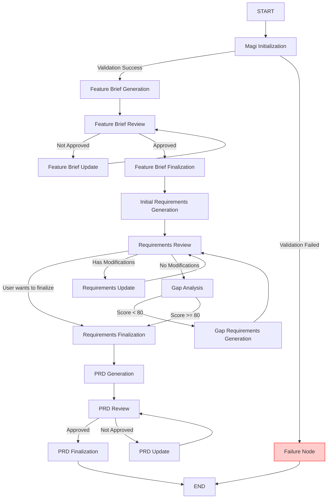

# PRD Generation Workflow Architecture

## Overview

The PRD (Product Requirements Document) Generation Workflow is a comprehensive AI-powered system that orchestrates the creation of high-quality product requirements documents for Salesforce mobile native applications. This workflow implements a sophisticated iterative process that combines automated generation with human review to ensure requirements quality and completeness.

## Workflow Overview

> Note: once we have an abstracted workflow pattern this will be further broken down into smaller workflow (i.e. feature brief workflow, prd workflow)

### Phase 1: Initialization and Feature Brief
- **Initialize** project and extract user requirements
- **Generate** feature brief from user utterance
- **Review** feature brief with user approval

### Phase 2: Initial Requirements Generation
- **Generate** initial functional requirements from feature brief
- **Review** requirements with user/stakeholder approval

### Phase 3: Gap Analysis and Iteration
- **Review** requirements with user/stakeholder approval
- **Update** requirements based on review feedback (if modifications needed)
- **Analyze** gaps in requirements coverage
- **Generate** additional requirements to address gaps (if needed)
- **Finalize** requirements (update status to approved)

### Phase 4: PRD Generation
- **Generate** comprehensive PRD document
- **Review** PRD for quality and completeness
- **Update** PRD based on review feedback (if modifications needed)
- **Finalize** PRD (update status to finalized)

### Phase 5: Completion
- **Complete** workflow

## Workflow Diagram



## Architecture Components

### Node Types

There are two base node classes in the PRD workflow:

> NOTE: there is a lot of overlap from the normal magen workflow here, these will be refactored in the future
> to share the same abstracted orchestrator/nodes.

1. **`PRDBaseNode`** - Base class for all nodes
   - Provides standard node name and execution interface
   - Used for state transformation without tool invocation

2. **`PRDAbstractToolNode`** - Extends `PRDBaseNode`
   - Adds tool execution capabilities
   - Provides standardized logging and error handling
   - Includes `executeToolWithLogging()` for safe tool invocation

## Node Details

### 1. Magi Initialization Node
**Class:** `PRDMagiInitializationNode`  
**Type:** Base Node (no tools)

**Purpose:** Initializes the PRD workflow by validating inputs and creating the necessary directory structure.

**Responsibilities:**
- Validates that `projectPath` is provided in user input
- Validates that `userUtterance` is provided
- Ensures the `magi-sdd` directory exists in the project
- Returns validated paths and user utterance

**Key State Updates:**
- Sets `projectPath` - the root project directory
- Sets `userUtterance` - the user's original request
- Sets `prdWorkflowFatalErrorMessages` - array of error messages if initialization fails

**Error Handling:**
- If `projectPath` or `userUtterance` is missing: throws an Error (orchestrator catches and routes to failure)
- If directory creation fails: sets `prdWorkflowFatalErrorMessages` with error details (router will route to failure)
- The router (`PRDInitializationValidatedRouter`) checks for `prdWorkflowFatalErrorMessages` and routes to failure node if present

---

### 2. Feature Brief Generation Node
**Class:** `PRDFeatureBriefGenerationNode`  
**Type:** Tool Node  
**Tool:** `magi-prd-feature-brief`

**Purpose:** Generates a structured feature brief from the user's original utterance.

**Responsibilities:**
- Calls the feature brief generation tool
- Retrieves existing feature IDs to ensure uniqueness
- Creates feature directory structure
- **Writes feature brief file immediately with "draft" status**
- Generates recommended feature ID

**Tool Input:**
```typescript
{
  userUtterance: string,
  currentFeatureIds: string[]
}
```

**Note:** All tools now follow a consistent pattern where file paths are passed instead of file content. The LLM is instructed to read files from the provided paths.

**Tool Output:**
```typescript
{
  featureBriefMarkdown: string, // Includes Status section with "draft" status
  recommendedFeatureId: string
}
```

**Key State Updates:**
- Sets `featureId` - unique identifier for the feature
- Content is always read from file (not stored in state)

**Output Files:**
- **Creates file immediately**: `{projectPath}/magi-sdd/{featureId}/feature-brief.md`
- File includes Status section with "draft" status
- Directory is created: `{projectPath}/magi-sdd/{featureId}/` (calculated on-demand)

**Note:** 
- This node is ONLY for initial generation. For iterations/updates, see Feature Brief Update Node.
- The feature brief file is **written immediately** with draft status, not after approval.

---

### 3. Feature Brief Update Node
**Class:** `PRDFeatureBriefUpdateNode`  
**Type:** Tool Node  
**Tool:** `magi-prd-feature-brief-update`

**Purpose:** Updates an existing feature brief based on user feedback and modification requests from the review process. This node is specifically designed for iteration scenarios after a feature brief has been reviewed and not approved.

**Responsibilities:**
- Reads existing feature brief content from file
- Incorporates user feedback and requested modifications
- **Writes updated feature brief file immediately with "draft" status**
- Maintains the same feature ID throughout iterations

**Tool Input:**
```typescript
{
  featureBriefPath: string, // Path to the feature brief file
  reviewResult: {
    approved: boolean, // Always false for update node
    modifications?: Array<{
      section: string,
      modificationReason: string,
      requestedContent: string
    }>
  }
}
```

**Tool Output:**
```typescript
{
  featureBriefMarkdown: string // Updated feature brief content with Status section set to "draft"
}
```

**Key State Updates:**
- Preserves `featureId` (no changes)
- Clears review state after update
- Content is always read from file (not stored in state)

**Output Files:**
- **Writes file immediately**: `{projectPath}/magi-sdd/{featureId}/feature-brief.md`
- File includes Status section with "draft" status

**Key Differences from Generation Node:**
- **Generation Node**: Creates new feature brief from scratch
- **Update Node**: Revises existing feature brief based on feedback
- **Update Node**: Always reuses existing directory and feature ID
- **Update Node**: Incorporates review feedback and modifications
- **Update Node**: Reads file from path (LLM reads the file)

**Note:** After update, routes back to Feature Brief Review Node for another review cycle.

---

### 4. Feature Brief Review Node
**Class:** `PRDFeatureBriefReviewNode`  
**Type:** Tool Node  
**Tool:** `magi-prd-feature-brief-review` (MagiFeatureBriefReviewTool)

**Purpose:** Facilitates user review and approval of the generated feature brief. Returns only review feedback without modifying the file.

**Responsibilities:**
- Presents feature brief for review
- Captures approval/rejection/modification decisions
- Records user feedback
- Generates review summary
- **Returns only feedback** - does not modify the file directly

**Tool Input:**
```typescript
{
  featureBriefPath: string // Path to the feature brief file
}
```

**Tool Output:**
```typescript
{
  approved: boolean,
  modifications?: Array<{
    section: string,
    modificationReason: string,
    requestedContent: string
  }>
}
```

**Key State Updates:**
- Sets `isFeatureBriefApproved` - approval status
- Sets `featureBriefModifications` - requested modifications

**Workflow Behavior:**
- If approved → route to Feature Brief Finalization Node
- If modifications needed → route to Feature Brief Update Node
- The update node applies modifications, then routes back to review
- The finalization node updates status to "approved" when approved

**CRITICAL:** This node only collects feedback. File modifications are handled by separate update and finalization nodes.

---

### 5. Feature Brief Finalization Node
**Class:** `PRDFeatureBriefFinalizationNode`  
**Type:** Tool Node  
**Tool:** `magi-prd-feature-brief-finalization` (MagiFeatureBriefFinalizationTool)

**Purpose:** Finalizes the feature brief by updating the status to "approved" after user approval.

**Responsibilities:**
- Reads feature brief file from path
- Updates status section from "draft" to "approved"
- Writes finalized feature brief file back to disk
- Preserves all other content unchanged

**Tool Input:**
```typescript
{
  featureBriefPath: string // Path to the feature brief file
}
```

**Tool Output:**
```typescript
{
  finalizedFeatureBriefContent: string // Updated feature brief with status "approved"
}
```

**Key State Updates:**
- Returns empty state (content is always read from file)

**Output Files:**
- **Updates file**: `{projectPath}/magi-sdd/{featureId}/feature-brief.md`
- Status section updated from "draft" to "approved"
- All other content preserved exactly as-is

**Workflow Behavior:**
- Executed only when feature brief is approved
- After finalization, workflow proceeds to Initial Requirements Generation

---

### 6. Initial Requirements Generation Node
**Class:** `PRDInitialRequirementsGenerationNode`  
**Type:** Tool Node  
**Tool:** `magi-prd-initial-requirements` (MagiInitialRequirementsTool)

**Purpose:** Analyzes the feature brief to generate initial requirements and create the requirements.md file.

**Responsibilities:**
- Invokes initial requirements generation tool
- **Writes requirements.md file immediately with "draft" status**

**Tool Input:**
```typescript
{
  featureBriefPath: string // Path to the feature brief file
}
```

**Tool Output:**
```typescript
{
  requirementsMarkdown: string // Complete requirements.md file content with Status section set to "draft"
}
```

**Key State Updates:**
- Returns empty state (content is always read from file)

**Output Files:**
- **Creates file immediately**: `{projectPath}/magi-sdd/{featureId}/requirements.md`
- File includes Status section with "draft" status
- File contains initial requirements marked as pending review

---

### 7. Requirements Review Node
**Class:** `PRDRequirementsReviewNode`  
**Type:** Tool Node  
**Tool:** `magi-prd-requirements-review` (MagiRequirementsReviewTool)

**Purpose:** Facilitates user/stakeholder review of functional requirements. Returns only review feedback without modifying the file.

**Responsibilities:**
- Presents requirements for review
- Captures approval/rejection/modification decisions
- Records user feedback
- Generates review summary
- **Asks user if they want to finalize requirements** (userIterationPreference)
- **Returns only feedback** - does not modify the file directly

**Tool Input:**
```typescript
{
  requirementsPath: string // Path to the requirements.md file
}
```

**Tool Output:**
```typescript
{
  approvedRequirementIds: string[],
  rejectedRequirementIds: string[],
  modifications?: Array<{
    requirementId: string,
    modificationReason: string,
    requestedChanges: {
      title?: string,
      description?: string,
      priority?: 'high' | 'medium' | 'low',
      category?: string
    }
  }>,
  userIterationPreference?: boolean // Optional: true = finalize now, false/undefined = continue
}
```

**Key State Updates:**
- Sets `approvedRequirementIds` - approved requirement IDs
- Sets `rejectedRequirementIds` - rejected requirement IDs
- Sets `requirementModifications` - modification requests
- Sets `userIterationPreference` - user decision to finalize or continue

**Workflow Behavior:**
- If `userIterationPreference === true` → route directly to Requirements Finalization
- If modifications exist → route to Requirements Update Node
- Otherwise → route to Gap Analysis Node
- The update node applies modifications, then routes back to review

**CRITICAL:** This node only collects feedback. File modifications are handled by the separate Requirements Update Node.

---

### 8. Requirements Update Node
**Class:** `PRDRequirementsUpdateNode`  
**Type:** Tool Node  
**Tool:** `magi-prd-requirements-update` (MagiRequirementsUpdateTool)

**Purpose:** Updates the requirements.md file based on review feedback. Applies approved, rejected, and modification decisions to the requirements document.

**Responsibilities:**
- Reads requirements.md file from path
- Applies review feedback (approvals, rejections, modifications)
- Updates requirements document structure
- Writes updated requirements.md file back to disk

**Tool Input:**
```typescript
{
  requirementsPath: string, // Path to the requirements.md file
  reviewResult: {
    approvedRequirementIds: string[],
    rejectedRequirementIds: string[],
    modifications?: Array<{
      requirementId: string,
      modificationReason: string,
      requestedChanges: {
        title?: string,
        description?: string,
        priority?: 'high' | 'medium' | 'low',
        category?: string
      }
    }>,
    userIterationPreference?: boolean
  }
}
```

**Tool Output:**
```typescript
{
  updatedRequirementsContent: string // Updated requirements.md with review decisions applied
}
```

**Key State Updates:**
- Clears review state after update

**Output Files:**
- **Updates file**: `{projectPath}/magi-sdd/{featureId}/requirements.md`
- Applies all review decisions (approved, rejected, modified)
- Maintains review history

**Workflow Behavior:**
- After update, routes back to Requirements Review Node for another review cycle

---

### 9. Gap Analysis Node
**Class:** `PRDGapAnalysisNode`  
**Type:** Tool Node  
**Tool:** `magi-prd-gap-analysis` (MagiGapAnalysisTool)

**Purpose:** Analyzes requirements for gaps, incompleteness, and quality issues.

**Responsibilities:**
- Compares approved requirements against feature brief
- Identifies missing functionality
- Provides overall gap analysis score
- **Excludes rejected and out-of-scope requirements** from gap suggestions

**Note:** Gap schemas (`GAP_SCHEMA` and `SUGGESTED_REQUIREMENT_SCHEMA`) are defined in `shared/gapSchemas.ts` and shared between gap analysis and gap requirements generation tools.

**Tool Input:**
```typescript
{
  featureBriefPath: string, // Path to the feature brief file
  requirementsPath: string // Path to the requirements.md file
}
```

**Tool Behavior:**
The tool receives file paths and instructs the LLM to read both files. The tool performs gap analysis excluding explicitly rejected/out-of-scope items, focusing on approved and modified requirements.

**Tool Output:**
```typescript
{
  gapAnalysisEvaluation: 'Excellent' | 'Good' | 'Fair' | 'Poor', // Textual evaluation of requirements quality
  identifiedGaps: Array<Gap>
}

// The textual evaluation is converted to a numeric score (0-100) internally:
// - Excellent: 90
// - Good: 75
// - Fair: 60
// - Poor: 40

// Gap schema (from shared/gapSchemas.ts):
type Gap = {
  id: string, // Unique identifier for the gap
  title: string, // Title of the identified gap
  description: string, // Detailed description of the gap
  severity: 'critical' | 'high' | 'medium' | 'low', // Severity of the gap
  category: string, // Category of the gap
  impact: string, // Description of the impact if this gap is not addressed
  suggestedRequirements: Array<SuggestedRequirement> // Suggested requirements to address this gap
}

// SuggestedRequirement schema (from shared/gapSchemas.ts):
type SuggestedRequirement = {
  title: string, // Suggested requirement title
  description: string, // Suggested requirement description
  priority: 'high' | 'medium' | 'low', // Suggested priority
  category: string // Suggested category
}
```

**Key State Updates:**
- Sets `gapAnalysisScore` - numeric score (0-100) extracted from textual evaluation
- Sets `identifiedGaps` - array of identified gaps (excludes rejected/out-of-scope items)

**Note:** The tool uses textual evaluations ("Excellent", "Good", "Fair", "Poor") instead of direct numeric scoring, as textual evaluations are more reliable for LLMs. The textual evaluation is converted to a numeric score internally for workflow routing decisions.

**Note:** The `userIterationPreference` decision is now captured during Requirements Review, not during Gap Analysis.

---

### 10. Gap Requirements Generation Node
**Class:** `PRDGapRequirementsGenerationNode`  
**Type:** Tool Node  
**Tool:** `magi-prd-gap-requirements` (MagiGapRequirementsTool)

**Purpose:** Generates additional requirements to address identified gaps and updates the requirements.md file.

**Responsibilities:**
- Uses gap analysis results to propose new requirements
- Ensures no duplication with existing approved requirements
- Ensures no duplication with rejected/out-of-scope requirements
- Addresses high/critical severity gaps first
- **Writes updated requirements.md file immediately with "draft" status**

**Tool Input:**
```typescript
{
  featureBriefPath: string, // Path to the feature brief file
  requirementsPath: string, // Path to the requirements.md file
  identifiedGaps: Array<Gap> // Array of Gap objects (from shared/gapSchemas.ts)
}
```

**Tool Behavior:**
The tool receives file paths and instructs the LLM to read both files. The tool extracts:
- Approved requirements (to avoid duplicates)
- Rejected requirements (to avoid regenerating)
- Out-of-scope requirements (to avoid regenerating)
Then generates new requirements addressing gaps while avoiding all excluded items. New requirements are appended to the "Pending Review Requirements" section.

**Tool Output:**
```typescript
{
  updatedRequirementsMarkdown: string // Complete updated requirements.md file content with new requirements appended, Status remains "draft"
}
```

**Key State Updates:**
- Returns empty state (content is always read from file)

**Output Files:**
- **Updates file immediately**: `{projectPath}/magi-sdd/{featureId}/requirements.md`
- File includes all existing requirements plus new requirements appended
- Status section remains "draft"

**Workflow Behavior:**
- Generates new requirements based on gaps
- Uses suggested requirements from gap analysis as starting points
- Assigns appropriate priorities based on gap severity
- Returns to requirements review node after generation

---

### 11. Requirements Finalization Node
**Class:** `PRDRequirementsFinalizationNode`  
**Type:** Tool Node  
**Tool:** `magi-prd-requirements-finalization` (MagiRequirementsFinalizationTool)

**Purpose:** Finalizes the requirements.md file by ensuring all requirements are reviewed and updating the status to "approved" before proceeding to PRD generation.

**Responsibilities:**
- Ensures all pending requirements have been reviewed
- Updates status section from "draft" to "approved"
- Writes finalized requirements.md file back to disk

**Tool Input:**
```typescript
{
  requirementsPath: string // Path to the requirements.md file
}
```

**Tool Output:**
```typescript
{
  finalizedRequirementsContent: string // Complete requirements.md file content with Status section set to "approved"
}
```

**Key State Updates:**
- Returns empty state (content is always read from file)

**Output Files:**
- **Updates file**: `{projectPath}/magi-sdd/{featureId}/requirements.md`
- Status section is updated from "draft" to "approved"
- All pending requirements should have been reviewed and moved to appropriate sections

**Workflow Behavior:**
- This node is executed when:
  - User explicitly wants to finalize (`userIterationPreference === true` during review), OR
  - Gap analysis score is >= 80 (automatic threshold, where score is extracted from textual evaluation)
- It serves as the explicit point where requirements are finalized before PRD generation
- After finalization, the workflow proceeds to PRD generation

---

### 12. PRD Generation Node
**Class:** `PRDGenerationNode`  
**Type:** Tool Node  
**Tool:** `magi-prd-generation` (MagiPRDGenerationTool)

**Purpose:** Generates the complete Product Requirements Document from approved requirements.

**Responsibilities:**
- Generates comprehensive PRD document
- Creates traceability table
- Sets document metadata
- Writes PRD.md file with "draft" status

**Tool Input:**
```typescript
{
  featureBriefPath: string, // Path to the feature brief file
  requirementsPath: string // Path to the requirements.md file
}
```

**Tool Behavior:**
The tool receives file paths and instructs the LLM to read both files. The tool extracts:
- Approved requirements (included in PRD)
- Modified requirements (included in PRD with modification notes)
Excluded items (rejected/out-of-scope) are not included in the PRD.

**Tool Output:**
```typescript
{
  prdContent: string // Full markdown PRD content
}
```

**Key State Updates:**
- Sets `prdContent` - full PRD markdown (for backward compatibility)
- PRD file is written to `{projectPath}/magi-sdd/{featureId}/prd.md` (calculated on-demand)
- Status is set to "draft"

**PRD Structure:**
1. Document Status (author, date, status)
2. Feature Brief
3. Functional Requirements
4. Traceability Table

---

### 13. PRD Review Node
**Class:** `PRDReviewNode`  
**Type:** Tool Node  
**Tool:** `magi-prd-review` (MagiPRDReviewTool)

**Purpose:** Facilitates final review and approval of the complete PRD document. Returns only review feedback without modifying the file.

**Responsibilities:**
- Presents PRD document for review
- Captures approval/modification decisions
- Records user feedback
- Generates review summary
- **Returns only feedback** - does not modify the file directly

**Tool Input:**
```typescript
{
  prdFilePath: string // Path to the PRD.md file
}
```

**Tool Output:**
```typescript
{
  approved: boolean,
  modifications?: Array<{
    section: string,
    modificationReason: string,
    requestedContent: string
  }>
}
```

**Key State Updates:**
- Sets `isPrdApproved` - approval status
- Sets `prdModifications` - modification requests

**Workflow Behavior:**
- If approved → route to PRD Finalization Node
- If modifications needed → route to PRD Update Node
- The update node applies modifications, then routes back to review

**CRITICAL:** This node only collects feedback. File modifications are handled by the separate PRD Update Node.

---

### 14. PRD Update Node
**Class:** `PRDUpdateNode`  
**Type:** Tool Node  
**Tool:** `magi-prd-update` (MagiPRDUpdateTool)

**Purpose:** Updates the PRD.md file based on review feedback. Applies modifications requested during the review process.

**Responsibilities:**
- Reads PRD.md file from path
- Applies review feedback and modifications
- Updates PRD document with requested changes
- Writes updated PRD.md file back to disk

**Tool Input:**
```typescript
{
  prdFilePath: string, // Path to the PRD.md file
  reviewResult: {
    approved: boolean, // Always false for update node
    modifications?: Array<{
      section: string,
      modificationReason: string,
      requestedContent: string
    }>
  }
}
```

**Tool Output:**
```typescript
{
  updatedPrdContent: string // Updated PRD.md with modifications applied
}
```

**Key State Updates:**
- Clears review state after update

**Output Files:**
- **Updates file**: `{projectPath}/magi-sdd/{featureId}/prd.md`
- Applies all requested modifications
- Status remains "draft"

**Workflow Behavior:**
- After update, routes back to PRD Review Node for another review cycle

---

### 15. PRD Finalization Node
**Class:** `PRDFinalizationNode`  
**Type:** Tool Node  
**Tool:** `magi-prd-finalization` (MagiPRDFinalizationTool)

**Purpose:** Finalizes the PRD by updating the status to "finalized" after user approval.

**Responsibilities:**
- Reads PRD file from path
- Updates status section from "draft" to "finalized"
- Writes finalized PRD file back to disk
- Preserves all other content unchanged

**Tool Input:**
```typescript
{
  prdFilePath: string // Path to the PRD.md file
}
```

**Tool Output:**
```typescript
{
  finalizedPrdContent: string // Updated PRD with status "finalized"
}
```

**Key State Updates:**
- Returns empty state

**Output Files:**
- **Updates file**: `{projectPath}/magi-sdd/{featureId}/prd.md`
- Status section updated from "draft" to "finalized"
- All other content preserved exactly as-is

**Workflow Behavior:**
- Executed only when PRD is approved
- After finalization, workflow completes

---

### 16. Failure Node
**Class:** `PRDFailureNode`  
**Type:** Tool Node  
**Tool:** `magi-prd-failure`

**Purpose:** Handles non-recoverable workflow failures and communicates them to the user.

**Responsibilities:**
- Invokes the PRD failure tool with error messages
- Formats failure information for user display
- Terminates workflow with error state

**Tool Input:**
```typescript
{
  messages: string[] // Array of error messages describing failures
}
```

**Tool Output:**
```typescript
{} // Empty result object, workflow terminates
```

**Key State Updates:**
- Reads `prdWorkflowFatalErrorMessages` from state
- Workflow terminates (routes to END)

**Error Handling Flow:**
1. Error occurs in any workflow node
2. Orchestrator catches the error and populates `prdWorkflowFatalErrorMessages` in state
3. Orchestrator routes execution to `prdFailureNode`
4. Failure node invokes the PRD failure tool to communicate the error to the user
5. Workflow terminates with error status

**Note:** Currently, no automatic recovery mechanisms are implemented. All errors are non-recoverable and result in workflow termination. Future enhancements may add retry logic or partial recovery capabilities.

---

## State Management

### PRD Workflow State

The workflow state (`PRDState`) is defined using LangGraph's `Annotation` API. State is organized into logical sections:

#### Core Workflow Data
```typescript
userInput: Record<string, unknown>
projectPath: string
featureId: string
userUtterance: string
```

**Note:** Paths like `prdWorkspacePath`, `featureBriefPath`, and `prdPath` are **not stored in state**. They are calculated on-demand using utility functions that derive them from `projectPath` and `featureId`.

#### Feature Brief Review State
```typescript
isFeatureBriefApproved: boolean // Whether the feature brief is approved
featureBriefModifications: Array<Modification> // Requested modifications from review
```

**Note:** `featureBriefPath` is **not stored in state**. It is calculated on-demand using `getMagiPath()` utility when needed. **Feature brief content is always read from file**, not stored in state.

#### Requirements Review State
```typescript
approvedRequirementIds: string[] // Requirement IDs that were approved
rejectedRequirementIds: string[] // Requirement IDs that were rejected
requirementModifications: Array<{
  requirementId: string,
  modificationReason: string,
  requestedChanges: {
    title?: string,
    description?: string,
    priority?: 'high' | 'medium' | 'low',
    category?: string
  }
}> // Modification requests
userIterationPreference: boolean // Optional: true = finalize now, false/undefined = continue
```

**Note:** Requirement data is **NOT stored in workflow state**. Instead, the workflow calculates the path to the `requirements.md` file using `getMagiPath()` utility. Nodes read and write the markdown file directly. This ensures:
- Single source of truth (markdown file)
- No state staleness
- External edits are always picked up
- Collaboration-friendly workflow
- Simpler state (no content storage needed)

#### Gap Analysis State
```typescript
gapAnalysisScore: number // Score from 0-100, extracted from textual evaluation
identifiedGaps: Array<Gap>
```

**Note:** `gapAnalysisScore` is derived from a textual evaluation ("Excellent", "Good", "Fair", or "Poor") provided by the LLM. This approach is more reliable than asking LLMs to provide direct numeric scores. The conversion mapping is:
- Excellent → 90
- Good → 75
- Fair → 60
- Poor → 40

**Note:** `userIterationPreference` is now captured during Requirements Review, not during Gap Analysis.

#### PRD Generation Results
```typescript
prdContent: string
prdStatus: {
  author: string,
  lastModified: string,
  status: 'draft' | 'finalized'
}
```

**Note:** `prdPath` is **not stored in state**. It is calculated on-demand using `getMagiPath()` utility. The PRD file is written to `{projectPath}/magi-sdd/{featureId}/prd.md`.

#### PRD Review State
```typescript
isPrdApproved: boolean // Whether the PRD is approved
prdModifications: Array<{
  section: string,
  modificationReason: string,
  requestedContent: string
}> // Modification requests
```

#### Error Handling State
```typescript
prdWorkflowFatalErrorMessages: string[] // Array of error messages for failure communication
```

#### Requirements Artifact (`requirements.md`)
A markdown file that acts as the **single source of truth** for the state of all requirements for a given feature. It is managed exclusively by the `PRDRequirementsReviewNode` and read by all tools that need requirement data.

**Location:** `{projectPath}/magi-sdd/{featureId}/requirements.md`

**Purpose:**
- Human-readable and review-friendly format
- Supports collaborative editing and PR workflows
- Single source of truth for all requirement data
- Prevents workflow state staleness

**Structure:**
The markdown file contains structured sections for:
- Approved Requirements
- Modified Requirements (with modification notes)
- Rejected Requirements (with rejection reasons)
- Out-of-Scope Requirements (with scope exclusion reasons)
- Review History (optional, can be in separate file or embedded)

**Access Pattern:**
- Workflow nodes calculate the artifact path on-demand using `resolveRequirementsArtifactPath()` utility
- Utility derives path from the feature directory (calculated from `projectPath` and `featureId`)
- Tools receive the path and read/parse the markdown file directly
- This ensures tools always see the latest version, even if edited externally

## Flow Control

### Linear Edges
Simple linear progression with no branching:
1. START → Magi Initialization
2. Feature Brief Generation → Feature Brief Review
3. Feature Brief Update → Feature Brief Review (iteration loop)
4. Feature Brief Finalization → Initial Requirements Generation
5. Initial Requirements Generation → Requirements Review
6. Requirements Update → Requirements Review (iteration loop)
7. Gap Requirements Generation → Requirements Review
8. Requirements Finalization → PRD Generation
9. PRD Generation → PRD Review
10. PRD Update → PRD Review (iteration loop)
11. PRD Finalization → END
12. Failure Node → END

### Conditional Edges
Branching logic based on state evaluation:

#### Magi Initialization → Feature Brief Generation or Failure
```typescript
.addConditionalEdges(magiInitializationNode.name, prdInitializationValidatedRouter.execute)
```

**Decision Logic:**
The `PRDInitializationValidatedRouter` checks if initialization was successful:
- If `prdWorkflowFatalErrorMessages` has any entries → route to Failure Node
- Otherwise → proceed to Feature Brief Generation

**Common Error Scenarios:**
- `projectPath` missing in user input
- `userUtterance` missing in user input
- Directory creation failures (permissions, disk space, etc.)

**Flow:**
- If errors present → Failure Node
- If no errors → Feature Brief Generation Node

---

#### Feature Brief Review → Update or Finalization
```typescript
.addConditionalEdges(featureBriefReviewNode.name, state => {
  const isApproved = state.isFeatureBriefApproved;
  return isApproved ? featureBriefFinalizationNode.name : featureBriefUpdateNode.name;
})
.addEdge(featureBriefUpdateNode.name, featureBriefReviewNode.name)
.addEdge(featureBriefFinalizationNode.name, initialRequirementsGenerationNode.name)
```

**Decision Logic:**
The `isFeatureBriefApproved` flag is set by the Feature Brief Review Node based on user feedback:
- If `isFeatureBriefApproved = true` → proceed to Feature Brief Finalization Node
- If `isFeatureBriefApproved = false` → route to Feature Brief Update Node

**Flow:**
- If approved → Feature Brief Finalization Node → Initial Requirements Generation Node
- If not approved → Feature Brief Update Node → Feature Brief Review Node (iteration loop)

**User Options:**
The user can:
- Approve the feature brief as-is
- Request modifications to specific sections
- Request a complete revision if the brief doesn't match their vision

**Iteration Loop:**
When modifications are requested:
1. Feature Brief Review → Feature Brief Update (with feedback/modifications)
2. Feature Brief Update → Feature Brief Review (user reviews updated version)
3. Process repeats until approved
4. Feature Brief Finalization updates status to "approved"

---

#### Requirements Review → Update, Gap Analysis, or Finalization
```typescript
.addConditionalEdges(requirementsReviewNode.name, state => {
  // If user wants to finalize, skip everything and go straight to finalization
  if (state.userIterationPreference === true) {
    return requirementsFinalizationNode.name;
  }
  // If there are modifications, apply them first
  const hasModifications =
    state.requirementModifications && state.requirementModifications.length > 0;
  return hasModifications ? requirementsUpdateNode.name : gapAnalysisNode.name;
})
.addEdge(requirementsUpdateNode.name, requirementsReviewNode.name)
```

**Decision Logic:**
The Requirements Review Node sets `userIterationPreference` based on user feedback:
1. **User Preference**: If `userIterationPreference === true` → route directly to Requirements Finalization
2. **Modifications**: If modifications exist → route to Requirements Update Node
3. **Otherwise**: Route to Gap Analysis Node

**Flow:**
- If user wants to finalize → Requirements Finalization Node
- If modifications exist → Requirements Update Node → Requirements Review Node (iteration loop)
- Otherwise → Gap Analysis Node

**Note:** The `userIterationPreference` decision is captured during Requirements Review, allowing users to finalize requirements at any review point.

#### Gap Analysis → Gap Requirements Generation or Requirements Finalization
```typescript
.addConditionalEdges(gapAnalysisNode.name, state => {
  const gapScore = state.gapAnalysisScore ?? 0;
  const shouldIterate = gapScore < 80;
  return shouldIterate ? gapRequirementsGenerationNode.name : requirementsFinalizationNode.name;
})
```

**Decision Logic:**
Uses automatic threshold based on gap analysis score (extracted from textual evaluation):
- If `gapScore < 80` → generate gap-based requirements
- If `gapScore >= 80` → proceed to requirements finalization

**Flow:**
- If score < 80 → Gap Requirements Generation Node → Requirements Review Node
- If score >= 80 → Requirements Finalization Node

**Note:** This decision is automatic based on gap score. User preference override happens during Requirements Review. The gap score is extracted from a textual evaluation ("Excellent", "Good", "Fair", or "Poor") provided by the LLM, which is more reliable than direct numeric scoring.

#### Requirements Finalization → PRD Generation
Linear progression after requirements are finalized:
```typescript
.addEdge(requirementsFinalizationNode.name, prdGenerationNode.name)
```

**Flow:**
- Requirements Finalization → PRD Generation

#### PRD Review → Update or Finalization
```typescript
.addConditionalEdges(prdReviewNode.name, state => {
  const isApproved = state.isPrdApproved;
  return isApproved ? prdFinalizationNode.name : prdUpdateNode.name;
})
.addEdge(prdUpdateNode.name, prdReviewNode.name)
```

**Decision Logic:**
The `isPrdApproved` flag is set by the PRD Review Node:
- If `isPrdApproved = true` → route to PRD Finalization Node
- If `isPrdApproved = false` → route to PRD Update Node

**Flow:**
- If approved → PRD Finalization Node → END
- If modifications needed → PRD Update Node → PRD Review Node (iteration loop)

**Iteration Loop:**
When modifications are requested:
1. PRD Review → PRD Update (with feedback/modifications)
2. PRD Update → PRD Review (user reviews updated version)
3. Process repeats until approved
4. PRD Finalization updates status to "finalized"

#### Gap Requirements → Requirements Review
Loop back to review process:
```typescript
.addEdge(gapRequirementsGenerationNode.name, requirementsReviewNode.name)
```

**Flow:**
- Gap Requirements Generation → Requirements Review
- Then follows the Requirements Review routing logic (update, gap analysis, or finalization)

## Integration with MCP Server

The PRD workflow is orchestrated by the `magi-prd-orchestrator` tool, which:
- Manages workflow state persistence
- Handles human-in-the-loop interruptions
- Coordinates tool invocations
- Provides status updates
- Maintains thread context

### Orchestrator Responsibilities
1. Start new PRD workflows
2. Resume interrupted workflows
3. Process tool results
4. Manage workflow state
5. Determine next node to execute
6. Generate orchestration instructions

### Human-in-the-Loop
The workflow supports interruptions at key points:
- **Feature Brief Review**: User reviews and approves feature brief
- **Requirements Review**: User reviews and approves requirements, can choose to finalize at any point
- **PRD Review**: User reviews and approves PRD

#### User Control Over Iteration
The `userIterationPreference` state field (captured during Requirements Review) allows users to:
- **Override automatic decisions**: Users can explicitly decide to finalize requirements and proceed to PRD generation regardless of gap analysis score
- **Flexible workflow**: Enables users to balance thoroughness with time constraints
- **Informed decisions**: Gap analysis presents results, but user preference is captured during review, allowing informed choices

**Key Pattern:**
All review nodes follow a consistent pattern:
1. **Review Node**: Collects feedback only (does not modify files)
2. **Update Node**: Applies feedback to files (routes back to review)
3. **Finalization Node**: Updates status when approved (proceeds to next phase)

This separation ensures clear responsibilities and allows for iterative refinement.
