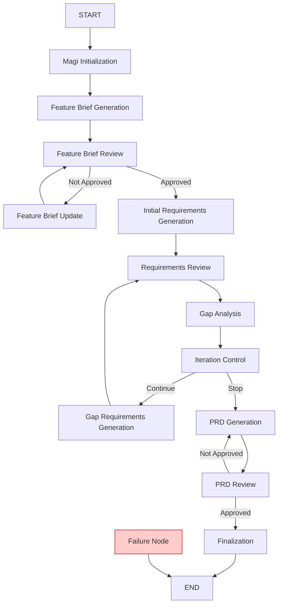

# PRD Generation Workflow Architecture

## Overview

The PRD (Product Requirements Document) Generation Workflow is a comprehensive AI-powered system that orchestrates the creation of high-quality product requirements documents for Salesforce mobile native applications. This workflow implements a sophisticated iterative process that combines automated generation with human review to ensure requirements quality and completeness.

## Workflow Overview

> Note: once we have an abstracted workflow pattern this will be further broken down into smaller workflow (i.e. feature brief workflow, prd workflow)

### Phase 1: Initialization and Feature Brief
- **Initialize** project and extract user requirements
- **Generate** feature brief from user utterance
- **Review** feature brief with user approval

### Phase 2: Initial Requirements Generation
- **Generate** initial functional requirements from feature brief
- **Review** requirements with user/stakeholder approval

### Phase 3: Gap Analysis and Iteration
- **Analyze** gaps in requirements coverage
- **Control** iteration based on gap analysis score
- **Generate** additional requirements to address gaps (if needed)

### Phase 4: PRD Generation
- **Generate** comprehensive PRD document
- **Review** PRD for quality and completeness

### Phase 5: Finalization
- **Complete** workflow and mark as finalized

## Workflow Diagram



## Architecture Components

### Node Types

There are two base node classes in the PRD workflow:

> NOTE: there is a lot of overlap from the normal magen workflow here, these will be refactored in the future
> to share the same abstracted orchestrator/nodes.

1. **`PRDBaseNode`** - Base class for all nodes
   - Provides standard node name and execution interface
   - Used for state transformation without tool invocation

2. **`PRDAbstractToolNode`** - Extends `PRDBaseNode`
   - Adds tool execution capabilities
   - Provides standardized logging and error handling
   - Includes `executeToolWithLogging()` for safe tool invocation

## Node Details

### 1. Magi Initialization Node
**Class:** `PRDMagiInitializationNode`  
**Type:** Base Node (no tools)

**Purpose:** Initializes the PRD workflow by validating inputs and creating the necessary directory structure.

**Responsibilities:**
- Validates that `projectPath` is provided in user input
- Validates that `originalUserUtterance` is provided
- Ensures the `magi-sdd` directory exists in the project
- Returns validated paths and user utterance

**Key State Updates:**
- Sets `projectPath` - the root project directory
- Sets `originalUserUtterance` - the user's original request
- Sets `magiSddPath` - path to the magi-sdd directory
- Sets `prdWorkflowFatalErrorMessages` - array of error messages if initialization fails

**Error Handling:**
- If `projectPath` is missing: sets `prdWorkflowFatalErrorMessages` and returns (router will route to failure)
- If `originalUserUtterance` is missing: sets `prdWorkflowFatalErrorMessages` and returns (router will route to failure)
- If directory creation fails: sets `prdWorkflowFatalErrorMessages` with error details (router will route to failure)
- Node **does not throw errors** - instead populates error state and lets router handle routing to failure node

---

### 2. Feature Brief Generation Node
**Class:** `PRDFeatureBriefGenerationNode`  
**Type:** Tool Node  
**Tool:** `magi-prd-feature-brief`

**Purpose:** Generates a structured feature brief from the user's original utterance.

**Responsibilities:**
- Calls the feature brief generation tool
- Retrieves existing feature IDs to ensure uniqueness
- Creates feature directory structure
- Stores feature brief content in state (does NOT write to disk yet)
- Generates recommended feature ID

**Tool Input:**
```typescript
{
  userUtterance: string,
  currentFeatureIds: string[]
}
```

**Tool Output:**
```typescript
{
  featureBriefMarkdown: string,
  recommendedFeatureId: string
}
```

**Key State Updates:**
- Sets `featureId` - unique identifier for the feature
- Sets `featureBrief` - path where file will be written (after approval)
- Sets `featureBriefContent` - markdown content stored in-memory

**Output Files:**
- **Does NOT create file yet** - file is only written after approval in Review Node
- Directory is created: `{magiSddPath}/{featureId}/`
- File path determined: `{magiSddPath}/{featureId}/feature-brief.md`

**Note:** 
- This node is ONLY for initial generation. For iterations/updates, see Feature Brief Update Node.
- The feature brief file is **only written to disk after approval** in the Review Node.

---

### 3. Feature Brief Update Node
**Class:** `PRDFeatureBriefUpdateNode`  
**Type:** Tool Node  
**Tool:** `magi-prd-feature-brief-update`

**Purpose:** Updates an existing feature brief based on user feedback and modification requests from the review process. This node is specifically designed for iteration scenarios after a feature brief has been reviewed and not approved.

**Responsibilities:**
- Reads existing feature brief content from state (or file if it exists)
- Incorporates user feedback and requested modifications
- Stores updated content in state (does NOT write to disk yet)
- Maintains the same feature ID throughout iterations

**Tool Input:**
```typescript
{
  projectPath: string,
  existingFeatureId: string, // Must be reused
  featureBrief: string, // Path to file OR content from state
  userUtterance: unknown, // Original utterance for context
  userFeedback?: string, // User feedback from review
  modifications?: Array<{
    section: string,
    modificationReason: string,
    requestedContent: string
  }> // Specific modification requests
}
```

**Tool Output:**
```typescript
{
  featureBriefMarkdown: string // Updated feature brief content
}
```

**Key State Updates:**
- Updates `featureBriefContent` in state (stores updated content)
- Preserves `featureId` and `featureBrief` path (no changes)
- Clears review state after update

**Output Files:**
- **Does NOT write file yet** - file is only written after approval in Review Node
- Uses same file path: `{magiSddPath}/{featureId}/feature-brief.md`

**Key Differences from Generation Node:**
- **Generation Node**: Creates new feature brief from scratch
- **Update Node**: Revises existing feature brief based on feedback
- **Update Node**: Always reuses existing directory and feature ID
- **Update Node**: Incorporates review feedback and modifications

---

### 4. Feature Brief Review Node
**Class:** `PRDFeatureBriefReviewNode`  
**Type:** Tool Node  
**Tool:** `magi-prd-feature-brief-review`

**Purpose:** Facilitates user review and approval of the generated feature brief before proceeding to requirements generation. Writes the feature brief file to disk only when approved.

**Responsibilities:**
- Presents feature brief content from state to user for review
- Captures approval/rejection/modification decisions
- Records user feedback
- Generates review summary
- **Writes feature brief file to disk when approved**

**Tool Input:**
```typescript
{
  projectPath: string,
  featureBrief: string, // Path to feature brief file (or content if file doesn't exist)
  featureBriefContent?: string // Content from state (used when file doesn't exist yet)
}
```

**Tool Output:**
```typescript
{
  approved: boolean,
  userFeedback?: string,
  reviewSummary: string,
  modifications?: Array<{
    section: string,
    modificationReason: string,
    requestedContent: string
  }>
}
```

**Key State Updates:**
- Sets `featureBriefApproved` - approval status
- Sets `featureBriefUserFeedback` - user feedback
- Sets `featureBriefReviewSummary` - review summary

**Workflow Behavior:**
- If approved → write feature brief file to disk, then proceed to initial requirements generation
- If modifications needed → route to Feature Brief Update Node (not Generation Node)
- All changes are documented for tracking

**File Writing:**
- **When approved**: Writes `featureBriefContent` from state to `featureBrief` file path
- **When not approved**: File is NOT written; content remains in state for iteration

---

### 5. Initial Requirements Generation Node
**Class:** `PRDInitialRequirementsGenerationNode`  
**Type:** Tool Node  
**Tool:** `magi-prd-initial-requirements`

**Purpose:** Analyzes the feature brief to propose initial functional requirements.

**Responsibilities:**
- Reads feature brief content from file
- Invokes initial requirements generation tool
- Proposes original functional requirements

**Tool Input:**
```typescript
{
  projectPath: string,
  featureBrief: string
}
```

**Tool Output:**
```typescript
{
  functionalRequirements: Array<{
    id: string,
    title: string,
    description: string,
    priority: 'high' | 'medium' | 'low',
    category: string
  }>,
  summary: string
}
```

**Key State Updates:**
- Sets `functionalRequirements` - array of proposed requirements
- Sets requirements summary

---

### 4. Requirements Review Node
**Class:** `PRDRequirementsReviewNode`  
**Type:** Tool Node  
**Tool:** `magi-prd-requirements-review`
**Artifact:** `{magiSddPath}/{featureId}/requirements.json`

**Purpose:** Facilitates user/stakeholder review of functional requirements and **persists the results to a file**.

**Responsibilities:**
- Presents requirements for review
- Captures approval/rejection/modification decisions
- **Creates and updates `requirements.json` after each review cycle to persist the cumulative state of all requirements.**
- **Maintains a review history within the artifact for traceability.**
- Records user feedback
- Generates review summary

**Artifact Management:**
This node is responsible for managing the `requirements.json` artifact. After each review, it reads the existing file, merges the new results, and writes the file back to disk. It then updates the workflow's in-memory state to match the persisted artifact, ensuring that subsequent nodes like Gap Analysis and PRD Generation have a complete and accurate view of all approved requirements.

**Tool Input:**
```typescript
{
  projectPath: string,
  functionalRequirements: Array<Requirement>
}
```

**Tool Output:**
```typescript
{
  approvedRequirements: Array<Requirement>,
  rejectedRequirements: Array<Requirement>,
  modifiedRequirements: Array<ModifiedRequirement>,
  reviewSummary: string,
  userFeedback: string
}
```

**Key State Updates:**
- Sets `approvedRequirements` - requirements accepted by user
- Sets `rejectedRequirements` - requirements rejected by user
- Sets `modifiedRequirements` - requirements modified by user
- Sets `requirementsReviewSummary` - summary of review decisions

**Workflow Behavior:**
- User can approve, reject, or modify each requirement
- Modified requirements include notes on changes made
- All decisions are recorded for audit trail

---

### 5. Gap Analysis Node
**Class:** `PRDGapAnalysisNode`  
**Type:** Tool Node  
**Tool:** `magi-prd-gap-analysis`

**Purpose:** Analyzes requirements for gaps, incompleteness, and quality issues. Also captures user decision on whether to continue refining requirements.

**Responsibilities:**
- Compares approved requirements against feature brief
- Identifies missing functionality
- Scores requirement strengths and weaknesses
- Provides overall quality assessment
- Suggests improvements
- Asks the user whether to continue refining or proceed to PRD generation

**Tool Input:**
```typescript
{
  projectPath: string,
  featureBrief: string,
  functionalRequirements: Array<Requirement>
}
```

**Tool Output:**
```typescript
{
  gapAnalysisScore: number, // 0-100
  identifiedGaps: Array<{
    id: string,
    title: string,
    description: string,
    severity: 'critical' | 'high' | 'medium' | 'low',
    category: string,
    impact: string,
    suggestedRequirements: Array<SuggestedRequirement>
  }>,
  requirementStrengths: Array<RequirementStrength>,
  recommendations: string[],
  summary: string,
  userWantsToContinueDespiteGaps?: boolean
}
```

**Key State Updates:**
- Sets `gapAnalysisScore` - overall gap analysis score (0-100)
- Sets `identifiedGaps` - array of identified gaps
- Sets `requirementStrengths` - analysis of each requirement
- Sets `gapAnalysisRecommendations` - high-level recommendations
- Sets `gapAnalysisSummary` - summary of findings
- Sets `userWantsToContinueDespiteGaps` - user's decision to continue or proceed (optional)

**User Decision:**
After presenting gap analysis results, the tool asks the user whether to:
- Continue refining requirements to address identified gaps
- Proceed to PRD generation despite the gaps (useful when gaps are minor or acceptable)

The user's decision is captured in the `userWantsToContinueDespiteGaps` field, which influences the iteration control decision.

---

### 6. Requirements Iteration Control Node
**Class:** `PRDRequirementsIterationControlNode`  
**Type:** Base Node (no tools)

**Purpose:** Determines whether to continue refining requirements or proceed to PRD generation based on gap analysis results and user preference.

**Responsibilities:**
- Evaluates gap analysis score
- Checks for explicit user decision
- Makes iteration control decision
- Implements quality threshold logic with user override capability

**Decision Logic:**
The node uses the following priority order:

1. **User Override (Highest Priority)**: If `userWantsToContinueDespiteGaps` is explicitly set:
   - `true` → always continue iteration
   - `false` → always proceed to PRD generation

2. **Automatic Threshold (Fallback)**: If no explicit user decision:
   - `shouldContinueIteration = gapAnalysisScore < 0.8` (80% threshold)

This ensures users have full control over the iteration process while maintaining sensible defaults.

**Implementation:**
```typescript
if (userWantsToContinue === true) {
  shouldContinueIteration = true;  // User wants to continue
} else if (userWantsToContinue === false) {
  shouldContinueIteration = false;  // User wants to proceed
} else {
  shouldContinueIteration = gapAnalysisScore < 0.8;  // Use threshold
}
```

**Key State Updates:**
- Sets `shouldContinueIteration` - boolean flag for iteration

**Control Flow:**
- If `shouldContinueIteration = true` → proceed to gap requirements generation
- If `shouldContinueIteration = false` → proceed to PRD generation

---

### 7. Gap Requirements Generation Node
**Class:** `PRDGapRequirementsGenerationNode`  
**Type:** Tool Node  
**Tool:** `magi-prd-gap-requirements`

**Purpose:** Generates additional functional requirements to address identified gaps.

**Responsibilities:**
- Uses gap analysis results to propose new requirements
- Ensures no duplication with existing requirements
- Addresses high/critical severity gaps first
- Integrates new requirements with existing ones

**Tool Input:**
```typescript
{
  projectPath: string,
  featureBrief: string,
  existingRequirements: Array<Requirement>,
  identifiedGaps: Array<Gap>
}
```

**Tool Output:**
```typescript
{
  functionalRequirements: Array<Requirement>,
  summary: string,
  gapsAddressed: string[] // Gap IDs addressed by these requirements
}
```

**Key State Updates:**
- Adds new requirements to `functionalRequirements`
- Updates requirements summary

**Workflow Behavior:**
- Generates new requirements based on gaps
- Uses suggested requirements from gap analysis as starting points
- Assigns appropriate priorities based on gap severity
- Returns to requirements review node after generation

---

### 8. PRD Generation Node
**Class:** `PRDGenerationNode`  
**Type:** Tool Node  
**Tool:** `magi-prd-generation`

**Purpose:** Generates the complete Product Requirements Document from approved requirements.

**Responsibilities:**
- Reads feature brief content
- Assembles all approved requirements
- Generates comprehensive PRD document
- Creates traceability table
- Sets document metadata

**Tool Input:**
```typescript
{
  projectPath: string,
  originalUserUtterance: string,
  featureBrief: string,
  approvedRequirements: Array<Requirement>,
  modifiedRequirements: Array<ModifiedRequirement>
}
```

**Tool Output:**
```typescript
{
  prdContent: string, // Full markdown PRD content
  prdFilePath: string, // Output file path
  documentStatus: {
    author: string,
    lastModified: string, // YYYY-MM-DD format
    status: 'draft' | 'finalized'
  },
  requirementsCount: number,
  traceabilityTableRows: Array<{
    requirementId: string,
    technicalRequirementIds: string, // TBD placeholder
    userStoryIds: string // TBD placeholder
  }>
}
```

**Key State Updates:**
- Sets `prdContent` - full PRD markdown
- Sets `prdFilePath` - path to PRD file
- Sets `prdDocumentStatus` - document metadata
- Sets `prdRequirementsCount` - number of requirements
- Sets `prdTraceabilityTableRows` - traceability data

**PRD Structure:**
1. Document Status (author, date, status)
2. Original User Utterance
3. Feature Brief
4. Functional Requirements
5. Traceability Table

---

### 9. PRD Review Node
**Class:** `PRDReviewNode`  
**Type:** Tool Node  
**Tool:** `magi-prd-review`

**Purpose:** Facilitates final review and approval of the complete PRD document.

**Responsibilities:**
- Presents PRD document for review
- Captures approval/modification decisions
- Records user feedback
- Generates review summary

**Tool Input:**
```typescript
{
  projectPath: string,
  prdContent: string,
  prdFilePath: string,
  documentStatus: {
    author: string,
    lastModified: string,
    status: 'draft' | 'finalized'
  }
}
```

**Tool Output:**
```typescript
{
  prdApproved: boolean,
  prdModifications: Array<{
    section: string,
    originalContent: string,
    modifiedContent: string,
    modificationReason: string
  }>,
  userFeedback: string,
  reviewSummary: string
}
```

**Key State Updates:**
- Sets `prdApproved` - approval status
- Sets `prdModifications` - any modifications requested
- Sets `prdUserFeedback` - user feedback
- Sets `prdReviewSummary` - review summary

**Workflow Behavior:**
- If approved → proceed to finalization
- If modifications needed → return to PRD generation for re-generation
- All changes are documented for tracking

---

### 10. Finalization Node
**Class:** `PRDFinalizationNode`  
**Type:** Base Node (no tools)

**Purpose:** Marks the PRD workflow as complete.

**Responsibilities:**
- Terminates workflow
- Returns to orchestrator

---

### 11. Failure Node
**Class:** `PRDFailureNode`  
**Type:** Tool Node  
**Tool:** `magi-prd-failure`

**Purpose:** Handles non-recoverable workflow failures and communicates them to the user.

**Responsibilities:**
- Invokes the PRD failure tool with error messages
- Formats failure information for user display
- Terminates workflow with error state

**Tool Input:**
```typescript
{
  messages: string[] // Array of error messages describing failures
}
```

**Tool Output:**
```typescript
{} // Empty result object, workflow terminates
```

**Key State Updates:**
- Reads `prdWorkflowFatalErrorMessages` from state
- Workflow terminates (routes to END)

**Error Handling Flow:**
1. Error occurs in any workflow node
2. Orchestrator catches the error and populates `prdWorkflowFatalErrorMessages` in state
3. Orchestrator routes execution to `prdFailureNode`
4. Failure node invokes the PRD failure tool to communicate the error to the user
5. Workflow terminates with error status

**Note:** Currently, no automatic recovery mechanisms are implemented. All errors are non-recoverable and result in workflow termination. Future enhancements may add retry logic or partial recovery capabilities.

---

## State Management

### PRD Workflow State

The workflow state (`PRDState`) is defined using LangGraph's `Annotation` API. State is organized into logical sections:

#### Core Workflow Data
```typescript
userInput: Record<string, unknown>
projectPath: string
featureId: string
magiSddPath: string
originalUserUtterance: string
```

#### Feature Brief State
```typescript
featureBrief: string // Path to feature-brief.md file (set after approval)
featureBriefContent: string // Feature brief markdown content (in-memory during review/iteration)
featureBriefApproved: boolean // Whether the feature brief is approved
featureBriefReviewSummary: string // Summary of the review process
featureBriefUserFeedback: string // User feedback on the feature brief
featureBriefModifications: Array<Modification> // Requested modifications from review
```

#### Requirements State
```typescript
functionalRequirements: Array<Requirement>
approvedRequirements: Array<Requirement>
rejectedRequirements: Array<Requirement>
modifiedRequirements: Array<ModifiedRequirement>
requirementsReviewSummary: string
```

#### Gap Analysis State
```typescript
gapAnalysisScore: number // 0-100
identifiedGaps: Array<Gap>
gapAnalysisRecommendations: string[]
gapAnalysisSummary: string
```

#### Iteration Control State
```typescript
requirementsIterationCount: number
shouldContinueIteration: boolean
iterationComplete: boolean
userWantsToContinueDespiteGaps: boolean
```

#### PRD Generation Results
```typescript
prdContent: string
prdFilePath: string
prdDocumentStatus: {
  author: string,
  lastModified: string,
  status: 'draft' | 'finalized'
}
prdRequirementsCount: number
prdTraceabilityTableRows: Array<TraceabilityRow>
```

#### PRD Review State
```typescript
prdApproved: boolean
prdModifications: Array<PRDModification>
prdUserFeedback: string
prdReviewSummary: string
prdFinalized: boolean
```

#### Error Handling State
```typescript
prdWorkflowFatalErrorMessages: string[] // Array of error messages for failure communication
```

#### Requirements Artifact (`requirements.json`)
A JSON file that acts as the single source of truth for the state of all requirements for a given feature. It is managed exclusively by the `PRDRequirementsReviewNode`.

**Location:** `{magiSddPath}/{featureId}/requirements.json`

**Structure:**
```json
{
  "featureId": "string",
  "approvedRequirements": "Array<Requirement>",
  "rejectedRequirements": "Array<Requirement>",
  "modifiedRequirements": "Array<ModifiedRequirement>",
  "reviewHistory": [
    {
      "timestamp": "Date",
      "summary": "string",
      "approvedIds": "string[]",
      "rejectedIds": "string[]",
      "modifiedIds": "string[]"
    }
  ]
}
```

## Flow Control

### Linear Edges
Simple linear progression with no branching:
1. START → Magi Initialization
2. Feature Brief Generation → Feature Brief Review
3. Feature Brief Update → Feature Brief Review (iteration loop)
4. Initial Requirements Generation → Requirements Review
5. Requirements Review → Gap Analysis
6. Gap Analysis → Requirements Iteration Control
7. PRD Generation → PRD Review
8. Finalization → END
9. Failure Node → END

### Conditional Edges
Branching logic based on state evaluation:

#### Magi Initialization → Feature Brief Generation or Failure
```typescript
.addConditionalEdges(magiInitializationNode.name, prdInitializationValidatedRouter.execute)
```

**Decision Logic:**
The `PRDInitializationValidatedRouter` checks if initialization was successful:
- If `prdWorkflowFatalErrorMessages` has any entries → route to Failure Node
- Otherwise → proceed to Feature Brief Generation

**Common Error Scenarios:**
- `projectPath` missing in user input
- `originalUserUtterance` missing in user input
- Directory creation failures (permissions, disk space, etc.)

**Flow:**
- If errors present → Failure Node
- If no errors → Feature Brief Generation Node

---

#### Feature Brief Review → Update or Proceed
```typescript
.addConditionalEdges(featureBriefReviewNode.name, state => {
  const isApproved = state.featureBriefApproved;
  return isApproved ? initialRequirementsGenerationNode.name : featureBriefUpdateNode.name;
})
.addEdge(featureBriefUpdateNode.name, featureBriefReviewNode.name)
```

**Decision Logic:**
The `featureBriefApproved` flag is set by the Feature Brief Review Node based on user feedback:
- If `featureBriefApproved = true` → proceed to Initial Requirements Generation
- If `featureBriefApproved = false` → route to Feature Brief Update Node

**Flow:**
- If approved → Initial Requirements Generation Node
- If not approved → Feature Brief Update Node → Feature Brief Review Node (iteration loop)

**User Options:**
The user can:
- Approve the feature brief as-is
- Request modifications to specific sections
- Request a complete revision if the brief doesn't match their vision

**Iteration Loop:**
When modifications are requested:
1. Feature Brief Review → Feature Brief Update (with feedback/modifications)
2. Feature Brief Update → Feature Brief Review (user reviews updated version)
3. Process repeats until approved

---

#### Iteration Control → Gap Requirements or PRD Generation
```typescript
.addConditionalEdges(requirementsIterationControlNode.name, state => {
  const shouldContinue = state.shouldContinueIteration;
  return shouldContinue ? gapRequirementsGenerationNode.name : prdGenerationNode.name;
})
```

**Decision Logic:**
The `shouldContinueIteration` flag is determined by the Requirements Iteration Control Node using this priority:
1. **User Override**: If `userWantsToContinueDespiteGaps` is explicitly `true` or `false`, use that value
2. **Automatic Threshold**: If no user decision, use gap score (< 80% continues iteration)

**Flow:**
- If `shouldContinueIteration = true` → generate gap-based requirements
- If `shouldContinueIteration = false` → proceed to PRD generation

**Note:** Gap Analysis now always flows to Requirements Iteration Control, which makes the decision based on both gap score and user preference.

#### PRD Review → Finalization or PRD Generation
```typescript
.addConditionalEdges(prdReviewNode.name, state => {
  const isApproved = state.prdApproved;
  return isApproved ? prdFinalizationNode.name : prdGenerationNode.name;
})
```

**Decision:** If `prdApproved = true` → finalize workflow  
**Else:** Re-generate PRD document

#### Gap Requirements → Requirements Review
Loop back to review process:
```typescript
.addEdge(gapRequirementsGenerationNode.name, requirementsReviewNode.name)
```

## Integration with MCP Server

The PRD workflow is orchestrated by the `magi-prd-orchestrator` tool, which:
- Manages workflow state persistence
- Handles human-in-the-loop interruptions
- Coordinates tool invocations
- Provides status updates
- Maintains thread context

### Orchestrator Responsibilities
1. Start new PRD workflows
2. Resume interrupted workflows
3. Process tool results
4. Manage workflow state
5. Determine next node to execute
6. Generate orchestration instructions

### Human-in-the-Loop
The workflow supports interruptions at key points:
- **Requirements Review**: User reviews and approves requirements
- **Gap Analysis**: User can choose to continue refining requirements or proceed to PRD generation despite identified gaps
- **PRD Review**: User reviews and approves PRD

#### User Control Over Iteration
The `userWantsToContinueDespiteGaps` state field allows users to:
- **Override automatic decisions**: Users can explicitly decide to continue refining or proceed to PRD regardless of gap analysis score
- **Flexible workflow**: Enables users to balance thoroughness with time constraints
- **Informed decisions**: Gap analysis presents results before asking for user input, enabling informed choices
